# Balanceador de carga

## Índice

### [1 Introducción](#1--Introducción)

### [2 Requerimientos](#2--Requerimientos)

### [3 Preparación](#3--Preparación)
#### &nbsp; &nbsp; [3.1 Instalación](#31--Instalación)
#### &nbsp; &nbsp; [3.2 Balanceo de carga](#32--Balanceo-de-carga)
#### &nbsp; &nbsp; [3.3 Seguridad](#33--Seguridad)
##### &nbsp; &nbsp; &nbsp; &nbsp; &nbsp; &nbsp; [3.3.1 Conexión por SSL](#331--Conexión-por-SSL)
##### &nbsp; &nbsp; &nbsp; &nbsp; &nbsp; &nbsp; [3.3.2 Habilitación de estadísticas](#332--Habilitación-de-estadísticas)
##### &nbsp; &nbsp; &nbsp; &nbsp; &nbsp; &nbsp; [3.3.3 Cortafuegos](#333--Cortafuegos)
#### &nbsp; &nbsp; [3.4 Comprobación de la seguridad](#34--Comprobación-de-la-seguridad)

### [4 Webgrafía](#4--Webgrafía)

### [5 Conclusión](#5--Conclusión)

---

## 1  Introducción

Un balanceador de carga es un dispositivo de hardware o software que se pone al frente de un conjunto de servidores que atienden una aplicación y asigna o balancea las solicitudes que llegan de los clientes.

El concepto está ı́ntimamente ligado a los sistemas de multiprocesamiento, o que hacen uso de más de una unidad de procesamiento para realizar labores útiles, usan un algoritmo que divide equitativamente el trabajo para evitar los llamados cuellos de botella.

En una empresa la aplicación más común de un balanceador de carga es emplearlo de proxy inverso en una red, y equilibrar las peticiones de los clientes para evitar saturaciones en los servidores.

## 2  Requerimientos

Todas las máquinas virtuales tienen el sistema operativo Debian 9 stretch.

- Hipervisor Oracle VM VirtualBox.

- Servidor ssh en las máquinas virtuales.

- Cliente ssh en la máquina anfitriona.

## 3  Preparación

En una máquina virtual accedemos mediante ssh desde la máquina anfitriona.

### 3.1  Instalación

Escribimos el comando, `# apt install haproxy`, para instalar el servidor haproxy.

	

### 3.2  Balanceo de carga

Escribimos el comando, `# nano /etc/haproxy/haproxy.cfg`, para establecer la configuración del servidor haproxy, y escribimos el contenido.

	frontend http_front
	   bind *:80
	   mode tcp
	   default_backend http_back
	   
	backend http_back
	   mode tcp
	   server clientloadbal1 192.168.20.35:80 check
	   server clientloadbal2 192.168.20.36:80 check

	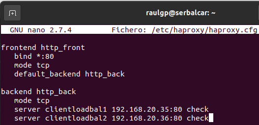

Escribimos el comando, `# service haproxy restart`, para reiniciar el servidor haproxy.

	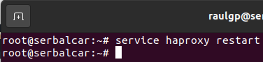

	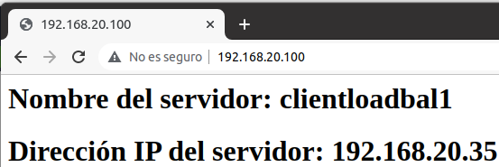

En uno de los clientes del balanceador de carga, escribimos el comando, `# service apache2 stop`, para desactivar el servidor web.

	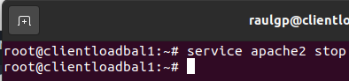

	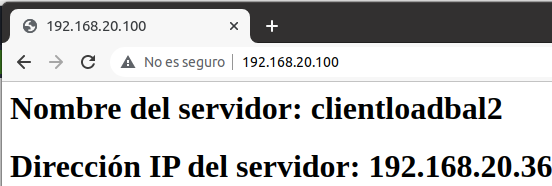

### 3.3  Seguridad

Escribimos el comando, `# nano /etc/haproxy/haproxy.cfg`, para añadir una opción de reducir latencia en el servidor haproxy, y escribimos el contenido.

	option http-server-close

	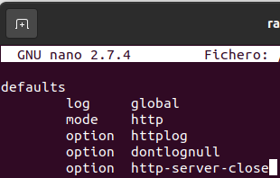

#### 3.3.1  Conexión por SSL

Escribimos el comando, `# openssl genrsa 4096 > certificadoseg.key`, para generar la llave del certificado SSL.

	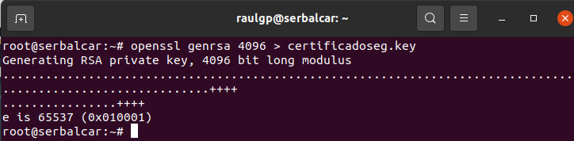

Escribimos el comando, `# openssl req -new -x509 -nodes -sha1 -days 365 -key certificadoseg.key > certificadoseg.pem`, para generar el certificado SSL especificado.

	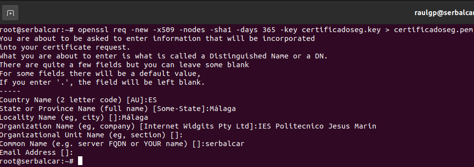

Escribimos el comando, `# cat certificadoseg.key certificadoseg.pem > /home/raulgp/certificadoseg.pem`, para concatenar los certificados SSL especificados.

	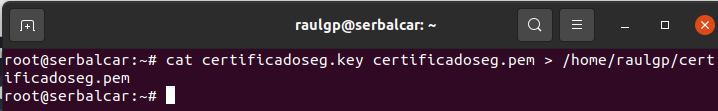

Escribimos el comando, `# nano /etc/haproxy/haproxy.cfg`, y escribimos el contenido.

	frontend https_front
	   bind *:443 crt /home/raulgp/certificadoseg.pem
	   mode tcp
	   default_backend https_back
	
	backend https_back
	   mode tcp
	   server clientloadbal1 192.168.20.35:443 check
	   server clientloadbal2 192.168.20.36:443 check

	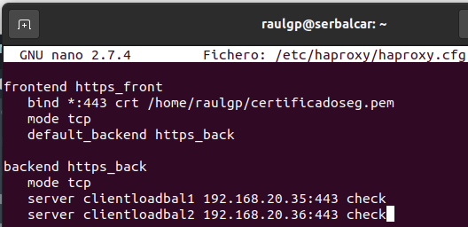

Escribimos el comando, `# service haproxy restart`, para reiniciar el servidor haproxy.

	

#### 3.3.2  Habilitación de estadísticas

Escribimos el comando, `# nano /etc/haproxy/haproxy.cfg`, para habilitar las estadı́sticas del servidor haproxy, y escribimos el contenido.

	frontend stats
	   bind *:8080
	   stats enable
	   stats uri /stats
	   stats refresh 10s

	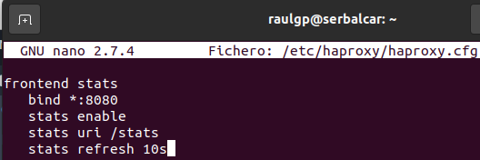

Escribimos el comando, `# service haproxy restart`, para reiniciar el servidor haproxy.

	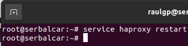

#### 3.3.3  Cortafuegos

Escribimos el comando, `# nano regbalcariptables.sh`, y escribimos el contenido.

	# Limpieza de todas las reglas y denegar o aceptar las conexiones
	iptables -F
	iptables -X
	iptables -Z
	iptables -t nat -F
	iptables -P INPUT DROP
	iptables -P FORWARD DROP
	iptables -P OUTPUT ACCEPT
	
	echo "40000 40100" > /proc/sys/net/ipv4/ip_local_port_range
	
	# Aceptar los protocolos y los puertos de entrada en las interfaces de red
	iptables -A INPUT -i lo -p all -j ACCEPT
	iptables -A INPUT -p icmp -j ACCEPT
	iptables -A INPUT -p tcp --dport 22 -j ACCEPT
	iptables -A INPUT -p tcp --dport 80 -j ACCEPT
	iptables -A INPUT -p tcp --dport 443 -j ACCEPT
	iptables -A INPUT -p tcp --dport 8080 -j ACCEPT
	iptables -A INPUT -p tcp --dport 40000:40100 -j ACCEPT

	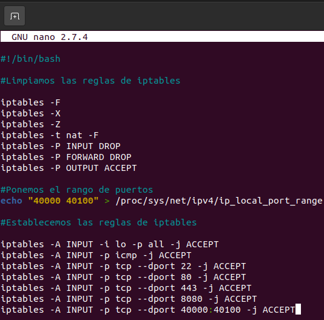

### 3.4  Comprobación de la seguridad

Nos vamos a la máquina anfitriona, ejecutamos un navegador web, escribimos la dirección del servidor haproxy, comprobamos que la conexión establecida esta encriptada.

	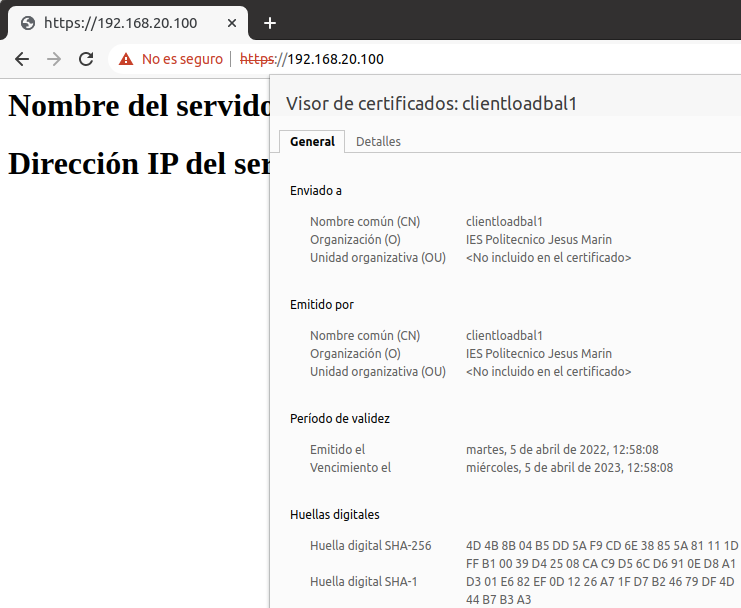

Ejecutamos un navegador web, escribimos la ruta establecida de las estadı́sticas en la dirección del servidor haproxy, comprobamos que las estadı́sticas están habilitadas.

	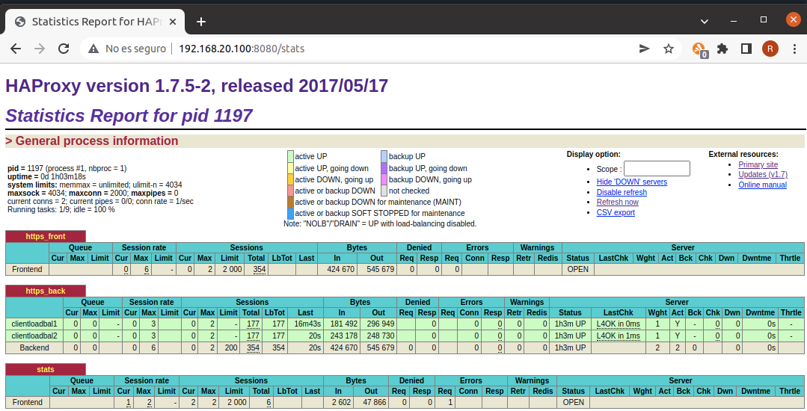

Escribimos el comando, `# iptables -L`, para mostrar las reglas de iptables establecidas.

	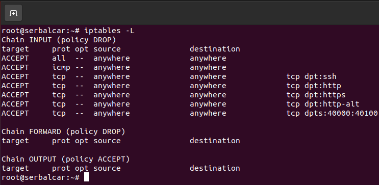

## 4  Webgrafía

<https://citizix.com/how-to-install-and-configure-haproxy-load-balancer-on-debian-11/>  
<https://www.haproxy.com/blog/exploring-the-haproxy-stats-page/>

## 5  Conclusión

Un balanceador de carga es una manera sencilla de alternar las solicitudes de clientes y evitar la saturación de los servidores, y emplearlo de proxy inverso en una red.
