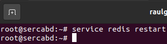

# Cacheador de base de datos

## Índice

### [1 Introducción](#1--Introducción)

### [2 Requerimientos](#2--Requerimientos)

### [3 Preparación](#3--Preparación)
#### &nbsp; &nbsp; [3.1 Instalación](#31--Instalación)
#### &nbsp; &nbsp; [3.2 Cacheo de la base de datos](#32--Cacheo-de-la-base-de-datos)
#### &nbsp; &nbsp; [3.3 Seguridad](#33--Seguridad)
##### &nbsp; &nbsp; &nbsp; &nbsp; &nbsp; &nbsp; [3.3.1 Deshabilitación de comandos](#331--Deshabilitación-de-comandos)
##### &nbsp; &nbsp; &nbsp; &nbsp; &nbsp; &nbsp; [3.3.2 Cortafuegos](#332--Cortafuegos)
#### &nbsp; &nbsp; [3.4 Comprobación de la seguridad](#34--Comprobación-de-la-seguridad)

### [4 Webgrafía](#4--Webgrafía)

### [5 Conclusión](#5--Conclusión)

---

## 1  Introducción

Las bases de datos NoSQL suelen usarse a los SGBD relacionales convencionales debido a las grandes cantidades de datos que se tienen que procesar en tan poco tiempo, siendo optimizadas para las operaciones de recuperar y agregar, y no ofreciendo más funcionalidades además de almacenar los datos.

Redis es un motor de base de datos en memoria, basado en el almacenamiento de tipo clave-valor y soportando diferentes estructuras de datos, pero que opcionalmente puede ser usada como una base de datos de cacheo de SGBS relacionales.

En una empresa la aplicación más común de un cacheador de base de datos es proporcionar grandes volúmenes de datos procesados en muy poco tiempo y su escalabilidad.

## 2  Requerimientos

Todas las máquinas virtuales tienen el sistema operativo Debian 9 stretch.

- Hipervisor VMware Workstation.

- Servidor ssh en las máquinas virtuales.

- Cliente ssh en la máquina anfitriona.

## 3  Preparación

En una máquina virtual accedemos mediante ssh desde la máquina anfitriona.

### 3.1  Instalación

Escribimos el comando, `# apt install redis-server`, para instalar el servidor redis.

	

Escribimos el comando, `# nano /etc/redis/redis.conf`, y escribimos el contenido.

    supervised systemd # Establecimiento de la supervisión e interacción
    bind 0.0.0.0 # Establecimiento de la interfaz de escucha de peticiones

	

Escribimos el comando, `# service redis restart`, para reiniciar el servidor redis.

	

### 3.2  Cacheo de la base de datos

Si queremos cachear el servidor redis con el lenguaje de programación php, escribimos el comando, `# apt install php-redis`, escribimos el comando, `# nano caredisdb.php`, y escribimos el contenido.

	<?php

	    $dbconn = new mysqli("192.168.20.10", "raulgp", "A123a.", "employees");
	    $redis = new Redis();
	    $redis->connect("192.168.20.15", "6379");

	    $listaempleados = $dbconn->query("select employees.emp_no, first_name, max(salary) from employees inner join salaries on employees.emp_no = salaries.emp_no group by employees.emp_no;");

	    // Consulta del ID, nombre y salario de los empleados en la base de datos
	    $empleadosnumero = array();
	    $empleadosnombre = array();
	    $empleadossalarios = array();

	    while($row = $listaempleados->fetch_array()){
		array_push($empleadosnumero, $row[0]);
		array_push($empleadosnombre, $row[1]);
		array_push($empleadossalarios, $row[2]);
	    }

	    // Insercción de los elementos en el servidor redis
	    for($i = 0; $i < count($empleadosnumero); $i++){
		$redis->rPush($empleadosnumero[$i], $empleadosnombre[$i]);
		$redis->rPush($empleadosnumero[$i], $empleadossalarios[$i]);
	    }

	?>

	

Si queremos cachear el servidor redis con el lenguaje de programación python, escribimos el comando, `# pip install redis`, escribimos el comando, `# nano caredisdb.py`, y escribimos el contenido.

	import mysql.connector, redis

	dbconn = mysql.connector.connect(host="192.168.20.10", user="raulgp", password="A123a.", database="employees")
	dbredis = redis.Redis("192.168.20.15", "6379")

	dbconncursor = dbconn.cursor()
	dbconncursor.execute("select employees.emp_no, first_name, max(salary) from employees inner join salaries on employees.emp_no = salaries.emp_no group by employees.emp_no;")
	listaempleados = dbconncursor.fetchall()

	# Consulta del ID, nombre y salario de los empleados en la base de datos
	empleadosnumero = []
	empleadosnombre = []
	empleadossalario = []

	for i in range(len(listaempleados)):
	    empleadosnumero.append(listaempleados[i][0])
	    empleadosnombre.append(listaempleados[i][1])
	    empleadossalario.append(listaempleados[i][2])

	# Insercción de los elementos en el servidor redis
	for i in range(len(empleadosnumero)):
	    dbredis.rpush(empleadosnumero[i], empleadosnombre[i])
	    dbredis.rpush(empleadosnumero[i], empleadossalario[i])

	

Ejecutamos el script en php o python, y mediante un archivo en su respectivo lenguaje de programación comprobamos el tiempo de ejecución en consultar en una base de datos o en el servidor redis.

	

### 3.3  Seguridad

Escribimos el comando, `# nano /etc/redis/redis.conf`, para establecer una contraseña de autenticación, y escribimos el contenido.

	requirepass "contraseña"

	

#### 3.3.1  Deshabilitación de comandos

Escribimos el comando, `# nano /etc/redis/redis.conf`, para renombrar y deshabilitar comandos peligrosos, y escribimos el contenido.

	rename-command FLUSHDB ""
	rename-command FLUSHALL ""
	rename-command KEYS ""
	rename-command PEXPIRE ""
	rename-command DEL ""
	rename-command CONFIG ""
	rename-command SHUTDOWN ""
	rename-command BGREWRITEAOF ""
	rename-command BGSAVE ""
	rename-command SAVE ""
	rename-command SPOP ""
	rename-command SREM ""
	rename-command RENAME ""
	rename-command DEBUG ""

	

Escribimos el comando, `# service redis restart`, para reiniciar el servidor redis.

	

#### 3.3.2  Cortafuegos

Escribimos el comando, `# nano regcacheobdiptables.sh`, y escribimos el contenido.

	# Limpieza de todas las reglas y denegar o aceptar las conexiones
	iptables -F
	iptables -X
	iptables -Z
	iptables -t nat -F
	iptables -P INPUT DROP
	iptables -P FORWARD DROP
	iptables -P OUTPUT ACCEPT
	
	echo "40000 40100" > /proc/sys/net/ipv4/ip_local_port_range
	
	# Aceptar los protocolos y los puertos de entrada en las interfaces de red
	iptables -A INPUT -i lo -p all -j ACCEPT
	iptables -A INPUT -p icmp -j ACCEPT
	iptables -A INPUT -p tcp --dport 22 -j ACCEPT
	iptables -A INPUT -p tcp --dport 6379 -j ACCEPT
	iptables -A INPUT -p tcp --dport 40000:40100 -j ACCEPT

	

### 3.4  Comprobación de la seguridad

Escribimos el comando, `# redis-cli`, y escribimos la sentencia, `> auth "contraseña"`, para autenticarse y ejecutar sentencias en el servidor redis.

	

Escribimos la sentencia, `> flushall`, comprobamos que el comando ha sido renombrado y deshabilitado en el servidor redis.

	

Escribimos el comando, `# iptables -L`, para mostrar las reglas de iptables establecidas.

	

## 4  Webgrafía

<https://www.digitalocean.com/community/tutorials/how-to-install-and-secure-redis-on-debian-9>  
<https://redis.io/>

## 5  Conclusión

Un cacheador de base de datos es una manera sencilla de procesar en poco tiempo grandes cantidades de información y escalar con diferentes servidores horizontalmente.
