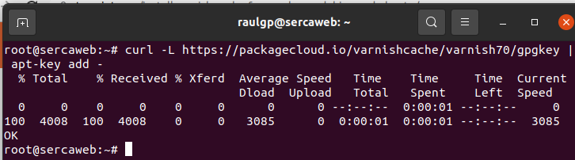
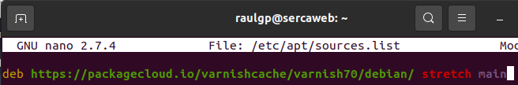
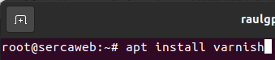
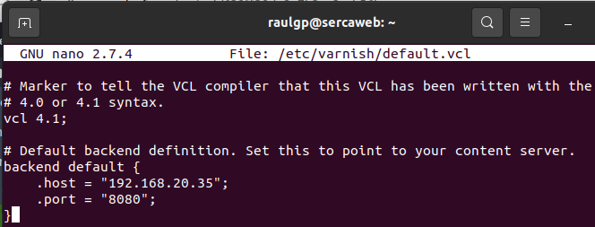
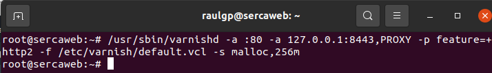
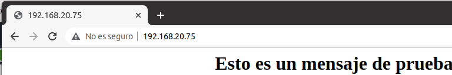
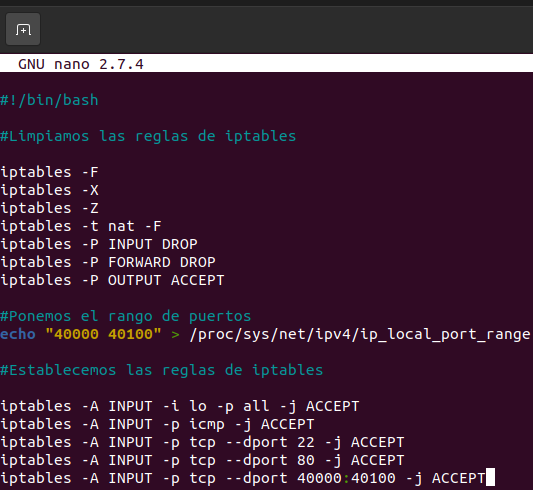
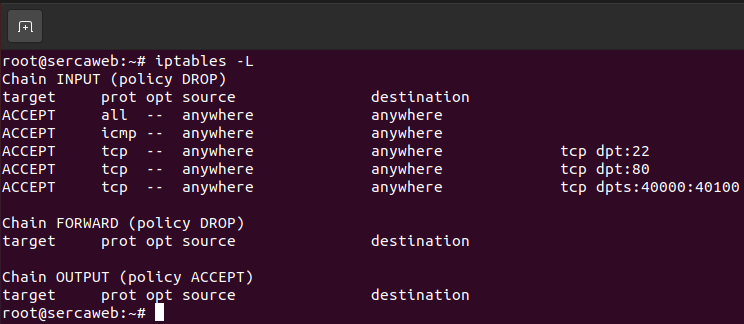

# Cacheador web

## Índice

### [1 Introducción](#1--Introducción)

### [2 Requerimientos](#2--Requerimientos)

### [3 Preparación](#3--Preparación)
#### &nbsp; &nbsp; [3.1 Instalación](#31--Instalación)
#### &nbsp; &nbsp; [3.2 Cacheo web](#32--Cacheo-web)
#### &nbsp; &nbsp; [3.3 Seguridad](#33--Seguridad)
#### &nbsp; &nbsp; [3.4 Comprobación de la seguridad](#34--Comprobación-de-la-seguridad)

### [4 Webgrafía](#4--Webgrafía)

### [5 Conclusión](#5--Conclusión)

---

## 1  Introducción

El cacheo web almacena documentos web para reducir el ancho de banda consumido, la carga de los servidores y el retardo en la descarga. Almacena copias de los documentos que pasan por él, de forma que subsiguientes peticiones pueden ser respondidas por el mismo.

Varnish es un acelerador de aplicaciones web, o caché de proxy HTTP inversa. Se configura para almacenar en el caché del servidor una copia del recurso solicitado estando ideado para aumentar el rendimiento de aplicaciones web con contenidos pesados y altamente consumidas.

En una empresa la aplicación más común de un cacheador web es incrementar la velocidad de las peticiones de contenido con mucho tráfico y configurarlo para ser un balanceador de carga o un proxy inverso.

## 2  Requerimientos

Todos los contenedores tienen el sistema operativo Debian 9 stretch.

- Aplicación de virtualización Docker.

- Servidor ssh en los contenedores.

- Cliente ssh en la máquina anfitriona.

## 3  Preparación

En un contenedor accedemos mediante ssh desde la máquina anfitriona.

### 3.1  Instalación

Escribimos el comando, `# curl -L https://packagecloud.io/varnishcache/varnish70/gpgkey | apt-key add -`, para añadir la llave oficial GPG de varnish.

	

Escribimos el comando, `# nano /etc/apt/sources.list`, para añadir el repositorio de varnish, y escribimos el contenido.

    deb https://packagecloud.io/varnishcache/varnish70/debian/ stretch main

	

Actualizamos los repositorios, y escribimos el comando, `# apt install varnish`, para instalar el servidor varnish.

	

### 3.2  Cacheo web

Escribimos el comando, `# nano /etc/varnish/default.vcl`, para establecer la dirección de cacheo del servidor web, y escribimos el contenido.

	backend default {
	    .host = "192.168.20.35";
	    .port = "8080";
	}

	

Escribimos el comando, `# /usr/sbin/varnishd -a :80 -a 127.0.0.1:8443,PROXY -p feature=+http2 -f /etc/varnish/default.vcl -s malloc,256m`, para iniciar el servidor varnish.

	

	

### 3.3  Seguridad

Escribimos el comando, `# nano regcacheowebiptables.sh`, y escribimos el contenido.

	# Limpieza de todas las reglas y denegar o aceptar las conexiones
	iptables -F
	iptables -X
	iptables -Z
	iptables -t nat -F
	iptables -P INPUT DROP
	iptables -P FORWARD DROP
	iptables -P OUTPUT ACCEPT
	
	echo "40000 40100" > /proc/sys/net/ipv4/ip_local_port_range
	
	# Aceptar los protocolos y los puertos de entrada en las interfaces de red
	iptables -A INPUT -i lo -p all -j ACCEPT
	iptables -A INPUT -p icmp -j ACCEPT
	iptables -A INPUT -p tcp --dport 22 -j ACCEPT
	iptables -A INPUT -p tcp --dport 80 -j ACCEPT
	iptables -A INPUT -p tcp --dport 40000:40100 -j ACCEPT

	

### 3.4  Comprobación de la seguridad

Escribimos el comando, `# iptables -L`, para mostrar las reglas de iptables establecidas.

	

## 4  Webgrafía

<https://www.tecmint.com/install-varnish-cache-for-apache-on-debian-and-ubuntu/>  
<https://www.varnish-software.com/es/>

## 5  Conclusión

Un cacheador web es una manera sencilla de mejorar el tiempo de respuesta en contenido web con mucho tráfico, y configurarlo de balanceador de carga o de proxy inverso.
