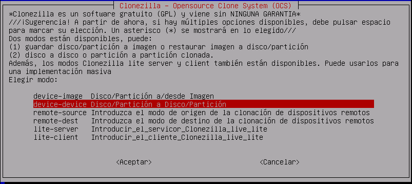

# Clonación de equipos

## Índice

### [1 Introducción](#1--Introducción)

### [2 Requerimientos](#2--Requerimientos)

### [3 Preparación](#3--Preparación)
#### &nbsp; &nbsp; [3.1 Clonación local](#31--Clonación-local)
##### &nbsp; &nbsp; &nbsp; &nbsp; &nbsp; &nbsp; [3.1.1 Por comandos mediante un archivo imagen](#311--Por-comandos-mediante-un-archivo-imagen)
##### &nbsp; &nbsp; &nbsp; &nbsp; &nbsp; &nbsp; [3.1.2 Por comandos mediante una unidad de almacenamiento](#312--Por-comandos-mediante-una-unidad-de-almacenamiento)
##### &nbsp; &nbsp; &nbsp; &nbsp; &nbsp; &nbsp; [3.1.3 Por un programa mediante un archivo imagen](#313--Por-un-programa-mediante-un-archivo-imagen)
##### &nbsp; &nbsp; &nbsp; &nbsp; &nbsp; &nbsp; [3.1.4 Por un programa mediante una unidad de almacenamiento](#314--Por-un-programa-mediante-una-unidad-de-almacenamiento)
#### &nbsp; &nbsp; [3.2 Clonación remota](#32--Clonación-remota)
##### &nbsp; &nbsp; &nbsp; &nbsp; &nbsp; &nbsp; [3.2.1 Por comandos mediante un archivo imagen](#321--Por-comandos-mediante-un-archivo-imagen)
##### &nbsp; &nbsp; &nbsp; &nbsp; &nbsp; &nbsp; [3.2.2 Por comandos mediante una unidad de almacenamiento](#322--Por-comandos-mediante-una-unidad-de-almacenamiento)
##### &nbsp; &nbsp; &nbsp; &nbsp; &nbsp; &nbsp; [3.2.3 Por un programa mediante un archivo imagen](#323--Por-un-programa-mediante-un-archivo-imagen)
##### &nbsp; &nbsp; &nbsp; &nbsp; &nbsp; &nbsp; [3.2.4 Por un programa mediante una unidad de almacenamiento](#324--Por-un-programa-mediante-una-unidad-de-almacenamiento)

### [4 Webgrafía](#4--Webgrafía)

### [5 Conclusión](#5--Conclusión)

---

## 1  Introducción

La clonación de unidades de almacenamiento es el proceso de copiar los contenidos de una unidad de una computadora a otra o a un archivo imagen. A menudo, los contenidos de la primera unidad se escriben en un archivo imagen como paso intermedio y posteriormente la unidad de destino es cargado con el contenido.

En una empresa la aplicación más común de la clonación de equipos es hacer copias de seguridad en archivos imágenes, y volcarlas o transferir los datos de una unidad de almacenamiento a otra customizados con instalaciones de programas.

## 2  Requerimientos

Todas las máquinas virtuales tienen el sistema operativo Debian 9 stretch.

- Hipervisor VMware Workstation.

- Servidor ssh en las máquinas virtuales.

- Cliente ssh en la máquina anfitriona.

## 3  Preparación

En una máquina virtual accedemos mediante ssh desde la máquina anfitriona.

### 3.1  Clonación local

#### 3.1.1  Por comandos mediante un archivo imagen

Escribimos el comando, `# dd if=/dev/sda1 | gzip | dd of=/mnt/imagenp1.iso`, para capturar en un archivo imagen los datos de la partición especificada.

	

Escribimos el comando, `# dd if=/mnt/imagenp1.iso | gunzip | dd of=/dev/sda1`, para volcar en una partición los datos del archivo imagen.

	

#### 3.1.2  Por comandos mediante una unidad de almacenamiento

Escribimos el comando, `# dd if=/dev/sdb1 of=/dev/sda1`, para clonar una unidad de almacenamiento a otra.

	

#### 3.1.3  Por un programa mediante un archivo imagen

Arrancamos el equipo con un live-cd de clonezilla, seleccionamos device-image, para capturar en un archivo imagen los datos de una unidad de almacenamiento.

	

Seleccionamos local_dev, para usar los dispositivos locales.

	

Seleccionamos el dispositivo donde queremos guardar el archivo imagen, seleccionamos el modo principiante, y seleccionamos saveparts, para capturar en un archivo imagen la partición especificada.

	

Escribimos el nombre del archivo imagen, seleccionamos la partición que queremos capturar, seleccionamos omitir la comprobación del sistema de archivos, seleccionamos comprobar la imagen grabada, y seleccionamos no cifrar la imagen, para capturar los datos de una partición.

	

Arrancamos el equipo con un live-cd de clonezilla, seleccionamos device-image, para volcar en una unidad de almacenamiento los datos de un archivo imagen.

	

Seleccionamos local_dev, para usar los dispositivos locales.

	

Seleccionamos el dispositivo de donde queremos restaurar el archivo imagen, seleccionamos el modo principiante, y seleccionamos restoreparts, para volcar en una partición los datos del archivo imagen.

	

Seleccionamos el archivo imagen, seleccionamos la partición del archivo imagen que queremos volcar, seleccionamos la partición donde queremos volcar el archivo imagen, y seleccionamos no comprobar la imagen antes de restaurar, para volcar los datos de un archivo imagen en una partición.

	

#### 3.1.4  Por un programa mediante una unidad de almacenamiento

Arrancamos el equipo con un live-cd de clonezilla, seleccionamos device-device, para clonar una unidad de almacenamiento a otra.

	

Seleccionamos el modo principiante, y seleccionamos part_to_local_part, para clonar una partición local a una partición especificada.

	

Seleccionamos la partición de donde queremos capturar los datos, seleccionamos la partición donde queremos clonar los datos, y seleccionamos omitir la comprobación del sistema de archivos, para clonar los datos de una partición a otra.

	

### 3.2  Clonación remota

#### 3.2.1  Por comandos mediante un archivo imagen

Escribimos el comando, `# dd if=/dev/sda | gzip | dd of=/mnt/imagend1.iso`, para capturar en un archivo imagen los datos del disco especificado.

	

Escribimos el comando, `# dd if=/mnt/imagend1.iso | gunzip | ssh root@192.168.20.30 "dd of=/dev/sda"`, para volcar en un disco remoto los datos de un archivo imagen.

	

#### 3.2.2  Por comandos mediante una unidad de almacenamiento

Escribimos el comando, `# dd if=/dev/sda | ssh root@192.168.20.30 "dd of=/dev/sda"`, para clonar en un disco remoto la unidad de almacenamiento especificada.

	

#### 3.2.3  Por un programa mediante un archivo imagen

Arrancamos el equipo con un live-cd de clonezilla, seleccionamos device-image, para capturar en un archivo imagen los datos de una unidad de almacenamiento.

	

Seleccionamos nfs_server, para usar un servidor NFS instalado y configurado.

	

Seleccionamos la versión de NFS, escribimos la dirección IP del servidor NFS, escribimos el nombre del recurso compartido, seleccionamos el modo principiante, y seleccionamos savedisk, para capturar en un archivo imagen el disco especificado.

	

Escribimos el nombre del archivo imagen, seleccionamos el disco que queremos capturar, seleccionamos omitir la comprobación del sistema de archivos, seleccionamos comprobar la imagen grabada, y seleccionamos no cifrar la imagen, para capturar los datos de un disco.

	

Arrancamos el equipo con un live-cd de clonezilla, seleccionamos device-image, para volcar en una unidad de almacenamiento los datos de un archivo imagen.

	

Seleccionamos nfs_server, para usar un servidor NFS.

	

Seleccionamos la versión de NFS, escribimos la dirección IP del servidor NFS, escribimos el nombre del recurso compartido, seleccionamos el modo principiante, y seleccionamos restoredisk, para volcar en un disco los datos del archivo imagen remoto.

	

Seleccionamos el archivo imagen, seleccionamos el disco donde queremos volcar el archivo imagen, y seleccionamos no comprobar la imagen antes de restaurar, para volcar los datos de un archivo imagen remoto en un disco.

	

#### 3.2.4  Por un programa mediante una unidad de almacenamiento

Arrancamos el equipo con un live-cd de clonezilla, seleccionamos remote-source, para establecer el equipo servidor donde queremos capturar los datos de la unidad de almacenamiento.

	

Seleccionamos el modo principiante, seleccionamos disk_to_remote_disk, para clonar un disco local a otro remoto.

	

Seleccionamos el disco de donde queremos capturar los datos, seleccionamos omitir la comprobación del sistema de archivos, y esperamos al equipo cliente, para clonar los datos de un disco a otro remoto.

	

Arrancamos el equipo con un live-cd de clonezilla, seleccionamos remote-dest, para establecer el equipo cliente donde queremos volcar los datos de la unidad de almacenamiento.

	

Escribimos la dirección IP del equipo servidor, y seleccionamos restoredisk, para clonar un disco remoto a otro.

	

Seleccionamos el disco donde queremos clonar los datos, y establecemos la conexión con el equipo servidor, para clonar los datos de un disco remoto a otro.

	

## 4  Webgrafía

<https://linux.die.net/man/1/dd>  
<https://clonezilla.org/downloads.php>

## 5  Conclusión

La clonación de equipos es una manera sencilla de hacer copias de seguridad customizados con instalaciones de programas en archivos imágenes y volcarlas en una unidad de almacenamiento.
