# Compartición de recursos

## Índice

### [1 Introducción](#1--Introducción)

### [2 Requerimientos](#2--Requerimientos)

### [3 Preparación](#3--Preparación)
#### &nbsp; &nbsp; [3.1 Compartición por SMB/CIFS](#31--Compartición-por-SMBCIFS)
#### &nbsp; &nbsp; [3.2 Compartición por NFS](#32--Compartición-por-NFS)
#### &nbsp; &nbsp; [3.3 Compartición por SSHFS](#33--Compartición-por-SSHFS)
#### &nbsp; &nbsp; [3.4 Compartición por FTP](#34--Compartición-por-FTP)
#### &nbsp; &nbsp; [3.5 Compartición por iSCSI](#35--Compartición-por-iSCSI)

### [4 Webgrafía](#4--Webgrafía)

### [5 Conclusión](#5--Conclusión)

---

## 1  Introducción

La compartición de recursos mediante sistemas de archivos en red son sistemas de archivos de computadoras que sirven para compartir archivos, impresoras o un almacenamiento persistente en una red, algunos son el sistema de archivos SMB/CIFS, NFS, o SSHFS, aunque también mediante protocolos de red se comparten recursos como el protocolo SFTP, o iSCSI.

El sistemas de archivos SMB/CIFS permite compartir archivos, impresoras, etcétera, entre nodos de una red de computadoras que usan principalmente el sistema operativo Microsoft Windows, pero usando la implementación libre Samba para sistemas de tipo UNIX, es posible que computadoras con GNU/Linux, Mac OS X o Unix en general se vean como servidores o actúen como clientes en redes de Windows.

El sistema de archivos de red NFS es un protocolo que es utilizado para sistemas de archivos distribuido en un entorno de red de computadoras de área local. Posibilita que distintos sistemas conectados a una misma red accedan a ficheros remotos como si se tratara de locales.

El sistema de archivos SSHFS opera sobre archivos en una computadora remota usando un entorno seguro de acceso. En la computadora local la implementación hace uso del módulo del kernel FUSE. El usuario final puede interactuar amigablemente con archivos remotos estando en un servidor SSH, viéndolos como si estuvieran en su computadora local, mientras que en la computadora remota se utiliza el subsistema SFTP de SSH.

El protocolo iSCSI es un estándar que permite el uso del protocolo SCSI sobre redes TCP/IP, en el contexto de almacenamiento, permite a un ordenador utilizar un iniciador iSCSI para conectar a un dispositivo SCSI como puede ser un disco duro en una red IP para acceder a los mismos a nivel de bloque, en el que los dispositivos parecen estar conectados realmente como dispositivos SCSI locales.

En una empresa la aplicación más común de la compartición de recursos es transferir archivos a diferentes equipos en una red, o centralizar los datos en un servidor disponibles para los demás usuarios.

## 2  Requerimientos

Todas las máquinas virtuales tienen el sistema operativo Debian 9 stretch.

- Hipervisor VMware Workstation.

- Servidor ssh en las máquinas virtuales.

- Cliente ssh en la máquina anfitriona.

## 3  Preparación

En una máquina virtual accedemos mediante ssh desde la máquina anfitriona.

### 3.1  Compartición por SMB/CIFS

Escribimos el comando, `# apt install libcups2 samba samba-common cups`, eliminamos o movemos el archivo /etc/samba/smb.conf, escribimos el comando, `# nano /etc/samba/smb.conf`, y escribimos el contenido.

    # Configuración por defecto de Samba
    [global]
    workgroup = WORKGROUP
    server string = Samba Server %v
    netbios name = debian
    security = user
    map to guest = bad user
    dns proxy = no
    
    # Configuración del recurso compartido
    [allusers]
    comment = All Users
    path = /sercomprec # Establecimiento del nombre del recurso compartido
    browseable = yes
    valid users = %U # Habilitación de la autenticación PAM
    create mask = 0757
    directory mask = 0757
    writable = yes

	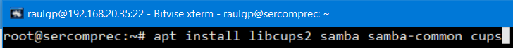

	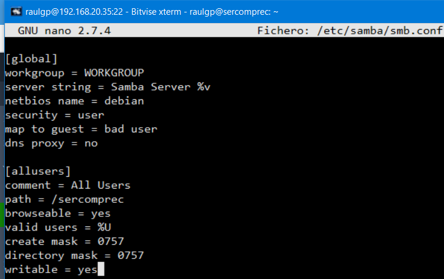

Escribimos el comando, `# service smbd restart`, para reiniciar el servidor Samba.

	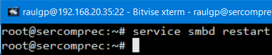

Escribimos el comando, `# mkdir /sercomprec`, y escribimos el comando, `# chmod o=rwx /sercomprec`, para establecer al recurso compartido los permisos especificados.

	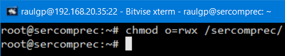

Escribimos el comando, `# smbpasswd -a "nombre de usuario"`, para establecer la contraseña de un usuario en el servidor Samba.

	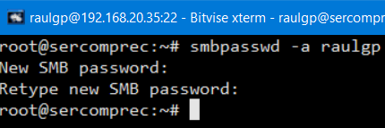

Nos vamos al equipo cliente, escribimos el comando, `# apt install cifs-utils`, y escribimos el comando, `# mount -t cifs -o user="nombre de usuario",vers=3.0 //192.168.20.35/allusers /mnt/`, para montar el recurso compartido.

	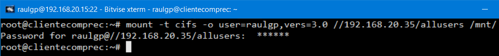

	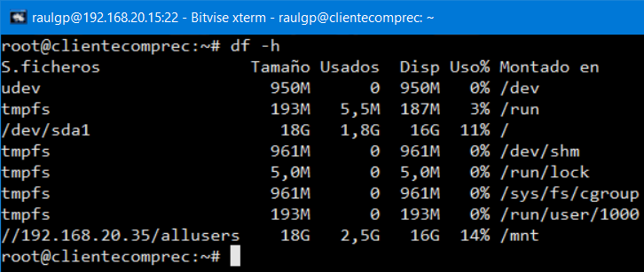

### 3.2  Compartición por NFS

Escribimos el comando, `# apt install nfs-kernel-server nfs-common`, escribimos el comando, `# nano /etc/exports`, y escribimos el contenido.

	/sercomprec 192.168.20.15(rw,sync,no_subtree_check)

	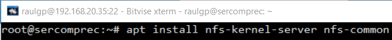

	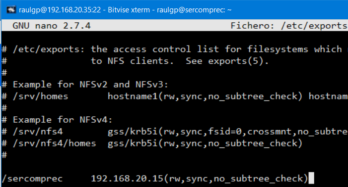

Escribimos el comando, `# service nfs-kernel-server restart`, para reiniciar el sevidor NFS.

	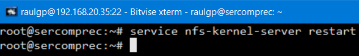

Escribimos el comando, `# mkdir /sercomprec`, y escribimos el comando, `# chmod o=rwx /sercomprec`, para establecer al recurso compartido los permisos especificados.

	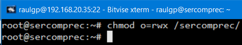

Nos vamos al equipo cliente, escribimos el comando, `# apt install nfs-common`, y escribimos el comando, `# mount -t nfs 192.168.20.35:/sercomprec /home/ldap/`, para montar el recurso especificado.

	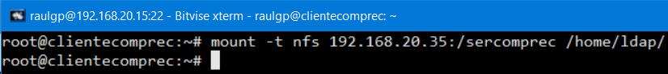

	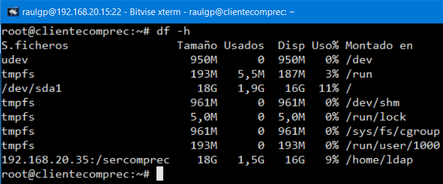

### 3.3  Compartición por SSHFS

Escribimos el comando, `# mkdir /sercomprec`, y escribimos el comando, `# chmod o=rwx /sercomprec`, para establecer al recurso compartido los permisos especificados.

	

Nos vamos al equipo cliente, escribimos el comando, `# apt install sshfs`, y escribimos el comando, `# sshfs raulgp@192.168.20.35:/sercomprec /home/ftp/`, para montar el recurso especificado.

	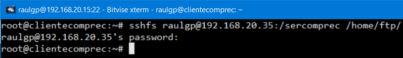

	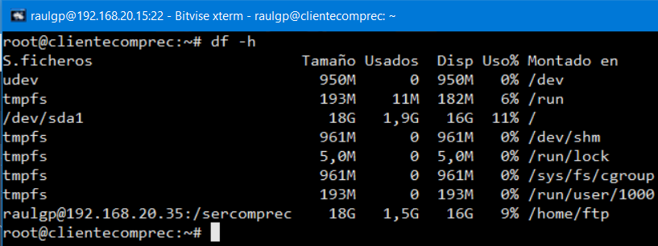

### 3.4  Compartición por FTP

En un servidor ftp instalado y configurado, escribimos el comando, `# scp /home/raulgp/certificadoseg.pem raulgp@192.168.20.35:/home/raulgp/`, para copiar el certificado SSL a los clientes ftp.

	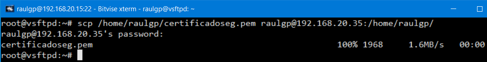

Nos vamos al equipo cliente, escribimos el comando, `# apt install curlftpfs`, y escribimos el comando, `# curlftpfs -o user=raulgp,ssl,cacert=/home/raulgp/certificadoseg.pem,no_verify_hostname,allow_other 192.168.20.15 /mnt/`, para montar el recurso especificado.

	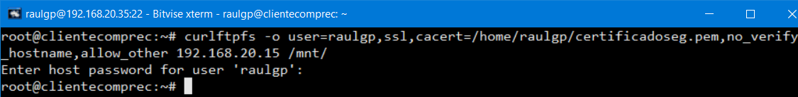

	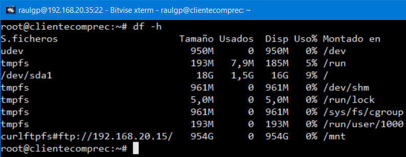

### 3.5  Compartición por iSCSI

Escribimos el comando, `# apt install tgt`, escribimos el comando, `# nano /etc/tgt/conf.d/sercomprec.conf`, y escribimos el contenido.

	<target iqn.2021-05.192.168.20.35:disk1> # Nomenclatura del recurso compartido
	incominguser raulgp A123a. # Establecimiento del inicio de sesión del iniciador
	backing-store /dev/sdb # Establecimiento del recurso compartido
	</target>

	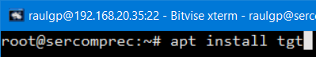

	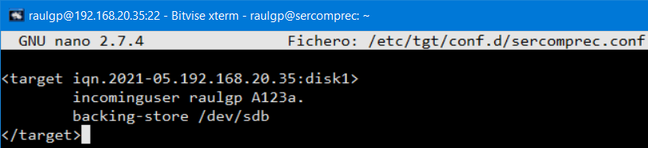

	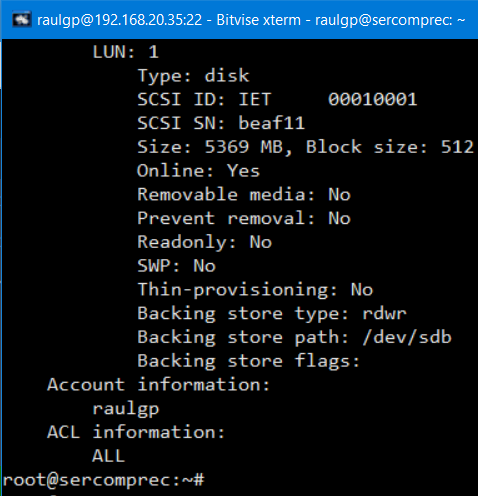

Nos vamos al equipo cliente, escribimos el comando, `# apt install open-iscsi`, y escribimos el comando, `# iscsiadm -m discovery -t st -p 192.168.20.35`, para descubrir los recursos compartidos del servidor iSCSI.

	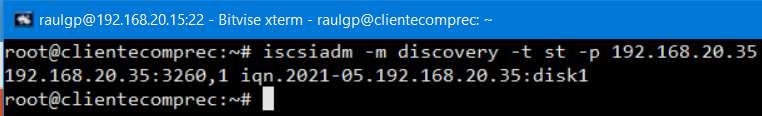

Escribimos el comando, `# nano /etc/iscsi/nodes/"nombre de archivo"/"nombre de archivo"/default`, y escribimos el contenido.

	# Habilitación de la conexión automática del recurso compartido
	node.startup = automatic
	
	# Establecimiento del inicio de sesión del iniciador
	node.session.auth.authmethod = CHAP
	node.session.auth.username = raulgp
	node.session.auth.password = A123a.

	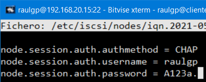

Escribimos el comando, `# service open-iscsi restart`, para reiniciar el servicio del iniciador iSCSI.

	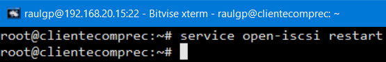

	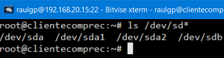

## 4  Webgrafía

<https://www.howtoforge.com/tutorial/debian-samba-server/>  
<https://www.howtoforge.com/tutorial/install-nfs-server-and-client-on-debian/>  
<https://linuxconfig.org/mount-remote-ftp-directory-host-locally-into-linux-filesystem>  
<https://linux.die.net/man/1/curlftpfs>  
<https://www.tecmint.com/setup-iscsi-target-and-initiator-on-debian-9/>

## 5  Conclusión

La compartición de recursos es una manera sencilla de transferir archivos y centralizar los datos de los equipos de una red.
