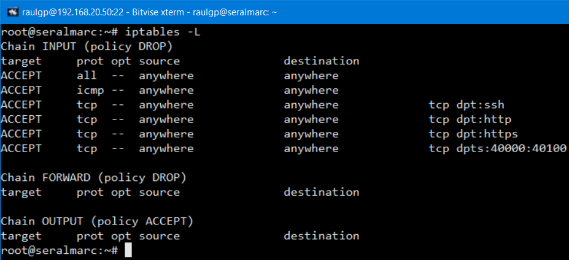

# Servidor de almacenamiento de archivos en línea

## Índice

### [1 Introducción](#1--Introducción)

### [2 Requerimientos](#2--Requerimientos)

### [3 Preparación](#3--Preparación)
#### &nbsp; &nbsp; [3.1 Instalación](#31--Instalación)
#### &nbsp; &nbsp; [3.2 Configuración del servidor web](#32--Configuración-del-servidor-web)
#### &nbsp; &nbsp; [3.3 Configuración de la base de datos](#33--Configuración-de-la-base-de-datos)
#### &nbsp; &nbsp; [3.4 Comprobación](#34--Comprobación)
#### &nbsp; &nbsp; [3.5 Seguridad](#35--Seguridad)
##### &nbsp; &nbsp; &nbsp; &nbsp; &nbsp; &nbsp; [3.5.1 Establecimiento de cuotas de usuario](#351--Establecimiento-de-cuotas-de-usuario)
##### &nbsp; &nbsp; &nbsp; &nbsp; &nbsp; &nbsp; [3.5.2 Cortafuegos](#352--Cortafuegos)
#### &nbsp; &nbsp; [3.6 Comprobación de la seguridad](#36--Comprobación-de-la-seguridad)

### [4 Webgrafía](#4--Webgrafía)

### [5 Conclusión](#5--Conclusión)

---

## 1  Introducción

Un servidor de almacenamiento de archivos en línea, es un servidor de alojamiento de Internet diseñado específicamente para alojar contenido estático, mayormente archivos de gran tamaño, que no son páginas web.

En general permiten acceso web y ftp, y pueden estar optimizados para servir a muchos usuarios o para el almacenamiento de uno únicamente.

En una empresa la aplicación más común de un servidor de almacenamiento de archivos en línea es alojar archivos de cualquier tipo y tamaño, y ofrecer un servicio de hosting a los clientes a través de la red.

## 2  Requerimientos

Todas las máquinas virtuales tienen el sistema operativo Debian 9 stretch.

- Hipervisor VMware Workstation.

- Servidor ssh en las máquinas virtuales.

- Cliente ssh en la máquina anfitriona.

## 3  Preparación

En una máquina virtual accedemos mediante ssh desde la máquina anfitriona.

### 3.1  Instalación

Escribimos el comando, `# nano /etc/apt/sources.list`, y escribimos el contenido.

    deb https://packages.sury.org/php/ stretch main
    deb https://download.owncloud.org/download/repositories/stable/Debian 9.0/ /

	

Escribimos el comando, `# apt install apt-transport-https`, escribimos el comando, `# wget -qO- https://download.owncloud.org/download/repositories/stable/Debian_9.0/Release.key | apt-key add -`, y actualizamos los repositorios, para descargar e insertar la llave del repositorio de owncloud.

	

Escribimos el comando, `# apt install libapache2-mod-php7.4 openssl php-imagick php7.4-common php7.4-curl php7.4-gd php7.4-imap php7.4-intl php7.4-json php7.4-ldap php7.4-mbstring php7.4-mcrypt php7.4-mysql php7.4-pgsql php-smbclient php-ssh2 php7.4-sqlite3 php7.4-xml php7.4-zip php-redis php-apcu`, para instalar las librerías de php.

	

Escribimos el comando, `# apt install owncloud-complete-files`, y escribimos el comando, `# chown -R www-data: /var/www/owncloud/`, para instalar el servidor owncloud y cambiar el propietario de los archivos.

	

### 3.2  Configuración del servidor web

En la misma máquina virtual con un servidor apache2 instalado y configurado, escribimos el comando, `# nano /etc/apache2/sites-available/owncloud.conf`, y escribimos el contenido.

	<VirtualHost *:443>
	  ServerName seralmarc.asir # Establecimiento del nombre del servidor
	  Alias /owncloud "/var/www/owncloud/" # Establecimiento del nombre del alias
	  
	# Establecimiento de las opciones de la ruta de los directorios
	  <Directory /var/www/owncloud/>
	    Options -Indexes +FollowSymlinks
	    AllowOverride All
	    Require all granted
	    
	      <IfModule mod_dav.c>
	        Dav off
	      </IfModule>
	      
	    SetEnv HOME /var/www/owncloud
	    SetEnv HTTP_HOME /var/www/owncloud
	  </Directory>
	  
	# Establecimiento de la ruta de los certificados SSL
	  SSLEngine on
	
	  SSLCertificateFile /home/raulgp/certificadoseg.pem
	  SSLCertificateKeyFile /home/raulgp/certificadoseg.key
	</VirtualHost>

	

Escribimos el comando, `# a2ensite owncloud.conf`, y escribimos el comando, `# service apache2 restart`, para reiniciar el servidor apache.

	

### 3.3  Configuración de la base de datos

En otra máquina virtual con un servidor MariaDB instalado y configurado, escribimos la sentencia, `> create database owncloud character set utf8;`, escribimos la sentencia, `> grant all privileges on owncloud.* to 'owncloud'@'%' identified by 'A123a.';`, y escribimos la sentencia, `> flush privileges;`, para actualizar los permisos.

	

### 3.4  Comprobación

Ejecutamos el navegador web, escribimos la dirección del servidor, escribimos el nombre de usuario y contraseña del usuario administrador, seleccionamos la base de datos MariaDB, escribimos el nombre de usuario y contraseña de la base de datos, escribimos la dirección IP del servidor de la base de datos, y le damos a completar la instalación.

	

### 3.5  Seguridad

Ejecutamos el navegador web, y escribimos el nombre de usuario y la contraseña del usuario administrador.

#### 3.5.1  Establecimiento de cuotas de usuario

Nos vamos a usuarios, le damos a configuración, y seleccionamos el cupo predeterminado, para establecer una cuota de usuario predeterminada.

	

#### 3.5.2  Cortafuegos

Escribimos el comando, `# nano regowncloudiptables.sh`, y escribimos el contenido.

	# Limpieza de todas las reglas y denegar o aceptar las conexiones
	iptables -F
	iptables -X
	iptables -Z
	iptables -t nat -F
	iptables -P INPUT DROP
	iptables -P FORWARD DROP
	iptables -P OUTPUT ACCEPT
	
	echo "40000 40100" > /proc/sys/net/ipv4/ip_local_port_range
	
	# Aceptar los protocolos y los puertos de entrada en las interfaces de red
	iptables -A INPUT -i lo -p all -j ACCEPT
	iptables -A INPUT -p icmp -j ACCEPT
	iptables -A INPUT -p tcp --dport 22 -j ACCEPT
	iptables -A INPUT -p tcp --dport 80 -j ACCEPT
	iptables -A INPUT -p tcp --dport 443 -j ACCEPT
	iptables -A INPUT -p tcp --dport 40000:40100 -j ACCEPT

	

### 3.6  Comprobación de la seguridad

Ejecutamos el navegador web, iniciamos sesión, le damos a subir, y seleccionamos el archivo, comprobamos que excedemos el tamaño de la cuota de usuario predeterminada.

	

Escribimos el comando, `# iptables -L`, para mostrar las reglas de iptables establecidas.

	

## 4  Webgrafía

<https://linuxhostsupport.com/blog/how-to-install-owncloud-10-on-debian-9/>  
<https://doc.owncloud.com/server/10.7/>

## 5  Conclusión

Un servidor de almacenamiento de archivos en línea es una manera sencilla de alojar archivos y ofrecer un servicio de hosting a los usuarios.
