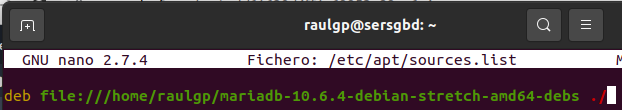
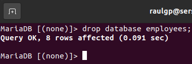

# Servidor de base de datos relacional

## Índice

### [1 Introducción](#1--Introducción)

### [2 Requerimientos](#2--Requerimientos)

### [3 Preparación](#3--Preparación)
#### &nbsp; &nbsp; [3.1 Instalación](#31--Instalación)
#### &nbsp; &nbsp; [3.2 Creación de usuario y asignación de permisos](#32--Creación-de-usuarios-y-asignación-de-permisos)
#### &nbsp; &nbsp; [3.3 Optimización y cacheo de consultas](#33--Optimización-y-cacheo-de-consultas)
#### &nbsp; &nbsp; [3.4 Seguridad](#34--Seguridad)
##### &nbsp; &nbsp; &nbsp; &nbsp; &nbsp; &nbsp; [3.4.1 Conexión por SSL](#341--Conexión-por-SSL)
##### &nbsp; &nbsp; &nbsp; &nbsp; &nbsp; &nbsp; [3.4.2 Copias de seguridad](#342--Copias-de-seguridad)
##### &nbsp; &nbsp; &nbsp; &nbsp; &nbsp; &nbsp; [3.4.3 Cortafuegos](#343--Cortafuegos)
#### &nbsp; &nbsp; [3.5 Comprobación de la seguridad](#35--Comprobación-de-la-seguridad)

### [4 Webgrafía](#4--Webgrafía)

### [5 Conclusión](#5--Conclusión)

---

## 1  Introducción

Un servidor MySQL es un sistema de gestión de bases de datos relacional desarrollado bajo licencia dual, y está considerada como la base de datos de código abierto más popular del mundo junto a Oracle y Microsoft SQL Server.

A raı́z de la compra de Sun Microsystems por parte de Oracle. Nace una bifurcación directa llamada MariaDB que asegura la existencia de una versión de este producto con licencia GPL, tiene una alta compatibilidad con MySQL ya que posee las mismas órdenes, interfaces, API y bibliotecas, siendo su objetivo poder cambiar un servidor por otro directamente.

Ambos sistemas gestores de base de datos están desarrollados en su mayor parte en ANSI C y C++, utilizando el puerto 3306 y tradicionalmente considerados como uno de los cuatro componentes de la pila de desarrollo LAMP.

En una empresa la aplicación más común de un servidor MySQL/MariaDB es almacenar grandes cantidades de datos relacionados entre sı́, y crear contenido dinámico para el desarrollo web.

## 2  Requerimientos

Todas las máquinas virtuales tienen el sistema operativo Debian 9 stretch.

- Hipervisor VMware Workstation.

- Servidor ssh en las máquinas virtuales.

- Cliente ssh en la máquina anfitriona.

## 3  Preparación

En una máquina virtual accedemos mediante ssh desde la máquina anfitriona.

### 3.1  Instalación

Escribimos el comando. `# wget https://dlm.mariadb.com/1807756/mariadb/mariadb-10.6.4/repo/debian/mariadb-10.6.4-debian-stretch-amd64-debs.tar`, lo desempaquetamos, escribimos el comando, `# nano /etc/apt/sources.list`, y escribimos el contenido.

	deb file:///home/raulgp/mariadb-10.6.4-debian-stretch-amd64-debs ./

	

Actualizamos los repositorios, escribimos el comando, `# apt install mariadb-server`, y escribimos el comando, `# mysql_secure_installation`, para securizar la instalación del servidor MariaDB.

	

Escribimos el comando, `# nano /etc/mysql/mariadb.conf.d/50-server.cnf`, y escribimos el contenido.

	bind-address = 0.0.0.0 # Dirección de la interfaz de escucha de peticiones

	

Escribimos el comando, `# service mysql restart`, y escribimos el comando, `# netstat -putan | egrep ":3306"`, para comprobar que esta escuchando peticiones el servidor MariaDB.

	

	

### 3.2  Creación de usuarios y asignación de permisos

Escribimos la sentencia, `> create user 'nombre de usuario'@'dirección ip' identified by 'contraseña';`, para crear un usuario en el servidor MariaDB.

	

Escribimos la sentencia, `> grant select (emp_no, first_name, last_name) on employees.employees to 'raulgp'@'%';` , y escribimos la sentencia, `> flush privileges;`, para actualizar los permisos.

	

	

	

	

### 3.3  Optimización y cacheo de consultas

Escribimos la sentencia, `> select count(distinct first_name), count(distinct last_name) from employees;`, para comprobar cual de las columnas de la tabla tiene mayor cardinalidad.

	

Escribimos la sentencia, `> create index ordemp on employees (last_name, first_name);`, para crear un ı́ndice en la tabla especificada.

	

Escribimos el comando, `# nano /etc/mysql/mariadb.conf.d/50-server.cnf`, para activar la cache y escribimos el contenido.

	query_cache_type = ON

	

Reiniciamos el servidor MariaDB, escribimos la sentencia, `> show variables like 'query_cache_type';`, comprobamos que la cache esta activa.

	

Escribimos la sentencia, `> select * from employees where first_name = 'prueba' and last_name = 'prueba2';`, y escribimos la sentencia, `> show status like 'qc%'; `, comprobamos que ha cacheado la consulta especificada.

	

### 3.4  Seguridad

Nos vamos al directorio principal de los archivos del servidor MariaDB.

#### 3.4.1  Conexión por SSL

Escribimos el comando, `# openssl genrsa 2048 > ca-key.pem`, y escribimos el comando, `# openssl req -new -x509 -nodes -days 3600 -key ca-key.pem -out ca.pem`, para generar los certificados SSL de la entidad certificadora.

	

	

Escribimos el comando, `# openssl req -newkey rsa:2048 -days 3600 -nodes -keyout server-key.pem -out server-req.pem`, escribimos el comando, `# openssl rsa -in server-key.pem -out server-key.pem`, y escribimos el comando, `# openssl x509 -req -in server-req.pem -days 3600 -CA ca.pem -CAkey ca-key.pem -set serial 01 -out server-cert.pem`, para generar los certificados SSL del servidor MariaDB.

	

	

Escribimos el comando, `# openssl req -newkey rsa:2048 -days 3600 -nodes -keyout client-key.pem -out client-req.pem`, escribimos el comando, `# openssl rsa -in client-key.pem -out client-key.pem`, y escribimos el comando, `# openssl x509 -req -in client-req.pem -days 3600 -CA ca.pem -CAkey ca-key.pem -set serial 01 -out client-cert.pem`, para generar los certificados SSL del cliente MariaDB.

	

	

Escribimos el comando, `# openssl verify -CAfile ca.pem server-cert.pem client-cert.pem`, para comprobar la verificación de los certificados SSL.

	

Escribimos el comando, `# chown -R mysql:mysql *.pem`, y escribimos el comando, `# chmod 600 *.pem`, para establecer los permisos especificados.

	

Escribimos el comando, `# nano /etc/mysql/mariadb.conf.d/50-server.cnf`, y escribimos el contenido.

	ssl-ca = /etc/mysql/ca.pem
	ssl-cert = /etc/mysql/server-cert.pem
	ssl-key = /etc/mysql/server-key.pem
	require-secure-transport = on # Habilitación de la conexión SSL de los clientes

	

Escribimos el comando, `# nano /etc/mysql/mariadb.conf.d/50-client.cnf`, y escribimos el contenido.

	ssl-ca=/etc/mysql/ca.pem
	ssl-cert = /etc/mysql/client-cert.pem
	ssl-key = /etc/mysql/client-key.pem

	

Escribimos el comando, `# service mysql restart`, para reiniciar el servidor MariaDB.

	

#### 3.4.2  Copias de seguridad

Escribimos el comando, `# nano /etc/mysql/mariadb.conf.d/50-server.cnf`, para activar el log binario y escribimos el contenido.

	server-id = 1
	log_bin = /var/log/mysql/mysql-bin.log # Habilitación del log binario

	

Escribimos el comando, `# service mysql restart`, para reiniciar el servidor MariaDB.

	

Escribimos el comando, `# mysqldump -u root -p --all-databases --master-data --single-transaction > copent.sql`, para generar una copia de seguridad completa del servidor MariaDB.

	

	

Escribimos la sentencia, `> flush binary logs;`, para generar una copia de seguridad incremental del servidor MariaDB.

	

	

#### 3.4.3  Cortafuegos

Escribimos el comando, `# nano regdbiptables.sh`, y escribimos el contenido.

	# Limpieza de todas las reglas y denegar o aceptar las conexiones
	iptables -F
	iptables -X
	iptables -Z
	iptables -t nat -F
	iptables -P INPUT DROP
	iptables -P FORWARD DROP
	iptables -P OUTPUT ACCEPT
	
	echo "40000 40100" > /proc/sys/net/ipv4/ip_local_port_range
	
	# Aceptar los protocolos y los puertos de entrada en las interfaces de red
	iptables -A INPUT -i lo -p all -j ACCEPT
	iptables -A INPUT -p icmp -j ACCEPT
	iptables -A INPUT -p tcp --dport 22 -j ACCEPT
	iptables -A INPUT -p tcp --dport 3306 -j ACCEPT
	iptables -A INPUT -p tcp --dport 40000:40100 -j ACCEPT

	

### 3.5  Comprobación de la seguridad

Nos vamos a la máquina anfitriona, ejecutamos el Wireshark, seleccionamos la interfaz de red especificada, le damos a capturar, le damos a empezar, comprobamos que la conexión establecida esta encriptada.

	

Escribimos el comando, `# rm /var/lib/mysql/* -rf`, para eliminar las bases de datos del servidor MariaDB.

	

Escribimos el comando, `# mysql_install_db`, para instalar las bases de datos necesarias para que funcione el servidor MariaDB.

	

Reinicimos el servidor MariaDB, y escribimos el comando, `# mysql -t < copent.sql`, para volcar la copia de seguridad completa en el servidor MariaDB.

	

	

Escribimos la sentencia, `> drop database employees;`, para eliminar una base de datos del servidor MariaDB.

	

Escribimos el comando, `# mysqlbinlog /var/log/mysql/mysql-bin.000007 | mysql -u root -p`, para volcar la copia de seguridad incremental en el servidor MariaDB.

	

	

Escribimos el comando, `# iptables -L`, para mostrar las reglas de iptables establecidas.

	

## 4  Webgrafía

<https://dev.mysql.com/doc/refman/5.7/en/>  
<https://www.howtoforge.com/tutorial/how-to-enable-ssl-and-remote-connections-for-mysql-on-centos-7/>

## 5  Conclusión

Un servidor de base de datos relacional es una manera sencilla de almacenar grandes cantidades de datos y crear contenido dinámico en el desarrollo web.
