# Servidor de correo

## Índice

### [1 Introducción](#1--Introducción)

### [2 Requerimientos](#2--Requerimientos)

### [3 Preparación](#3--Preparación)
#### &nbsp; &nbsp; [3.1 Instalación del MTA](#31--Instalación-del-MTA)
#### &nbsp; &nbsp; [3.2 Instalación del agente](#32--Instalación-del-agente)
#### &nbsp; &nbsp; [3.3 Seguridad](#33--Seguridad)
##### &nbsp; &nbsp; &nbsp; &nbsp; &nbsp; &nbsp; [3.3.1 Conexión por SSL](#331--Conexión-por-SSL)
##### &nbsp; &nbsp; &nbsp; &nbsp; &nbsp; &nbsp; [3.3.2 Detección de spam y virus](#332--Detección-de-spam-y-virus)
##### &nbsp; &nbsp; &nbsp; &nbsp; &nbsp; &nbsp; [3.3.3 Cortafuegos](#333--Cortafuegos)
#### &nbsp; &nbsp; [3.4 Comprobación de la seguridad](#34--Comprobación-de-la-seguridad)

### [4 Webgrafía](#4--Webgrafía)

### [5 Conclusión](#5--Conclusión)

---

## 1  Introducción

El protocolo de red SMTP (Simple Mail Transfer Protocol) es un protocolo de red utilizado para el intercambio de mensajes de correo electrónico entre computadoras u otros dispositivos. El funcionamiento de este protocolo se da en lı́nea, de manera que opera en los servicios de correo electrónico, utilizando el puerto 25 o el 587 para retransmitir el correo saliente a una inicial del servidor de correo, y el puerto 465 para el SMTP seguro.

Este protocolo posee algunas limitaciones en cuanto a la recepción de mensajes en el servidor de destino. Como alternativa a esta limitación se otorga a SMTP la tarea especı́fica de enviar correos, y recibirlos empleando los otros protocolos POP o IMAP.

En una empresa la aplicación más común de un servidor de correo es prestar servicio de correo electrónico para el envı́o de mensajes en una red.

## 2  Requerimientos

Todos los contenedores tienen el sistema operativo Debian 9 stretch.

- Aplicación de virtualización Docker.

- Servidor ssh en los contenedores.

- Cliente ssh en la máquina anfitriona.

## 3  Preparación

En un contenedor accedemos mediante ssh desde la máquina anfitriona.

### 3.1  Instalación del MTA

Escribimos el comando, `# apt install postfix mailutils`, para instalar el servidor postfix.

	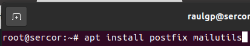

Seleccionamos Internet Site como el tipo de configuración general del servidor postfix.

	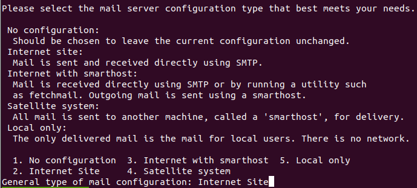

Escribimos el nombre del dominio para establecer el nombre del sistema de correo del servidor postfix.

	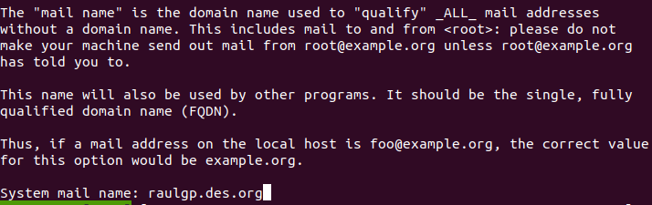

Escribimos el comando, `# nano /etc/postfix/main.cf`, y escribimos el contenido.

	myorigin = raulgp.des.org
	mydestination = $myhostname, $myorigin, localhost.$myorigin, localhost
	mynetworks = 127.0.0.0/8 [::ffff:127.0.0.0]/104 [::1]/128 192.168.20.0/24

	home_mailbox = Maildir/

	smtpd_sasl_type = dovecot
	smtpd_sasl_path = private/auth
	smtpd_sasl_auth_enable = yes
	smtpd_sasl_security_options = noanonymous
	smtpd_sasl_local_domain = $myhostname
	smtpd_recipient_restrictions = permit_mynetworks,permit_auth_destination,permit_sasl_authenticated,reject

	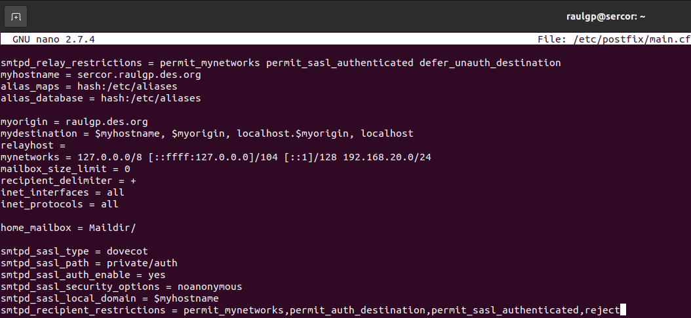

Escribimos el comando, `# /etc/init.d/postfix restart`, para reiniciar el servidor postfix.

	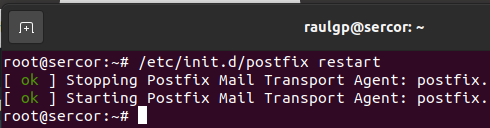

	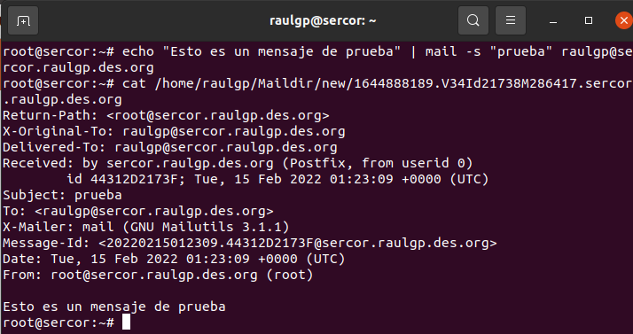

### 3.2  Instalación del agente

Escribimos el comando, `# apt install dovecot-core dovecot-imapd`, para instalar el agente dovecot.

	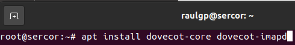

Escribimos el comando, `# nano /etc/dovecot/dovecot.conf`, y escribimos el contenido.

	listen = *, ::

	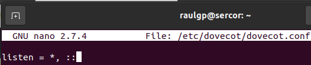

Escribimos el comando, `# nano /etc/dovecot/conf.d/10-auth.conf`, y escribimos el contenido.

	disable_plaintext_auth = no
	auth_mechanisms = plain login

	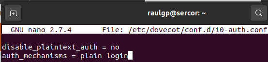

Escribimos el comando, `# nano /etc/dovecot/conf.d/10-mail.conf`, y escribimos el contenido.

	mail_location = maildir:~/Maildir

	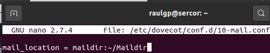

Escribimos el comando, `# nano /etc/dovecot/conf.d/10-master.conf`, y escribimos el contenido.

	  unix_listener /var/spool/postfix/private/auth {
	    mode = 0666
	    user = postfix
	    group = postfix
	  }
	}

	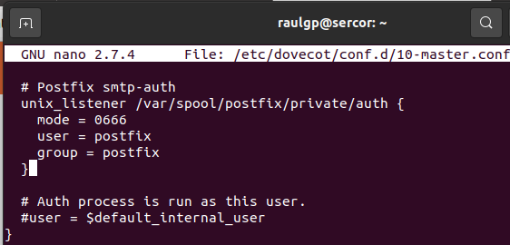

Escribimos el comando, `# /etc/init.d/dovecot restart`, para reiniciar el agente dovecot.

	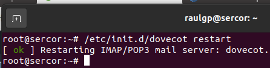

	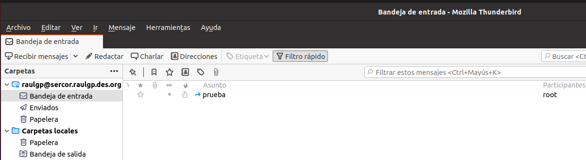

### 3.3  Seguridad

Escribimos el comando, `# apt install syslog-ng`, para instalar un servicio de generación de logs.

	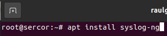

Escribimos el comando, `# /etc/init.d/syslog-ng restart`, para reiniciar el servicio de generación de logs.

	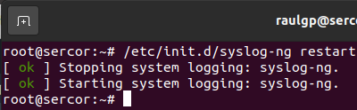

#### 3.3.1  Conexión por SSL

Escribimos el comando, `# openssl genrsa 4096 > /home/raulgp/certificadoseg.key`, para generar la llave del certificado SSL.

	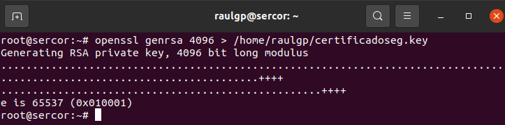

Escribimos el comando, `# openssl req -new -x509 -nodes -sha1 -days 365 -key /home/raulgp/certificadoseg.key > /home/raulgp/certificadoseg.pem`, para generar el certificado SSL especificado.

	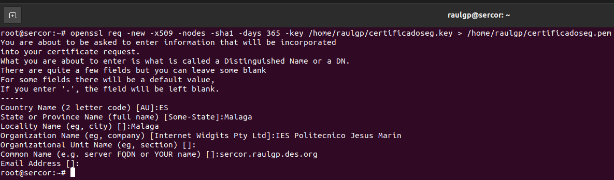

Escribimos el comando, `# chown root:ssl-cert /home/raulgp/certificadoseg.key`, y escribimos el comando, `# chmod 640 /home/raulgp/certificadoseg.key`, para establecer los permisos de la llave del certificado SSL.

	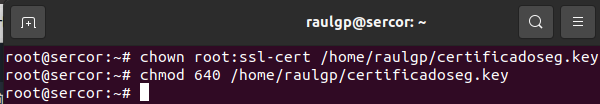

Escribimos el comando, `# nano /etc/postfix/main.cf`, y escribimos el contenido.

	smtpd_tls_cert_file=/home/raulgp/certificadoseg.pem
	smtpd_tls_key_file=/home/raulgp/certificadoseg.key
	smtpd_use_tls=yes
	smtpd_tls_session_cache_database = btree:${data_directory}/smtpd_scache
	smtp_tls_session_cache_database = btree:${data_directory}/smtp_scache

	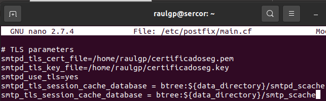

Escribimos el comando, `# nano /etc/dovecot/conf.d/10-ssl.conf`, y escribimos el contenido.

	ssl = yes
	ssl_cert = </home/raulgp/certificadoseg.pem
	ssl_key = </home/raulgp/certificadoseg.key

	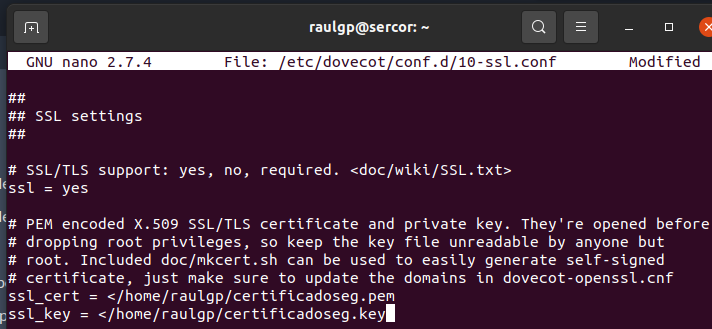

#### 3.3.2  Detección de spam y virus

Escribimos el comando, `# apt install amavisd-new spamassassin clamav clamav-daemon zoo unzip bzip2 libnet-ph-perl libnet-snpp-perl libnet-telnet-perl nomarch lzop razor pyzor`, para instalar el antispam y el antivirus.

	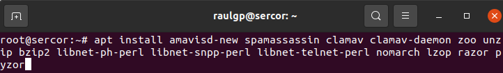

Escribimos el comando, `# nano /etc/amavis/conf.d/15-content_filter_mode`, y escribimos el contenido.

	@bypass_virus_checks_maps = (
	   \%bypass_virus_checks, \@bypass_virus_checks_acl, \$bypass_virus_checks_re);

	@bypass_spam_checks_maps = (
	   \%bypass_spam_checks, \@bypass_spam_checks_acl, \$bypass_spam_checks_re);

	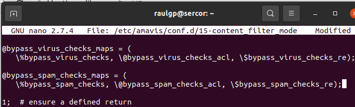

Escribimos el comando, `# nano /etc/amavis/conf.d/20-debian_defaults`, y escribimos el contenido.

	$sa_spam_subject_tag = '***SPAM*** ';
	$sa_tag_level_deflt  = -999;
	$sa_tag2_level_deflt = 4;
	$sa_kill_level_deflt = 10;
	$sa_dsn_cutoff_level = 10;

	$virus_admin = "amavis\@$mydomain";
	@local_domains_maps = ['.'];

	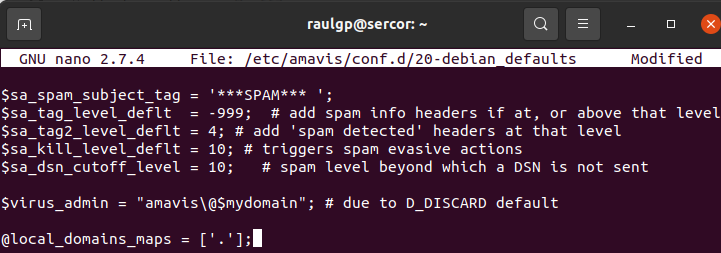

Escribimos el comando, `# addgroups clamav amavis`, para añadir un usuario al grupo especificado.

	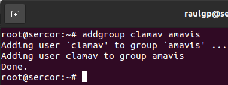

Escribimos el comando, `# nano /etc/spamassassin/local.cf`, y escribimos el contenido.

	use_pyzor 1
	pyzor_path /usr/bin/pyzor
	pyzor_timeout 10

	use_razor2 1
	razor_config /etc/razor/razor-agent.conf

	use_bayes 1
	use_bayes_rules 1
	bayes_auto_learn 1

	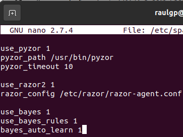

Escribimos el comando, `# nano /etc/default/spamassassin`, y escribimos el contenido.

	CRON=1

	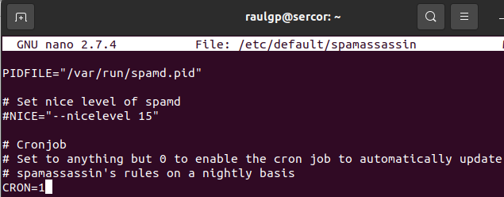

Escribimos el comando, `# nano /etc/postfix/main.cf`, y escribimos el contenido.

	content_filter = amavis:[127.0.0.1]:10024
	receive_override_options = no_address_mappings

	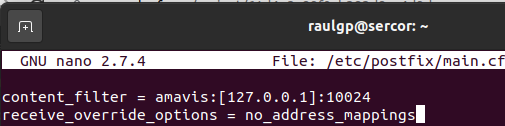

Escribimos el comando, `# nano /etc/postfix/master.cf`, y escribimos el contenido.

	amavis unix - - - - 2 smtp
		-o smtp_data_done_timeout=1200
		-o smtp_send_xforward_command=yes

	127.0.0.1:10025 inet n - - - - smtpd
		-o content_filter=
		-o local_recipient_maps=
		-o relay_recipient_maps=
		-o smtpd_restriction_classes=
		-o smtpd_delay_reject=no
		-o smtpd_client_restrictions=permit_mynetworks,reject
		-o smtpd_helo_restrictions=
		-o smtpd_sender_restrictions=
		-o smtpd_recipient_restrictions=permit_mynetworks,reject
		-o mynetworks_style=host
		-o mynetworks=127.0.0.0/8
		-o strict_rfc821_envelopes=yes
		-o smtpd_error_sleep_time=0
		-o smtpd_soft_error_limit=1001
		-o smtpd_hard_error_limit=1000
		-o smtpd_client_connection_count_limit=0
		-o smtpd_client_connection_rate_limit=0
		-o receive_override_options=no_unknown_recipient_checks,no_header_body_checks

	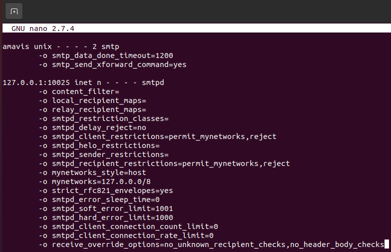

Escribimos el comando, `# /etc/init.d/amavis restart`, escribimos el comando, `# /etc/init.d/clamav-daemon restart`, escribimos el comando, `# /etc/init.d/clamav-freshclam restart`, y escribimos el comando, `# /etc/init.d/postfix restart`, para reiniciar los servicios especificados.

	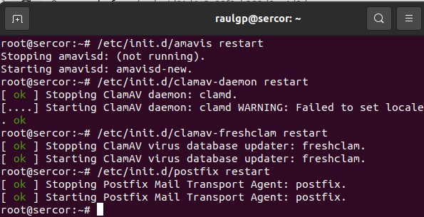

#### 3.3.3  Cortafuegos

Escribimos el comando, `# nano regcoriptables.sh`, y escribimos el contenido.

	# Limpieza de todas las reglas y denegar o aceptar las conexiones
	iptables -F
	iptables -X
	iptables -Z
	iptables -t nat -F
	iptables -P INPUT DROP
	iptables -P FORWARD DROP
	iptables -P OUTPUT ACCEPT
	
	echo "40000 40100" > /proc/sys/net/ipv4/ip_local_port_range
	
	# Aceptar los protocolos y los puertos de entrada en las interfaces de red
	iptables -A INPUT -i lo -p all -j ACCEPT
	iptables -A INPUT -p icmp -j ACCEPT
	iptables -A INPUT -p tcp --dport 22 -j ACCEPT
	iptables -A INPUT -p tcp --dport 143 -j ACCEPT
	iptables -A INPUT -p tcp --dport 25 -j ACCEPT
	iptables -A INPUT -p tcp --dport 993 -j ACCEPT
	iptables -A INPUT -p tcp --dport 40000:40100 -j ACCEPT

	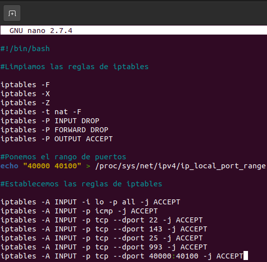

### 3.4  Comprobación de la seguridad

Nos vamos a la máquina anfitriona, ejecutamos el Wireshark, seleccionamos la interfaz de red especificada, le damos a capturar, le damos a empezar, comprobamos que la conexión establecida esta encriptada.

	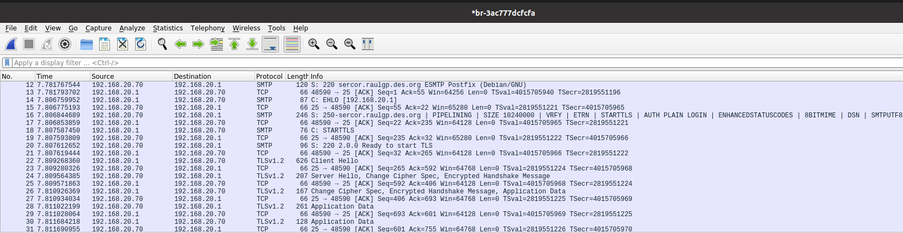

Enviamos un mensaje spam a una dirección de correo del servidor postix, y escribimos el comando, `# cat /var/log/mail.log`, para mostrar la detección del mensaje de spam del servidor postfix.

	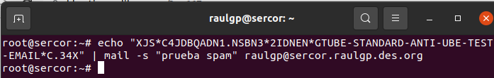

	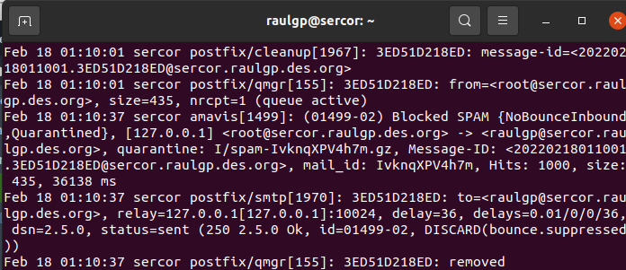

Enviamos un mensaje con archivo adjunto de un virus a una dirección de correo del servidor postix, y escribimos el comando, `# cat /var/log/mail.log`, para mostrar la detección del mensaje con un virus del servidor postfix.

	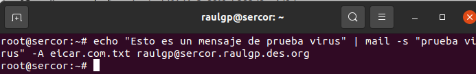

	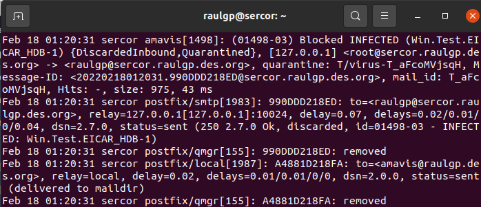

Escribimos el comando, `# iptables -L`, para mostrar las reglas de iptables establecidas.

	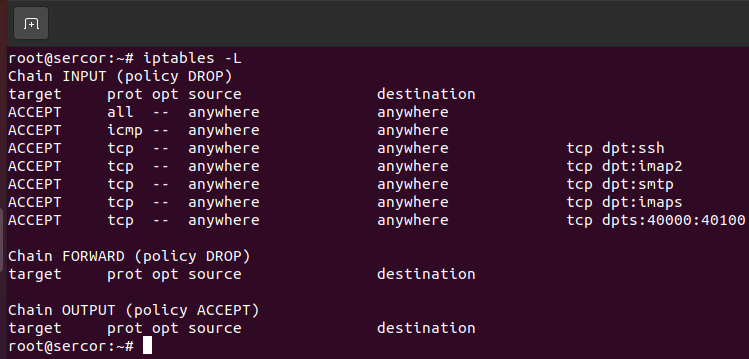

## 4  Webgrafía

<https://www.tecmint.com/install-postfix-mail-server-with-webmail-in-debian/>  
<https://blog.tiraquelibras.com/?p=667>  
<https://servidordebian.org/es/squeeze/email/filtering/amavisd_new>

## 5  Conclusión

Un servidor de correo es una manera sencilla de ofrecer un servicio de correo electrónico para enviar mensajes detectados sin spam ni virus en una red.
