# Servidor de mensajería instantánea

## Índice

### [1 Introducción](#1--Introducción)

### [2 Requerimientos](#2--Requerimientos)

### [3 Preparación](#3--Preparación)
#### &nbsp; &nbsp; [3.1 Instalación](#31--Instalación)
#### &nbsp; &nbsp; [3.2 Creación de objetos administrativos](#32--Creación-de-objetos-administrativos)
#### &nbsp; &nbsp; [3.3 Instalación de plugins](#33--Instalación-de-plugins)
#### &nbsp; &nbsp; [3.4 Seguridad](#34--Seguridad)
##### &nbsp; &nbsp; &nbsp; &nbsp; &nbsp; &nbsp; [3.4.1 Conexión por SSL](#341--Conexión-por-SSL)
##### &nbsp; &nbsp; &nbsp; &nbsp; &nbsp; &nbsp; [3.4.2 Cortafuegos](#342--Cortafuegos)
#### &nbsp; &nbsp; [3.5 Comprobación de la seguridad](#35--Comprobación-de-la-seguridad)

### [4 Webgrafía](#4--Webgrafía)

### [5 Conclusión](#5--Conclusión)

---

## 1  Introducción

El protocolo de red XMPP (Extensible Messaging and Presence Protocol) es abierto y extensible basado en XML, originalmente ideado para mensajerı́a instantánea, utilizando el puerto 5222 un cliente a un servidor, el puerto 5269 un servidor a otro servidor, y el puerto 5223 usando SSL.

Queda establecida una plataforma para el intercambio de datos XML, y las caracterı́sticas en cuanto a adaptabilidad y sencillez de este mismo protocolo son heredadas de este modo por el protocolo XMPP.

En una empresa la aplicación más común de un servidor de mensajerı́a instantánea es el envı́o de mensajes, conferencias y transferencias de archivos en una red.

## 2  Requerimientos

Todos los contenedores tienen el sistema operativo Debian 9 stretch.

- Aplicación de virtualización Docker.

- Servidor ssh en los contenedores.

- Cliente ssh en la máquina anfitriona.

## 3  Preparación

En un contenedor accedemos mediante ssh desde la máquina anfitriona.

### 3.1  Instalación

Escribimos el comando, `# apt install default-jre`, para instalar java.

	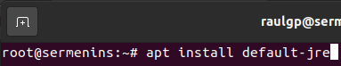

Escribimos el comando, `# wget https://www.igniterealtime.org/downloadServlet?filename=openfire/openfire_4.6.4_all.deb`, y escribimos el comando, `# dpkg -i openfire_4.6.4_all.deb`, para instalar servidor openfire.

	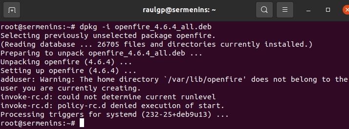

Reiniciamos el servidor openfire, nos vamos a la máquina anfitriona, ejecutamos un navegador web, escribimos la dirección del servidor openfire en el puerto de la consola de administración, seleccionamos el idioma, le damos a continuar, escribimos el nombre del equipo y le damos a continuar.

	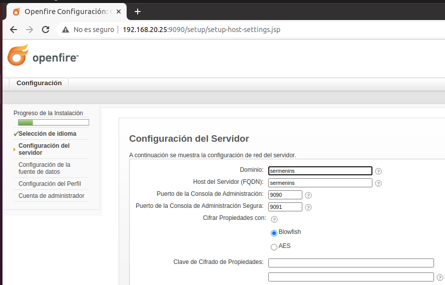

Seleccionamos conexión estándar en la configuración de la base de datos, le damos a continuar, seleccionamos el driver, escribimos la dirección del servidor de la base de datos, escribimos el nombre de usuario y la contraseña, y le damos a continuar.

	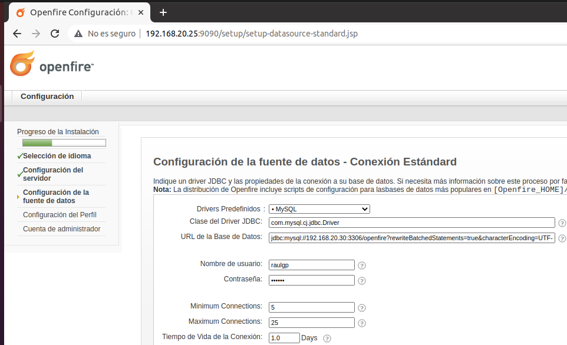

Seleccionamos el la configuración del perfil por defecto, le damos a continuar, escribimos la contraseña del usuario administrador, y le damos a continuar.

	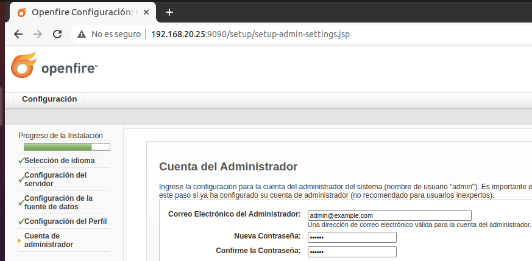

### 3.2  Creación de objetos administrativos

Nos vamos a usuarios/grupos, nos vamos a usuarios, le damos a crear nuevo usuario, escribimos el nombre de usuario, escribimos el nombre, escribimos la contraseña, y le damos a crear usuario, para crear un usuario en el servidor openfire.

	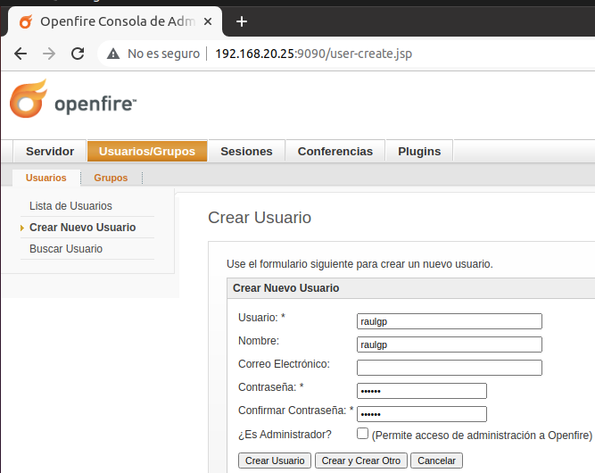

Nos vamos a usuarios/grupos, nos vamos a grupos, le damos a crear nuevo grupo, escribimos el nombre del grupo, y le damos a crear grupo, para crear un grupo en el servidor openfire.

	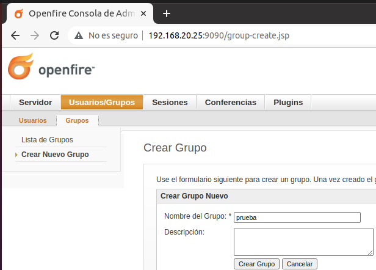

Nos vamos a conferencias, le damos a crear nueva sala, escribimos el ID de la sala, escribimos el nombre de la sala, escribimos la descripción, y le damos a guardar los cambios, para crear una sala de conferencia en el servidor openfire.

	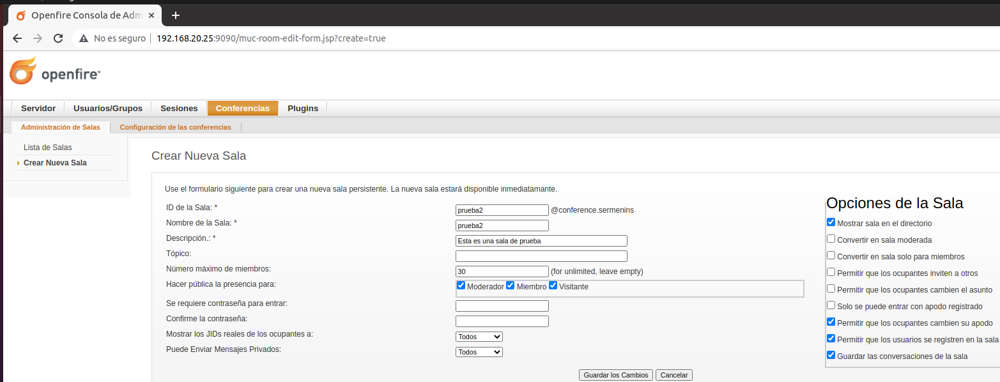

Nos vamos a la máquina anfitriona, ejecutamos el cliente spark, desactivamos la verificación del certificado del nombre de equipo, escribimos el nombre de usuario y la contraseña, escribimos la dirección del servidor openfire, y le damos a iniciar sesión.

	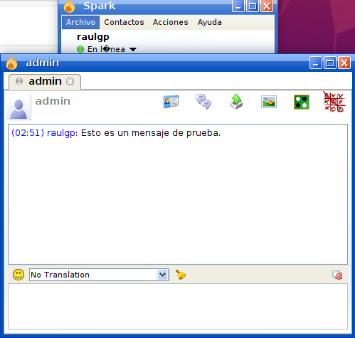

### 3.3  Instalación de plugins

Nos vamos a plugins, nos vamos a plugins disponibles, seleccionamos el plugin, y le damos a instalar.

- Content Filter: Escanea los mensajes enviados mediante un patrón especificado.

	Nos vamos a servidor, nos vamos a configuración del servidor, nos vamos a content filter, acivamos el filtro, escribimos el patrón, activamos el envı́o de paquetes al ser filtrado por un patrón, y le damos a guardar opciones.

	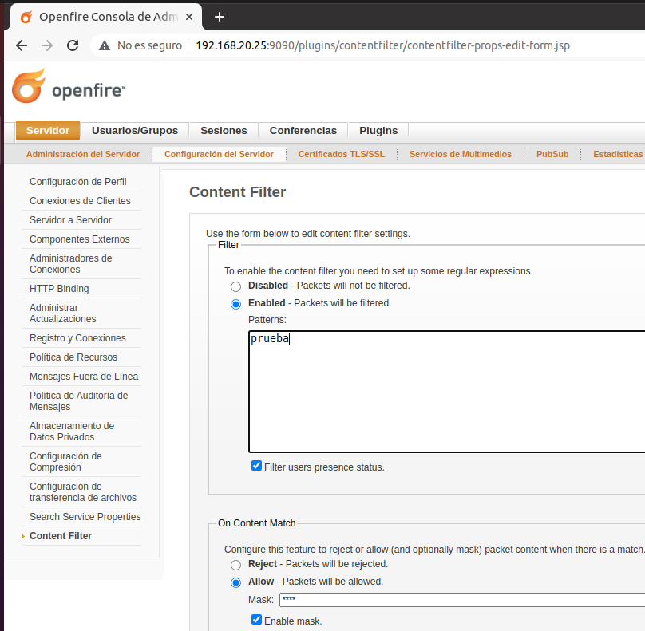

	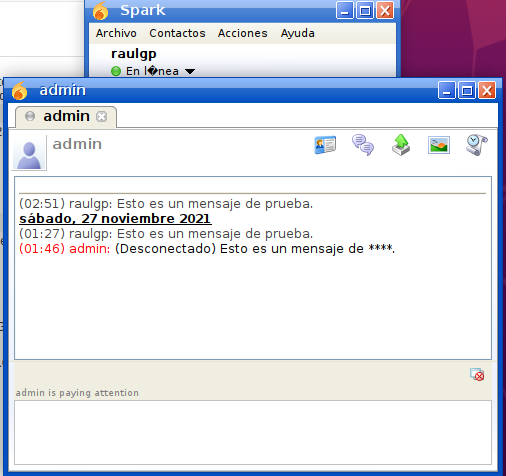

- Monitoring Service: Monitorización de conversaciones y estadı́sticas del servidor.

	Nos vamos a servidor, y nos vamos a estadı́sticas, para mostrar las estadı́sticas del servidor openfire.

	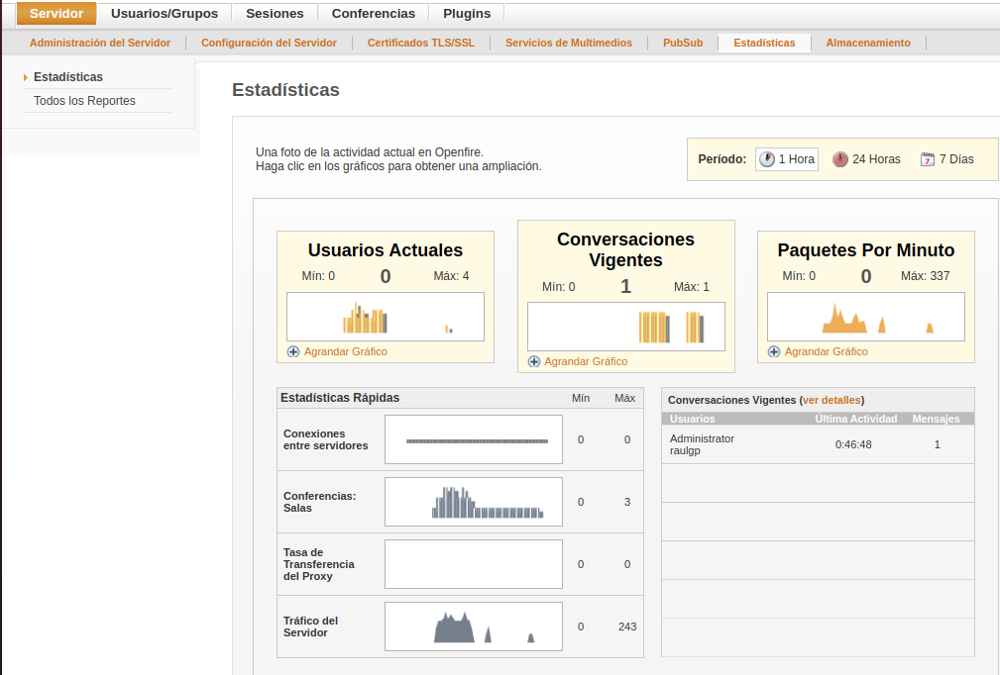

### 3.4  Seguridad

Nos vamos a la consola de administración, nos vamos a servidor, nos vamos a certificados TLS/SSL, le damos a administrar contenidos del almacén del almacén de identidad, y le damos a importados aquı́.

#### 3.4.1  Conexión por SSL

Escribimos el comando, `# openssl genrsa 4096 > /home/raulgp/certificadoseg.key`, para generar la clave del certificado SSL especificado.

	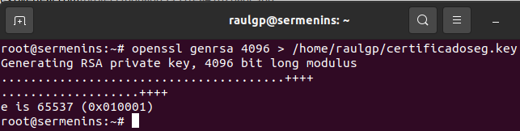

Escribimos el comando, `# openssl req -new -x509 -nodes -sha1 -days 365 -key /home/raulgp/certificadoseg.key > /home/raulgp/certificadoseg.pem`, para generar el certificado SSL especificado.

	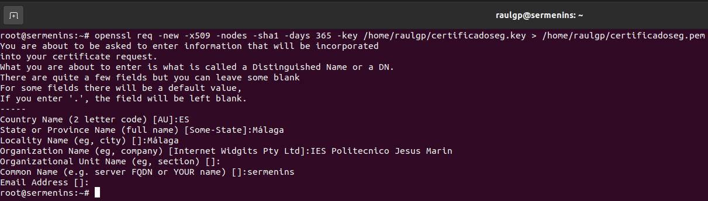

Escribimos el comando, `# cat "nombre de archivo"`, para copiar el contenido de los archivos en los formularios de la consola de administración, le damos a guardar, y reiniciamos el servidor openfire.

	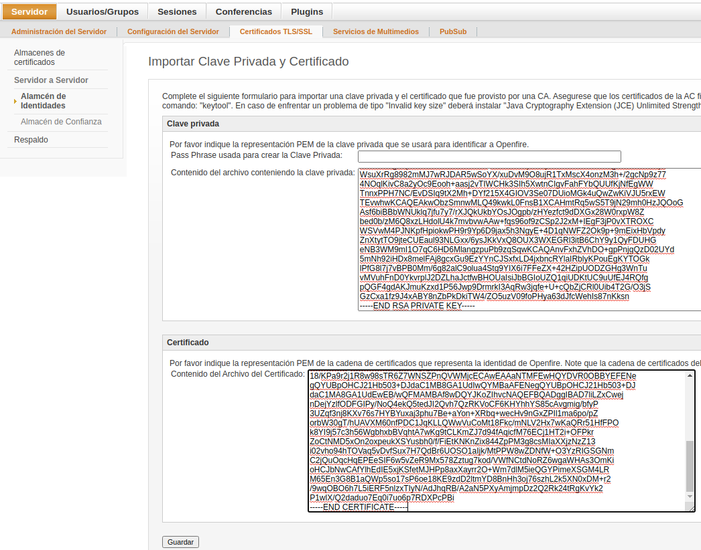

#### 3.4.2  Cortafuegos

Escribimos el comando, `# nano regmeninsiptables.sh`, y escribimos el contenido.

	# Limpieza de todas las reglas y denegar o aceptar las conexiones
	iptables -F
	iptables -X
	iptables -Z
	iptables -t nat -F
	iptables -P INPUT DROP
	iptables -P FORWARD DROP
	iptables -P OUTPUT ACCEPT
	
	echo "40000 40100" > /proc/sys/net/ipv4/ip_local_port_range
	
	# Aceptar los protocolos y los puertos de entrada en las interfaces de red
	iptables -A INPUT -i lo -p all -j ACCEPT
	iptables -A INPUT -p icmp -j ACCEPT
	iptables -A INPUT -p tcp --dport 22 -j ACCEPT
	iptables -A INPUT -p tcp --dport 5222 -j ACCEPT
	iptables -A INPUT -p tcp --dport 5223 -j ACCEPT
	iptables -A INPUT -p tcp --dport 7070 -j ACCEPT
	iptables -A INPUT -p tcp --dport 7443 -j ACCEPT
	iptables -A INPUT -p tcp --dport 5269 -j ACCEPT
	iptables -A INPUT -p tcp --dport 5270 -j ACCEPT
	iptables -A INPUT -p tcp --dport 5275 -j ACCEPT
	iptables -A INPUT -p tcp --dport 5276 -j ACCEPT
	iptables -A INPUT -p tcp --dport 5262 -j ACCEPT
	iptables -A INPUT -p tcp --dport 5263 -j ACCEPT
	iptables -A INPUT -p tcp --dport 9090 -j ACCEPT
	iptables -A INPUT -p tcp --dport 9091 -j ACCEPT
	iptables -A INPUT -p tcp --dport 7777 -j ACCEPT
	iptables -A INPUT -p tcp --dport 5229 -j ACCEPT
	iptables -A INPUT -p tcp --dport 40000:40100 -j ACCEPT

	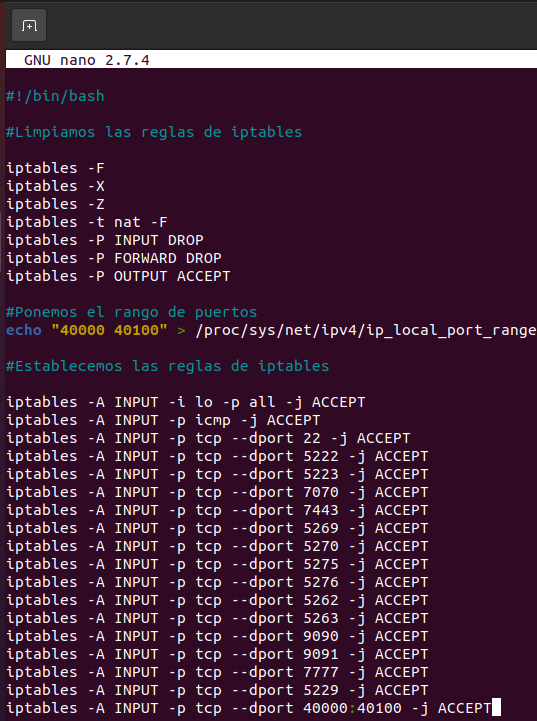

### 3.5  Comprobación de la seguridad

Nos vamos a la máquina anfitriona, ejecutamos el Wireshark, seleccionamos la interfaz de red especificada, le damos a capturar, le damos a empezar, comprobamos que la conexión establecida esta encriptada.

	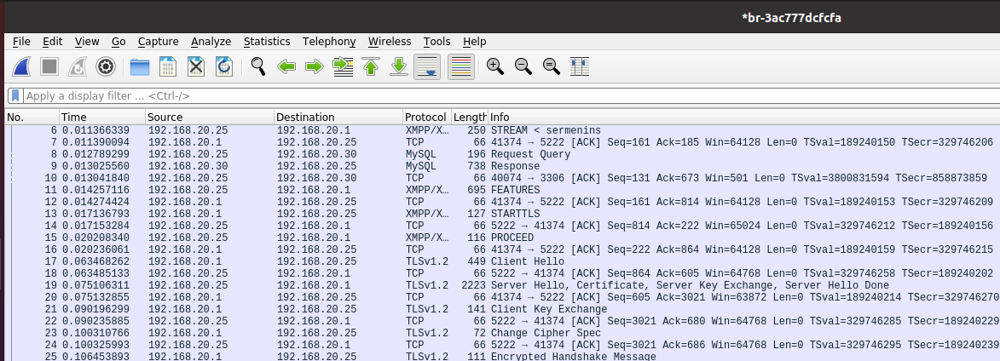

Escribimos el comando, `# iptables -L`, para mostrar las reglas de iptables establecidas.

	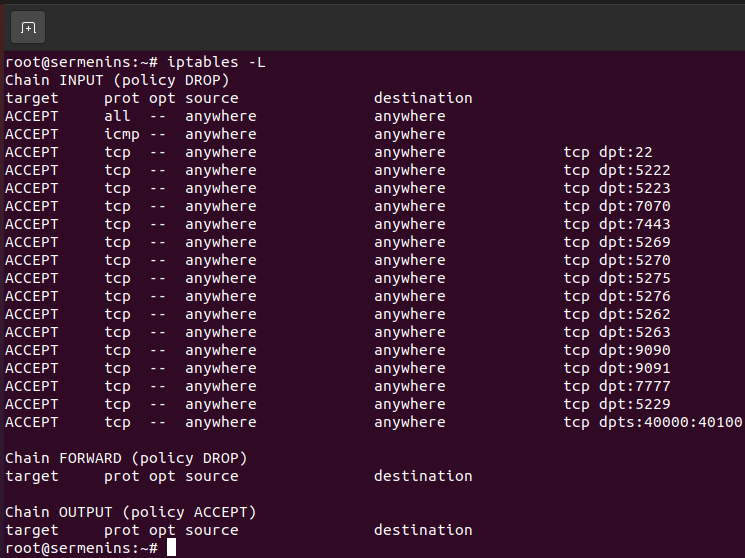

## 4  Webgrafía

<https://www.digitalocean.com/community/tutorials/how-to-install-openfire-xmpp-server-on-a-debian-or-ubuntu-vps>  
<https://www.igniterealtime.org/projects/openfire/plugins.jsp>

## 5  Conclusión

Un servidor de mensajerı́a instantánea es una manera sencilla de transferir mensajes de texto o archivos entre uno o más usuarios en una red.
