# DHCP relay

## Índice

### [1 Introducción](#1--Introducción)

### [2 Requerimientos](#2--Requerimientos)

### [3 Preparación](#3--Preparación)
#### &nbsp; &nbsp; [3.1 Configuración del dhcp relay](#31--Configuración-del-dhcp-relay)
#### &nbsp; &nbsp; [3.2 Configuración de los servidores dhcp](#32--Configuración-de-los-servidores-dhcp)
#### &nbsp; &nbsp; [3.3 Habilitación del enrutador](#33--Habilitación-del-enrutador)
#### &nbsp; &nbsp; [3.4 Comprobación](#34--Comprobación)

### [4 Webgrafía](#4--Webgrafía)

### [5 Conclusión](#5--Conclusión)

---

## 1  Introducción

El protocolo de red DHCP (Dynamic Host Configuration Protocol) es de tipo cliente-servidor mediante el cual un servidor DHCP asigna dinámicamente una dirección IP y otros parámetros de configuración a cada dispositivo en una red para que puedan comunicarse con otras redes, utilizando el puerto 67 el servidor y el 68 los clientes.

Este servidor posee una lista de direcciones IP dinámicas que va asignando a los clientes conforme se quedan libres, sabiendo en todo momento quién la ha tenido, durante cuánto tiempo y a quién se la asigna después.

En una empresa la aplicación más común de un servidor DHCP es asignar automáticamente los parámetros de configuración de una red, configurarlo para que sea servidor PXE y enviar un archivo de configuración.

Un DHCP relay es un proxy que redirige las peticiones de los clientes al servidor DHCP en una red, es una forma de segmentar una topología de red sin alterar el servidor.

## 2  Requerimientos

Todas las máquinas virtuales tienen el sistema operativo Debian 9 stretch.

- Hipervisor VMware Workstation.

- Servidor ssh en las máquinas virtuales.

- Cliente ssh en la máquina anfitriona.

## 3  Preparación

En una máquina virtual accedemos mediante ssh desde la máquina anfitriona.

### 3.1  Configuración del dhcp relay

Escribimos el comando, `# apt install isc-dhcp-relay`, escribimos la dirección ip de los servidores dhcp por la interfaz en las que recibe peticiones de los clientes.

	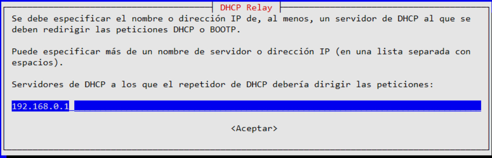

Escribimos el nombre de las interfaces de red por las que el dhcp relay recibe peticiones de los servidores dhcp para reenviar la configuración de red y de los clientes para redirigir las solicitudes a los servidores.

	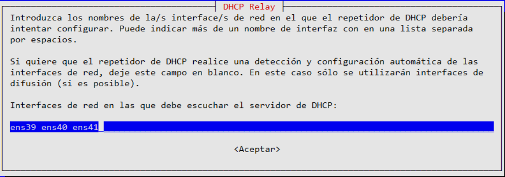

Escribimos el comando, `# nano /etc/default/isc-dhcp-relay`, para comprobar la configuración por defecto del servicio dhcp relay.

	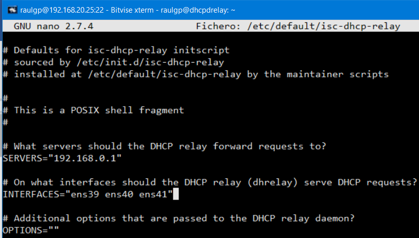

Escribimos el comando, `# echo 1 > /proc/sys/net/ipv4/ip_forward`, para habilitar la redirección de paquetes en el dhcp relay.

	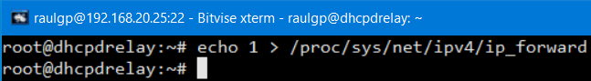

### 3.2  Configuración de los servidores dhcp

En otras maquinas virtuales con un servidor isc-dhcp-server instalado y configurado, escribimos el comando, `# nano /etc/dhcp/dhcpd.conf`, y escribimos el contenido.

	subnet 192.168.2.0 netmask 255.255.255.192 {
	  range 192.168.2.2 192.168.2.62;
	  max-lease-time 3600;
	  option routers 192.168.2.1;
	  option domain-name-servers 8.8.8.8, 8.8.4.4;
	  option broadcast-address 192.168.2.63;
	}
	
	subnet 192.168.3.0 netmask 255.255.255.192 {
	  range 192.168.3.2 192.168.3.62;
	  max-lease-time 3600;
	  option routers 192.168.3.1;
	  option domain-name-servers 8.8.8.8, 8.8.4.4;
	  option broadcast-address 192.168.3.63;
	}

	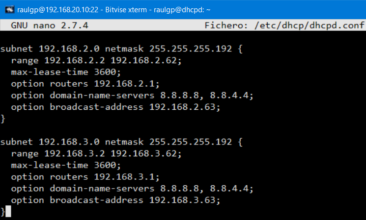

Escribimos el comando, `# service isc-dhcp-server restart`, para reiniciar los servidores dhcp.

	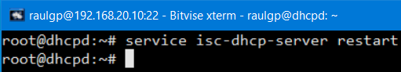

Escribimos el comando, `# ip route add "dirección ip de red"/"prefijo de máscara de subred" dev "interfaz de red"`, para añadir una ruta estática en la tabla de enrutamiento que redirija las peticiones del dhcp relay por la interfaz de red especificada.

	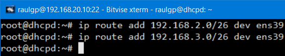

	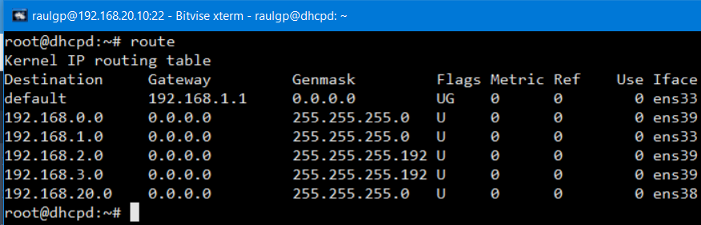

### 3.3  Habilitación del enrutador

Nos vamos al dhcp relay, escribimos el comando, `# nano regdhcprelayiptables.sh`, y escribimos el contenido.

	echo 1 > /proc/sys/net/ipv4/ip_forward
	
	# Enrutamiento de las direcciones de red
	iptables -t nat -A POSTROUTING -s 192.168.2.0/26 -o ens33 -j MASQUERADE
	iptables -t nat -A POSTROUTING -s 192.168.3.0/26 -o ens33 -j MASQUERADE
	
	# Aceptar o denegar la redirección de paquetes de una red especificada
	iptables -A FORWARD -s 192.168.1.0/24 -j ACCEPT
	iptables -A FORWARD -s 192.168.2.0/26 -j ACCEPT
	iptables -A FORWARD -s 192.168.3.0/26 -o ens33 -j DROP

	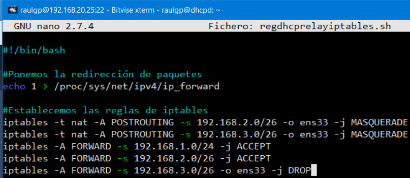

### 3.4  Comprobación

Nos vamos a los clientes dhcp, y escribimos el comando, `# dhclient`, para solicitar la configuración de red al servidor dhcp mediante el dhcp relay.

	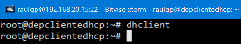

	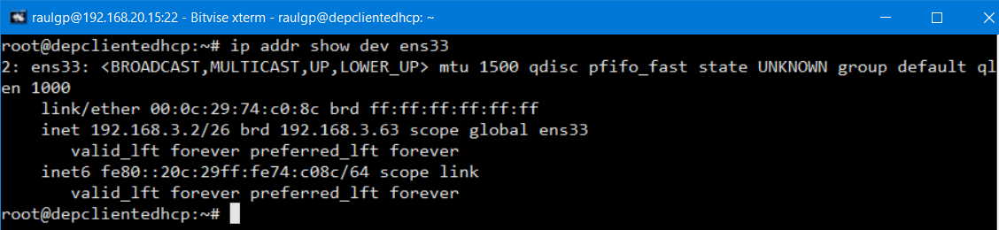

	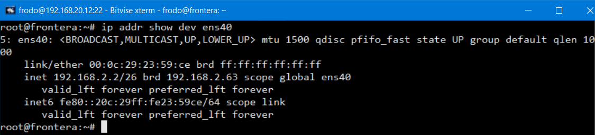

	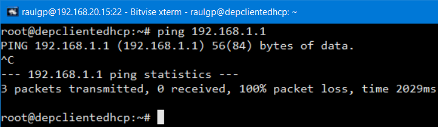

	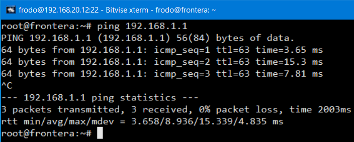

## 4  Webgrafía

<https://manpages.debian.org/unstable/isc-dhcp-server/dhcpd.conf.5.en.html>  
<https://bytelearning.blogspot.com/2016/08/como-crear-un-dhcp-relay-en-linux.html>

## 5  Conclusión

Un dhcp relay es una manera sencilla de tener un proxy que redirija el tráfico de los clientes dhcp.
