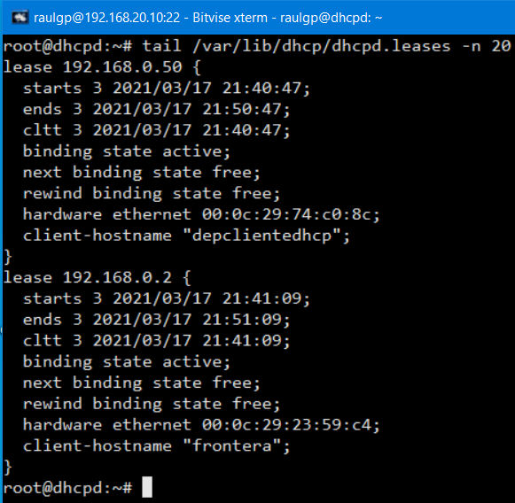

# Servidor DHCP

## Índice

### [1 Introducción](#1--Introducción)

### [2 Requerimientos](#2--Requerimientos)

### [3 Preparación](#3--Preparación)
#### &nbsp; &nbsp; [3.1 Instalación](#31--Instalación)
#### &nbsp; &nbsp; [3.2 Configuración](#32--Configuración)
#### &nbsp; &nbsp; [3.3 Comprobación](#33--Comprobación)
#### &nbsp; &nbsp; [3.4 Clasificación de los clientes](#34--Clasificación-de-los-clientes)
#### &nbsp; &nbsp; [3.5 Comprobación de la clasificación](#35--Comprobación-de-la-clasificación)
#### &nbsp; &nbsp; [3.6 Seguridad](#36--Seguridad)
##### &nbsp; &nbsp; &nbsp; &nbsp; &nbsp; &nbsp; [3.6.1 Respaldo de alta disponibilidad](#361--Respaldo-de-alta-disponibilidad)
##### &nbsp; &nbsp; &nbsp; &nbsp; &nbsp; &nbsp; [3.6.2 Cortafuegos](#362--Cortafuegos)
#### &nbsp; &nbsp; [3.7 Comprobación de la seguridad](#37--Comprobación-de-la-seguridad)

### [4 Webgrafía](#4--Webgrafía)

### [5 Conclusión](#5--Conclusión)

---

## 1  Introducción

El protocolo de red DHCP (Dynamic Host Configuration Protocol) es de tipo cliente-servidor mediante el cual un servidor DHCP asigna dinámicamente una dirección IP y otros parámetros de configuración a cada dispositivo en una red para que puedan comunicarse con otras redes, utilizando el puerto 67 el servidor y el 68 los clientes.

Este servidor posee una lista de direcciones IP dinámicas que va asignando a los clientes conforme se quedan libres, sabiendo en todo momento quién la ha tenido, durante cuánto tiempo y a quién se la asigna después.

En una empresa la aplicación más común de un servidor DHCP es asignar automáticamente los parámetros de configuración de una red, configurarlo para que sea servidor PXE y enviar un archivo de configuración.

## 2  Requerimientos

Todas las máquinas virtuales tienen el sistema operativo Debian 9 stretch.

- Hipervisor VMware Workstation.

- Servidor ssh en las máquinas virtuales.

- Cliente ssh en la máquina anfitriona.

## 3  Preparación

En una máquina virtual accedemos mediante ssh desde la máquina anfitriona.

### 3.1  Instalación

Escribimos el comando, `# apt install isc-dhcp-server`, y escribimos el comando, `# nano /etc/default/isc-dhcp-server`, para configurar el archivo de configuración por defecto del servicio isc-dhcp-server.

	

	

### 3.2  Configuración

Escribimos el comando, `# nano /etc/dhcp/dhcpd.conf`, y escribimos el contenido.

	authoritative; # Establecimiento de un mensaje de error
	
	subnet 192.168.0.0 netmask 255.255.255.0 { # Establecimiento de la subnet
	  range 192.168.0.50 192.168.0.254;
	  max-lease-time 3600; # Establecimiento de la duración de concesión
	  option routers 192.168.0.1; # Establecimiento de la puerta de enlace predeterminada
	  option domain-name-servers 8.8.8.8, 8.8.4.4;
	  option broadcast-address 192.168.0.255;
	}

	

	

Escribimos el comando, `# service isc-dhcp-server restart`, y escribimos el comando, `# netstat -putan | egrep ":67\s+"`, para comprobar que esta escuchando peticiones el servicio dhcpd.

	

	

### 3.3  Comprobación

Nos vamos a otra máquina virtual, y escribimos el comando, `# dhclient`, para solicitar la configuración de red al servidor dhcp.

	

	

Nos vamos al servidor dhcp, y escribimos el comando, `# tail /var/lib/dhcp/dhcpd.leases`, para mostrar las direcciones asignadas.

	

### 3.4  Clasificación de los clientes

Escribimos el comando, `# nano /etc/dhcp/dhcpd.conf`, y escribimos el contenido.

	# Identificación de los clientes por su dirección MAC
	class "depadministracion" {
	  match pick-first-value (option dhcp-client-identifier, hardware);
	}
	class "depclientes" {
	  match pick-first-value (option dhcp-client-identifier, hardware);
	}
	
	# Direcciones MAC de los clientes
	subclass "depadministracion" 1:00:0c:29:23:59:c4;
	subclass "depclientes" 1:00:0c:29:74:c0:8c;
	
	subnet 192.168.0.0 netmask 255.255.255.0 {
	  # range 192.168.0.50 192.168.0.254;
	  max-lease-time 3600;
	  option routers 192.168.0.1;
	  option domain-name-servers 8.8.8.8, 8.8.4.4;
	  option broadcast-address 192.168.0.255;
	  
	  # Establecimiento de los rangos en la clasificación de los clientes
	  pool {
	    range 192.168.0.2 192.168.0.49;
	    allow members of "depadministracion";
	  }
	  pool {
	    range 192.168.0.50 192.168.0.254;
	    allow members of "depclientes";
	  }
	}

	

Escribimos el comando, `# service isc-dhcp-server restart`, para reiniciar el servidor dhcp.

	

### 3.5  Comprobación de la clasificación

Nos vamos a los clientes dhcp, y escribimos el comando, `# dhclient`, para solicitar la configuración de red al servidor dhcp.

	

	

	

Nos vamos al servidor dhcp, y escribimos el comando, `# tail /var/lib/dhcp/dhcpd.leases -n 20`, para mostrar las direcciones asignadas por su clasificación.

	

### 3.6  Seguridad

En la máquina anfitriona clonamos la máquina virtual con la misma configuración del servidor dhcp.

#### 3.6.1  Respaldo de alta disponibilidad

Nos vamos al sevidor dhcp primario, escribimos el comando, `# nano /etc/dhcp/dhcpd.conf`, y escribimos el contenido.

	failover peer "dhcp-failover" {
	  primary;
	  address 192.168.20.10; # Establecimiento del servidor dhcp primario
	  port 647;
	  peer address 192.168.20.20; # Establecimiento del servidor dhcp secundario
	  peer port 647;
	  max-response-delay 30;
	  max-unacked-updates 10;
	  load balance max seconds 3;
	  mclt 1800;
	  split 128;
	}
	...
	  pool {
	    failover peer "dhcp-failover"; # Habilitación del respaldo de alta disponibilidad
	    range 192.168.0.2 192.168.0.49;
	    allow members of "depadministracion";
	  }
	  pool {
	    failover peer "dhcp-failover"; # Habilitación del respaldo de alta disponibilidad
	    range 192.168.0.50 192.168.0.254;
	    allow members of "depclientes";
	  }
	}

	

	

Nos vamos al servidor dhcp secundario, escribimos el comando, `# nano /etc/dhcp/dhcpd.conf`, y escribimos el contenido.

	failover peer "dhcp-failover" {
	  secondary;
	  address 192.168.20.20; # Establecimiento del servidor dhcp secundario
	  port 647;
	  peer address 192.168.20.10; # Establecimiento del servidor dhcp primario
	  peer port 647;
	  max-response-delay 30;
	  max-unacked-updates 10;
	  load balance max seconds 3;
	}
	...
	  pool {
	    failover peer "dhcp-failover"; # Habilitación del respaldo de alta disponibilidad
	    range 192.168.0.2 192.168.0.49;
	    allow members of "depadministracion";
	  }
	  pool {
	    failover peer "dhcp-failover"; # Habilitación del respaldo de alta disponibilidad
	    range 192.168.0.50 192.168.0.254;
	    allow members of "depclientes";
	  }
	}

	

	

#### 3.6.2  Cortafuegos

En los servidores dhcp, escribimos el comando, `# nano regdhcpdiptables.sh`, y escribimos el contenido.

	# Limpieza de todas las reglas y denegar o aceptar las conexiones
	iptables -F
	iptables -X
	iptables -Z
	iptables -t nat -F
	iptables -P INPUT DROP
	iptables -P FORWARD DROP
	iptables -P OUTPUT ACCEPT
	
	# Establecimiento del rango de puertos en una conexión establecida
	echo ”40000 40100” > /proc/sys/net/ipv4/ip_local_port_range
	
	# Aceptar los protocolos y los puertos de entrada en las interfaces de red
	iptables -A INPUT -i lo -p all -j ACCEPT
	iptables -A INPUT -i ens33 -p icmp -j ACCEPT
	iptables -A INPUT -p tcp --dport 22 -j ACCEPT
	iptables -A INPUT -p tcp --dport 67 -j ACCEPT
	iptables -A INPUT -p tcp --dport 68 -j ACCEPT
	iptables -A INPUT -p tcp --dport 647 -j ACCEPT
	iptables -A INPUT -p tcp --dport 40000:40100 -j ACCEPT

	

### 3.7  Comprobación de la seguridad

Nos vamos al servidor dhcp primario, y escribimos el comando, `# service isc-dhcp-server stop`, para parar el servicio isc-dhcp-server y activar el servidor dhcp secundario.

	

Nos vamos al cliente dhcp, y escribimos el comando, `# dhclient`, para solicitar la configuración de red al servidor dhcp.

	

	

Nos vamos al servidor dhcp secundario, y escribimos el comando, `# cat /var/lib/dhcp/dhcpd.leases`, comprobamos que concede direcciones IP a los equipos clientes ya que el servidor dhcp primario no funciona.

	

Escribimos el comando, `# iptables -L`, para mostrar las reglas de iptables establecidas.

	

## 4  Webgrafía

<https://debian-handbook.info/browse/es-ES/stable/index.html>  
<https://manpages.debian.org/unstable/isc-dhcp-server/dhcpd.conf.5.en.html>

## 5  Conclusión

Un servidor dhcp es una manera sencilla de asignar parámetros de configuración de una red a los clientes.
