# Servidor DNS

## Índice

### [1 Introducción](#1--Introducción)

### [2 Requerimientos](#2--Requerimientos)

### [3 Preparación](#3--Preparación)
#### &nbsp; &nbsp; [3.1 Instalación](#31--Instalación)
#### &nbsp; &nbsp; [3.2 Configuración](#32--Configuración)
#### &nbsp; &nbsp; [3.3 Seguridad](#33--Seguridad)
##### &nbsp; &nbsp; &nbsp; &nbsp; &nbsp; &nbsp; [3.3.1 Respaldo de alta disponibilidad](#331--Respaldo-de-alta-disponibilidad)
##### &nbsp; &nbsp; &nbsp; &nbsp; &nbsp; &nbsp; [3.3.2 Cortafuegos](#332--Cortafuegos)
#### &nbsp; &nbsp; [3.4 Comprobación de la seguridad](#34--Comprobación-de-la-seguridad)

### [4 Webgrafía](#4--Webgrafía)

### [5 Conclusión](#5--Conclusión)

---

## 1  Introducción

El protocolo de red DNS (Domain Name System) es un sistema de nomenclatura jerárquico descentralizado para dispositivos conectados a redes IP, que asocia información variada con nombres de dominio asignados a cada uno de los participantes.

El servidor DNS utiliza una base de datos distribuida y jerárquica que almacena información asociada a nombres de dominio en redes, los usos más comunes son la asignación de nombres de dominio a direcciones IP y la localización de los servidores de correo electrónico de cada dominio.

En una empresa la aplicación más común de un servidor DNS es la resolución de nombres de dominio en direcciones IP y viceversa en una red.

## 2  Requerimientos

Todos los contenedores tienen el sistema operativo Debian 9 stretch.

- Aplicación de virtualización Docker.

- Servidor ssh en los contenedores.

- Cliente ssh en la máquina anfitriona.

## 3  Preparación

En un contenedor accedemos mediante ssh desde la máquina anfitriona.

### 3.1  Instalación

Escribimos el comando, `# apt install bind9 dnsutils`, para instalar el servidor bind9.

	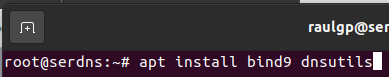

Escribimos el comando, `# nano /etc/resolv.conf`, para establecer el servidor DNS en los equipos clientes y escribimos el contenido.

    nameserver 192.168.20.55

	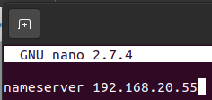

### 3.2  Configuración

Escribimos el comando, `# nano /etc/bind/named.conf.options`, y escribimos el contenido.

	dnssec-validation no;
	
	forwarders { # Establecimiento de la redirección de solicitudes
		8.8.8.8;
		8.8.4.4;
	};

	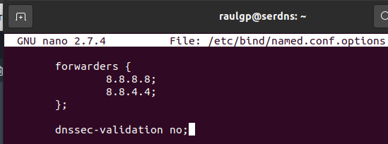

Escribimos el comando, `# named-checkconf`, para comprobar la configuración del archivo.

	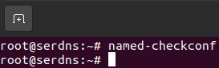

Escribimos el comando, `# nano /etc/bind/named.conf.local`, para definir las zonas en las que tienen los archivos para las resoluciones, y escribimos el contenido.

	zone "raulgp.des.org" {
		type master;
		file "/etc/bind/zones/db.raulgp.des.org";
	};
	
	zone "168.192.in-addr.arpa" {
		type master;
		file "/etc/bind/zones/db.168.192";
	};

	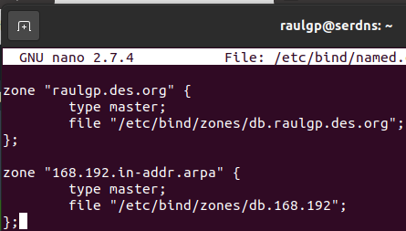

Escribimos el comando, `# nano /etc/bind/zones/db.raulgp.des.org`, para establecer la configuración de la resolución directa de nombres, y escribimos el contenido.

	$TTL	1D
	@	IN	SOA	serdns.raulgp.des.org.	root.raulgp.des.org. (
				0	; numero de serie
				604800	; refresco
				86400	; reintento
				2419200 ; expiracion
				604800 	; Cache negativa TTL
	);
	
					IN	NS	serdns.raulgp.des.org.
	serdns.				IN	A	192.168.20.55
	serdns.raulgp.des.org.		IN	A	192.168.20.55
	raulgp.des.org.			IN	A	192.168.20.50

	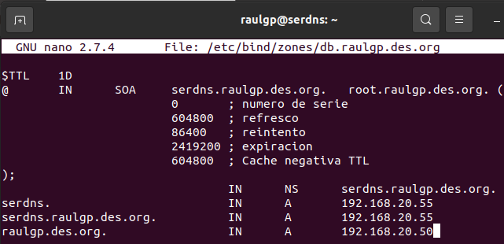

Escribimos el comando, `# named-checkzone raulgp.des.org /etc/bind/zones/db.raulgp.des.org`, para comprobar la verificación del archivo.

	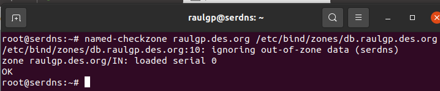

Escribimos el comando, `# /etc/init.d/bind9 restart`, para reiniciar el servidor bind9.

	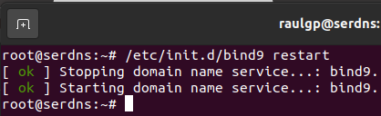

	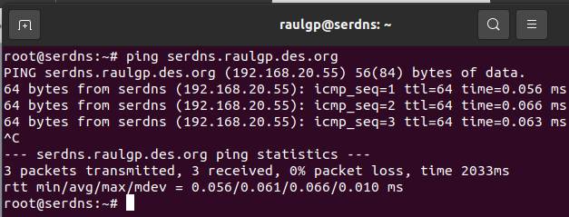

Escribimos el comando, `# nano /etc/bind/zones/db.168.192`, para establecer la configuración de la resolución inversa de nombres, y escribimos el contenido.

	$TTL	1D
	@	IN	SOA	raulgp.des.org.	root.raulgp.des.org. (
				0	; numero de serie
				604800	; refresco
				86400	; reintentar
				2419200 ; expiracion
				604800	; TTL Cache negativa
				)
	; Servidores de nombres
			IN	NS	serdns.raulgp.des.org.
	; Registros PTR
	55.20		IN	PTR	serdns.
	55.20		IN	PTR	serdns.raulgp.des.org.
	50.20		IN	PTR	raulgp.des.org.

	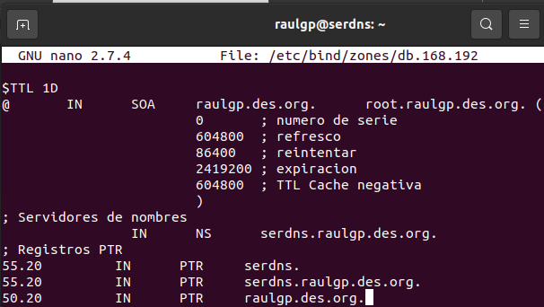

Escribimos el comando, `# named-checkzone 168.192 /etc/bind/zones/db.168.192`, para comprobar la verificación del archivo.

	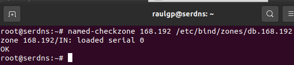

Escribimos el comando, `# /etc/init.d/bind9 restart`, para reiniciar el servidor bind9.

	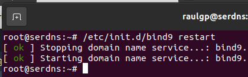

	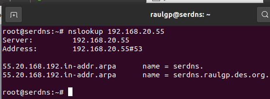

### 3.3  Seguridad

En la máquina anfitriona replicamos el contenedor con la misma configuración del servidor DNS.

#### 3.3.1  Respaldo de alta disponibilidad

En el servidor DNS primario, escribimos el comando, `# nano /etc/bind/named.conf.local`, para establecer la transferencia con el servidor DNS secundario, y escribimos el contenido.

	zone "raulgp.des.org" {
		type master;
		file "/etc/bind/zones/db.raulgp.des.org";
		allow-transfer { 192.168.20.50; }; # Establecimiento del servidor DNS secundario
	};
	
	zone "168.192.in-addr.arpa" {
		type master;
		file "/etc/bind/zones/db.168.192";
		allow-transfer { 192.168.20.50; }; # Establecimiento del servidor DNS secundario
	};

	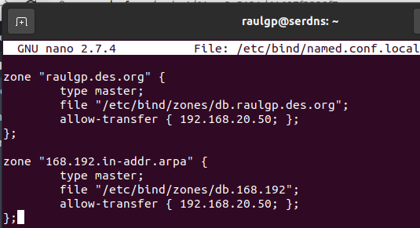

Escribimos el comando, `# /etc/init.d/bind9 restart`, para reiniciar el servidor bind9.

	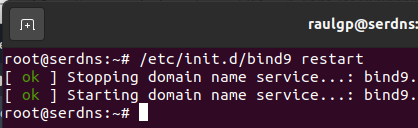

En el servidor DNS secundario, escribimos el comando, `# nano /etc/bind/named.conf.local`, para establecer la transferencia con el servidor DNS primario, y escribimos el contenido.

	zone "raulgp.des.org" {
		type slave;
		file "db.raulgp.des.org";
		masters { 192.168.20.55; }; # Establecimiento del servidor DNS primario
	};
	
	zone "168.192.in-addr.arpa" {
		type slave;
		file "db.168.192";
		masters { 192.168.20.55; }; # Establecimiento del servidor DNS primario
	};

	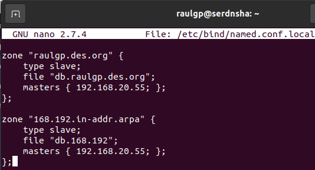

Escribimos el comando, `# /etc/init.d/bind9 restart`, para reiniciar el servidor bind9.

	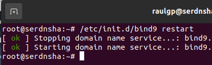

#### 3.3.2  Cortafuegos

En los servidores DNS, escribimos el comando, `# nano regdnsiptables.sh`, y escribimos el contenido.

	# Limpieza de todas las reglas y denegar o aceptar las conexiones
	iptables -F
	iptables -X
	iptables -Z
	iptables -t nat -F
	iptables -P INPUT DROP
	iptables -P FORWARD DROP
	iptables -P OUTPUT ACCEPT
	
	echo "40000 40100" > /proc/sys/net/ipv4/ip_local_port_range
	
	# Aceptar los protocolos y los puertos de entrada en las interfaces de red
	iptables -A INPUT -i lo -p all -j ACCEPT
	iptables -A INPUT -p icmp -j ACCEPT
	iptables -A INPUT -p tcp --dport 22 -j ACCEPT
	iptables -A INPUT -p udp --dport 53 -j ACCEPT
	iptables -A INPUT -p udp --dport 53 -j ACCEPT
	iptables -A INPUT -p tcp --dport 40000:40100 -j ACCEPT

	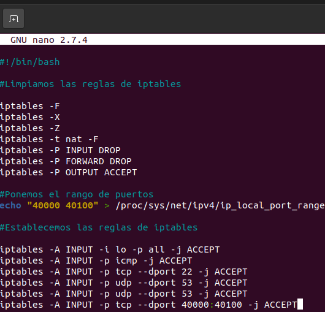

### 3.4  Comprobación de la seguridad

En el servidor DNS primario, escribimos el comando, `# /etc/init.d/bind9 stop`, para desactivar el servidor bind9 primario.

	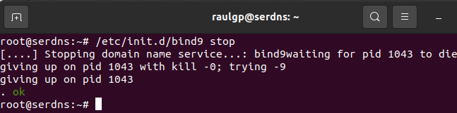

	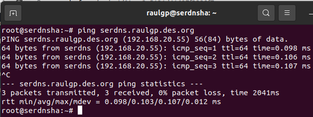

Escribimos el comando, `# iptables -L`, para mostrar las reglas de iptables establecidas.

	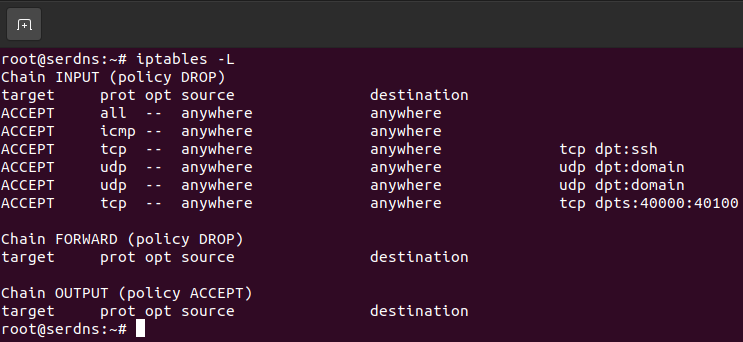

## 4  Webgrafía

<https://chachocool.com/como-instalar-el-servidor-dns-bind-en-debian-9-stretch/>  
<https://www.digitalocean.com/community/tutorials/how-to-configure-bind-as-a-private-network-dns-server-on-debian-9>

## 5  Conclusión

Un servidor DNS es una manera sencilla de resolver nombres de dominio en direcciones IPs y viceversa abastecido en alta disponibilidad con un servidor DNS secundario estableciendo peticiones en caso de multitud de solicitudes.
