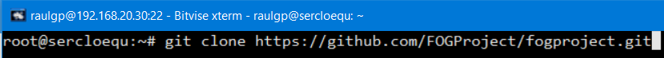
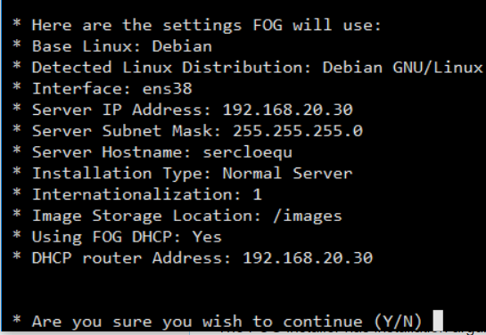
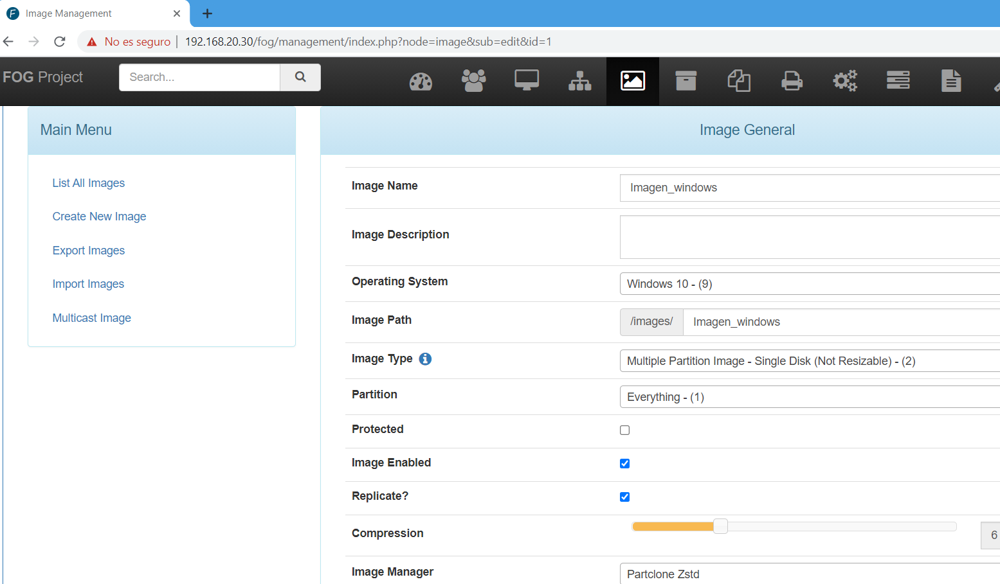
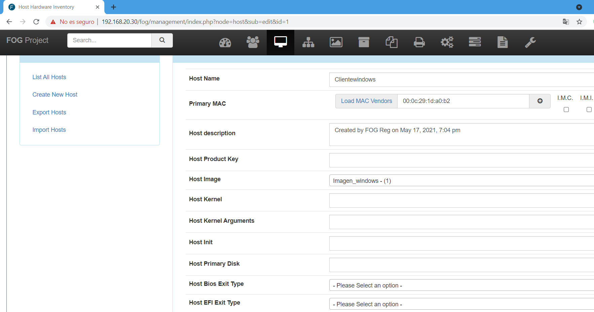
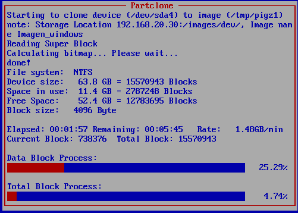
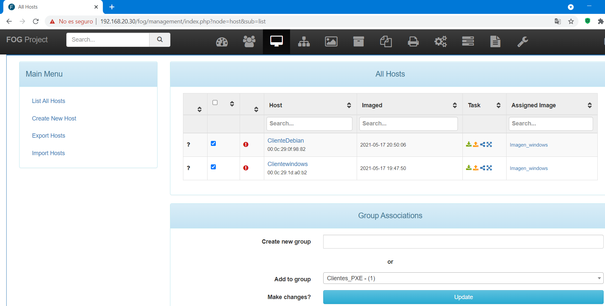
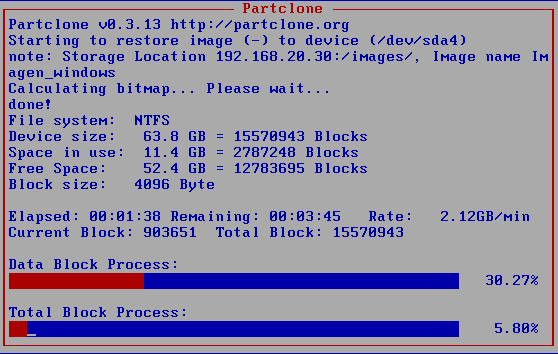
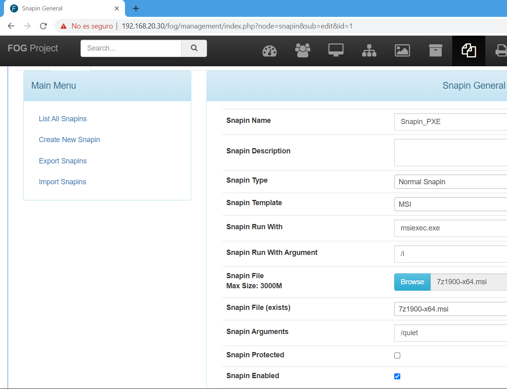
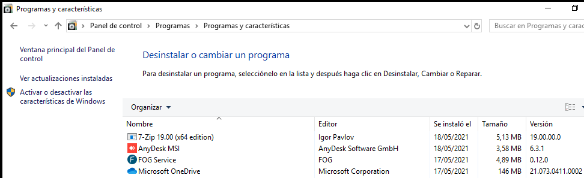

# Servidor FOG

## Índice

### [1 Introducción](#1--Introducción)

### [2 Requerimientos](#2--Requerimientos)

### [3 Preparación](#3--Preparación)
#### &nbsp; &nbsp; [3.1 Instalación](#31--Instalación)
#### &nbsp; &nbsp; [3.2 Captura de imágenes de respaldo](#32--Captura-de-imágenes-de-respaldo)
#### &nbsp; &nbsp; [3.3 Volcado de imágenes de respaldo](#33--Volcado-de-imágenes-de-respaldo)
#### &nbsp; &nbsp; [3.4 Ejecución de scripts](#34--Ejecución-de-scripts)

### [4 Webgrafía](#4--Webgrafía)

### [5 Conclusión](#5--Conclusión)

---

## 1  Introducción

El servidor FOG basado en Linux, gratis y de código libre, es una solución a la clonación de equipos para varias versiones de Windows, Linux y Mac OS X, y contiene unas cuantas herramientas de código abierto con una interfaz web basada en PHP.

El servidor FOG no usa ningún disco duro, o CDs para arrancar los eqipos; todo es hecho vía TFTP y PXE, el equipo arranca por PXE y automáticamente descarga un pequeño cliente linux que hace todo el trabajo de clonación.

En una empresa la aplicación más común de un servidor FOG es hacer imágenes de respaldo, instalar programas automáticamente, y clonar los equipos en una red.

## 2  Requerimientos

Todas las máquinas virtuales tienen el sistema operativo Debian 9 stretch.

- Hipervisor VMware Workstation.

- Servidor ssh en las máquinas virtuales.

- Cliente ssh en la máquina anfitriona.

## 3  Preparación

En una máquina virtual accedemos mediante ssh desde la máquina anfitriona.

### 3.1  Instalación

Escribimos el comando, `# apt install git`, y escribimos el comando, `# git clone https://github.com/FOGProject/fogproject.git`, para descargar los archivos del repositorio.

	

Escribimos el comando, `# ./fogproject/bin/installfog.sh`, para ejecutar el script de instalación del servidor fog.

	

### 3.2  Captura de imágenes de respaldo

Arrancamos un equipo por PXE, le damos a inventariado rápido, nos vamos a la interfaz web del servidor fog, le damos a imágenes, le damos a crear una nueva imagen, y le damos a añadir, para crear una imagen del equipo cliente.

	

Le damos a equipos, seleccionamos el equipo que queremos capturar la imagen, asignamos la imagen que hemos creado, le damos a actualizar, y le damos a capturar, para capturar una imagen del equipo especificado.

	

	

### 3.3  Volcado de imágenes de respaldo

Le damos a grupos, le damos a crear nuevo grupo, nos vamos a equipos, seleccionamos los equipos que queremos añadir al grupo, asignamos el grupo, le damos a actualizar, y le damos a multicast, para volcar a los equipos del grupo la imagen especificada.

	

	

### 3.4  Ejecución de scripts

Le damos a snapin, le damos a crear un nuevo snapin, le damos a grupos, nos vamos a snapins, seleccionamos los snapins que queremos agregar, le damos a añadir, nos vamos a tareas básicas, le damos a avanzado, y le damos a todos los snapins, para ejecutar scripts al grupo especificado.

	

	

## 4  Webgrafía

<https://wiki.fogproject.org/wiki/index.php?title=Main_Page>  
<https://fogproject.org/>

## 5  Conclusión

Un servidor FOG es una manera sencilla de hacer imágenes de respaldo customizadas, y volcarlas a los equipos en una red.
