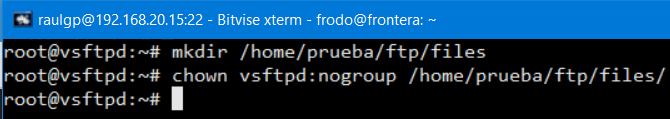
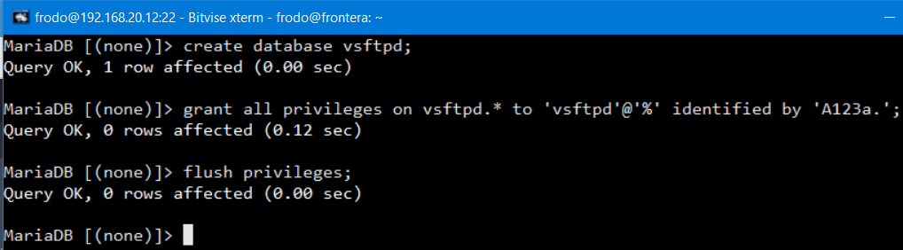
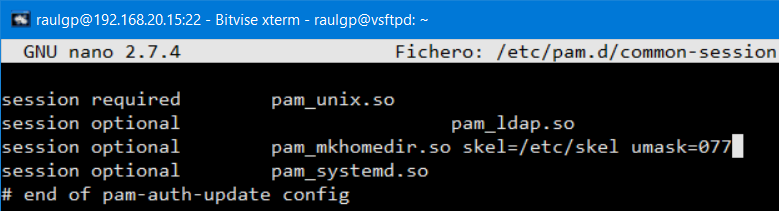

# Autenticación al servidor FTP

## Índice

### [1 Introducción](#1--Introducción)

### [2 Requerimientos](#2--Requerimientos)

### [3 Preparación](#3--Preparación)
#### &nbsp; &nbsp; [3.1 Configuración](#31--Configuración)
#### &nbsp; &nbsp; [3.2 Autenticación en una base de datos](#32--Autenticación-en-una-base-de-datos)
##### &nbsp; &nbsp; &nbsp; &nbsp; &nbsp; &nbsp; [3.2.1 Configuración de la base de datos](#321--Configuración-de-la-base-de-datos)
##### &nbsp; &nbsp; &nbsp; &nbsp; &nbsp; &nbsp; [3.2.2 Comprobación en una base de datos](#322--Comprobación-en-una-base-de-datos)
#### &nbsp; &nbsp; [3.3 Autenticación por el protocolo LDAP](#33--Autenticación-por-el-protocolo-LDAP)
##### &nbsp; &nbsp; &nbsp; &nbsp; &nbsp; &nbsp; [3.3.1 Comprobación por el protocolo LDAP](#331--Comprobación-por-el-protocolo-LDAP)

### [4 Webgrafía](#4--Webgrafía)

### [5 Conclusión](#5--Conclusión)

---

## 1  Introducción

El protocolo de red FTP (File Transfer Protocol) sirve para la transferencia de archivos en una red TCP basado en una arquitectura cliente-servidor independientemente del sistema operativo usado en cada equipo y utilizando normalmente los puertos de red 20 y 21.

En una empresa la aplicación más común de un servidor FTP es el alojamiento donde los clientes suben sus archivos correspondientes, o para almacenar copias de seguridad o archivos de configuración de servidores.

Hay otras formas de autenticación de los usuarios en un servidor FTP, además de la autenticación PAM que es la más común, como tener los usuarios en una base de datos MariaDB o mediante el protocolo LDAP.

MariaDB es un sistema de gestión de bases de datos derivado de MySQL desarrollado por Michael Widenius fundador de MySQL, la fundación MariaDB y la comunidad de desarrolladores de software libre. Tiene una alta compatibilidad con MySQL ya que posee las mismas órdenes, interfaces, API y bibliotecas, siendo su objetivo poder cambiar un servidor por otro directamente.

El protocolo LDAP (Lightweight Directory Access Protocol) hace referencia a un protocolo a nivel de aplicación que permite el acceso a un servicio de directorio ordenado y distribuido para buscar diversa información en un entorno de red.

## 2  Requerimientos

Todas las máquinas virtuales tienen el sistema operativo Debian 9 stretch.

- Hipervisor VMware Workstation.

- Servidor ssh en las máquinas virtuales.

- Cliente ssh en la máquina anfitriona.

## 3  Preparación

En una máquina virtual accedemos mediante ssh desde la máquina anfitriona.

### 3.1  Configuración

Escribimos el comando, `# nano /etc/vsftpd.conf`, y teniendo la misma configuración que en el archivo del servidor ftp realizado, escribimos el contenido.

	guest_enable=YES # Habilitación del usuario invitado  
	guest_username=vsftpd # Nombre del usuario invitado  
	virtual_use_local_privs=YES

	

Escribimos el comando, `# useradd --home /home/vsftpd --gid nogroup -m --shell /bin/false vsftpd`, para crear un usuario con esas especificaciones.

	

Escribimos el comando `# nano /etc/vsftpd.userlist`, y escribimos el nombre de los usuarios virtuales o del servidor LDAP especificados.

	

Escribimos el comando, `# nano /proc/sys/net/ipv4/ip_local_port_range`, y escribimos el rango de puertos especificado.

	

Escribimos el comando, `# chown nobody:nogroup /home/prueba/ftp`, escribimos el comando, `# chmod 555 /home/prueba/ftp`, para establecer los permisos del directorio del usuario virtual o del servidor LDAP especificado.

	

	

Escribimos el comando, `# chown vsftpd:nogroup /home/prueba/ftp/"nombre de archivo"`, para cambiar el propietario y el grupo donde el usuario virtual o del servidor LDAP subirá sus archivos en la carpeta especificada, y reiniciamos el servidor vsftpd.

	

### 3.2  Autenticación en una base de datos

Escribimos el comando, `# apt install libpam-mysql`, escribimos el comando, `# nano /etc/pam.d/vsftpd`, y escribimos el contenido.

	auth required pam_mysql.so user=vsftpd passwd=A123a. host=192.168.20.12 db=vsftpd table=accounts usercolumn=username passwdcolumn=pass crypt=2  

	account required pam_mysql.so user=vsftpd passwd=A123a. host=192.168.20.12 db=vsftpd table=accounts usercolumn=username passwdcolumn=pass crypt=2

	

#### 3.2.1  Configuración de la base de datos

En otra máquina virtual con un servidor MariaDB instalado y configurado, escribimos la sentencia, `> create database vsftpd;`, escribimos la sentencia, `> grant all privileges on vsftpd.* to 'vsftpd'@'%' identified by 'A123a.';`, y escribimos la sentencia, `> flush privileges;`, para actualizar los permisos.

	

Escribimos la sentencia, ``> create table `accounts` ( `id` int not null auto_increment primary key , `username` varchar( 30 ) not null , `pass` varchar( 50 ) not null , unique (`username`)) engine = MYISAM ;``, para crear una tabla especificada.

	

Escribimos la sentencia, `> insert into accounts (username, pass) values ('prueba', PASSWORD('prueba'));`, para crear un usuario virtual e iniciar sesión en el servidor vsftpd.

	

#### 3.2.2  Comprobación en una base de datos

Nos vamos a la máquina anfitriona, ejecutamos el cliente FileZilla, escribimos la dirección IP del servidor, escribimos el nombre del usuario virtual, escribimos la contraseña, y le damos a conexión rápida.

	

Nos vamos al servidor vsftpd, y escribimos el comando, `# vsftpdwho`, para mostrar los usuarios conectados en el servidor vsftpd.

	

	

### 3.3  Autenticación por el protocolo LDAP

Escribimos el comando, `# apt install libnss-ldap libpam-ldap ldap-utils`, escribimos la dirección IP del servidor LDAP, y le damos a aceptar.

	

Escribimos el nombre distintivo base del servidor LDAP, y le damos a aceptar.

	

Seleccionamos la versión del protocolo LDAP, escribimos el nombre de usuario con privilegios de root, y le damos a aceptar.

	

Escribimos la contraseña del usuario con privilegios de root, le damos a aceptar, y le damos a aceptar a que el archivo nsswitch.conf no se gestionara automáticamente.

	

Seleccionamos que la cuenta del administrador del servidor LDAP se comporte como la del administrador local, seleccionamos que no hace falta un usuario para acceder a la base de datos LDAP, escribimos el nombre de usuario con privilegios de root, escribimos la contraseña, y le damos a aceptar.

	

Escribimos el comando, `# nano /etc/nsswitch.conf`, y escribimos el contenido.

	passwd: compat ldap
	group: compat ldap
	shadow: compat ldap

	

Escribimos el comando, `# nano /etc/pam.d/common-password`, y escribimos el contenido.

	password [success=1 user_unknown=ignore default=die] pam_ldap.so try_first_pass

	

Escribimos el comando, `# nano /etc/pam.d/common-session`, y escribimos el contenido.

	session optional pam_mkhomedir.so skel=/etc/skel umask=077

	

Reiniciamos el cliente LDAP, escribimos el comando, `# nano /etc/pam.d/vsftpd`, y escribimos el contenido.

	auth required pam_listfile.so item=user sense=deny file=/etc/ftpusers onerr=succeed
	@include common-account
	@include common-session
	@include common-auth
	
	auth required pam_ldap.so
	account required pam_ldap.so
	session required pam_ldap.so
	password required pam_ldap.so

	

#### 3.3.1  Comprobación por el protocolo LDAP

Nos vamos a la máquina anfitriona, ejecutamos el cliente FileZilla, escribimos la dirección IP del servidor, escribimos el nombre del usuario ldap, escribimos la contraseña, y le damos a conexión rápida.

	

Nos vamos al servidor vsftpd, y escribimos el comando, `# vsftpdwho`, para mostrar los usuarios conectados en el servidor vsftpd.

	

	

## 4  Webgrafía

<https://linux.die.net/man/5/vsftpd.conf>  
<https://www.howtoforge.com/virtual-hosting-with-vsftpd-and-mysql-on-ubuntu-12.04>  
<https://kifarunix.com/configure-openldap-client-on-debian-9-stretch/>  
<https://serverfault.com/questions/318713/vsftpd-ldap-pam>

## 5  Conclusión

Autenticarse en un servidor ftp en una base de datos o por el protocolo LDAP es una manera sencilla de administrar muchos usuarios permitidos que suben o descargan archivos.
