# Servidor FTP

## Índice

### [1 Introducción](#1--Introducción)

### [2 Requerimientos](#2--Requerimientos)

### [3 Preparación](#3--Preparación)
#### &nbsp; &nbsp; [3.1 Instalación](#31--Instalación)
#### &nbsp; &nbsp; [3.2 Configuración](#32--Configuración)
#### &nbsp; &nbsp; [3.3 Comprobación](#33--Comprobación)
#### &nbsp; &nbsp; [3.4 Habilitación del usuario anónimo](#34--Habilitación-del-usuario-anónimo)
#### &nbsp; &nbsp; [3.5 Comprobación del usuario anónimo](#35--Comprobación-del-usuario-anónimo)
#### &nbsp; &nbsp; [3.6 Seguridad](#36--Seguridad)
##### &nbsp; &nbsp; &nbsp; &nbsp; &nbsp; &nbsp; [3.6.1 Conexión por SSL](#361--Conexión-por-SSL)
##### &nbsp; &nbsp; &nbsp; &nbsp; &nbsp; &nbsp; [3.6.2 Establecimiento de cuotas de usuario](#362--Establecimiento-de-cuotas-de-usuario)
##### &nbsp; &nbsp; &nbsp; &nbsp; &nbsp; &nbsp; [3.6.3 Cortafuegos](#363--Cortafuegos)
#### &nbsp; &nbsp; [3.7 Comprobación de la seguridad](#37--Comprobación-de-la-seguridad)

### [4 Webgrafía](#4--Webgrafía)

### [5 Conclusión](#5--Conclusión)

---

## 1  Introducción

El protocolo de red FTP (File Transfer Protocol) sirve para la transferencia de archivos en una red TCP basado en una arquitectura cliente-servidor independientemente del sistema operativo usado en cada equipo y utilizando normalmente los puertos de red 20 y 21.  

En una empresa la aplicación más común de un servidor FTP es el alojamiento donde los clientes suben sus archivos correspondientes, o para almacenar copias de seguridad o archivos de configuración de servidores.

## 2  Requerimientos

Todas las máquinas virtuales tienen el sistema operativo Debian 9 stretch.

- Hipervisor VMware Workstation.

- Servidor ssh en las máquinas virtuales.

- Cliente ssh en la máquina anfitriona.

## 3  Preparación

En una máquina virtual accedemos mediante ssh desde la máquina anfitriona.

### 3.1  Instalación

Escribimos el comando, `# apt install vsftpd`, para instalar el servidor vsftp, y escribimos el comando, `# netstat -putan | egrep vsftpd`, para comprobar que esta escuchando peticiones el servicio vsftpd.

	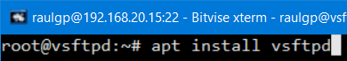

	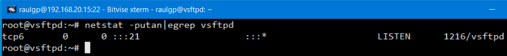

### 3.2  Configuración

Escribimos el comando, `# nano /etc/vsftpd.conf`, y escribimos el contenido.

	userlist_enable=YES # Habilitación de la lista de usuarios del servidor vsftpd  
	userlist_file=/etc/vsftpd.userlist  
	userlist_deny=NO  
	  
	write_enable=YES # Habilitación de permisos de escritura a los usuarios  
	local_umask=022 # Establecer permisos a los archivos creados  
	  
	chroot_local_user=YES # Enjaulamiento de los usuarios  
	user_sub_token=$USER  
	local_root=/home/$USER/ftp  
	  
	# Establecer puertos pasivos del servidor vsftpd  
	pasv_min_port=40000  
	pasv_max_port=40100  

	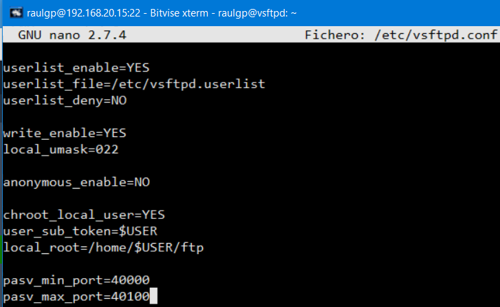

Escribimos el comando, `# nano /etc/vsftpd.userlist`, y escribimos el nombre de los usuarios especificados.

	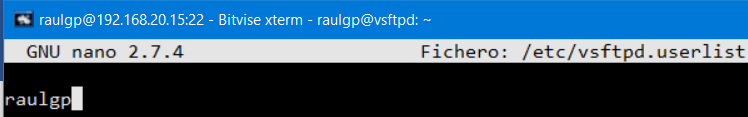

Escribimos el comando, `# chown nobody:nogroup /home/raulgp/ftp`, escribimos el comando, `# chmod 555 /home/raulgp/ftp`, para establecer los permisos del directorio del usuario vsftpd especificado.

	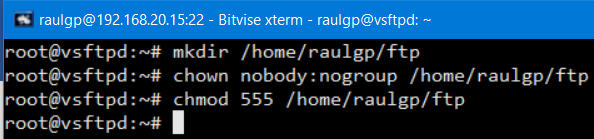

	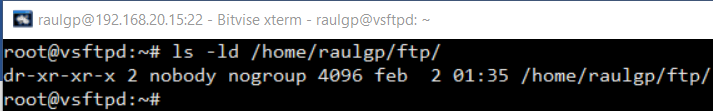

Escribimos el comando, `# chown raulgp:raulgp /home/raulgp/ftp/"nombre de archivo"`, para cambiar el propietario y el grupo donde el usuario vsftpd subirá sus archivos en la carpeta especificada.

	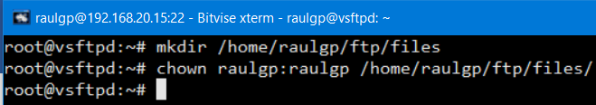

	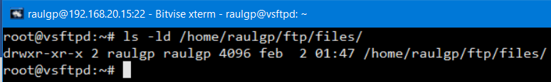

Escribimos el comando, `# service vsftpd restart`, para reiniciar el servidor vsftpd.

	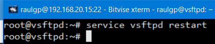

### 3.3  Comprobación

Nos vamos a otra máquina virtual, escribimos el comando, `# ftp 192.168.20.15`, escribimos el nombre de usuario, y escribimos la contraseña.

	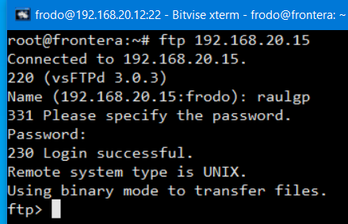

Nos vamos a la máquina anfitriona, ejecutamos el cliente FileZilla, escribimos la dirección IP del servidor, escribimos el nombre de usuario, escribimos la contraseña, y le damos a conexión rápida.

	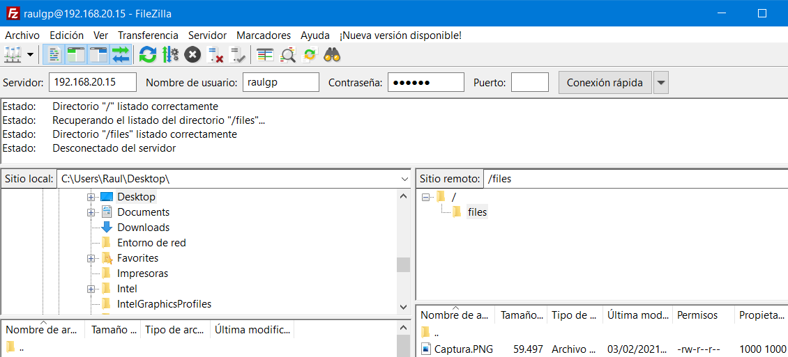

Nos vamos al servidor vsftpd, y escribimos el comando, `# tcpdump -i "interfaz de red" tcp`, comprobamos que los puertos pasivos utilizados son entre el 40000 al 40100.

	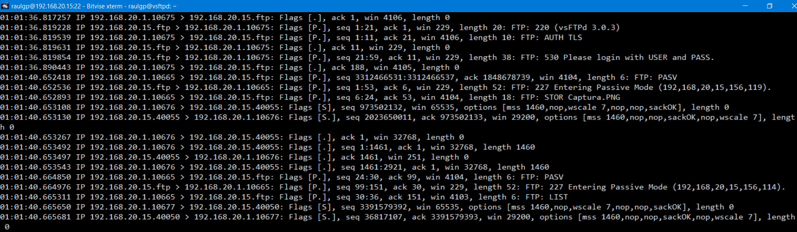

Escribimos el comando, `# vsftpdwho`, para mostrar los usuarios conectados en el servidor vsftpd.

	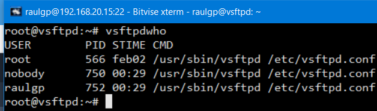

### 3.4  Habilitación del usuario anónimo

Escribimos el comando, `# nano /etc/vsftpd.conf`, y escribimos el contenido.

	ftpd_banner=Bienvenido al servidor vsftpd de raulgp. # Habilitación del mensaje de bienvenida
	idle_session_timeout=120 # Establecer tiempo de cierre de sesión por inactividad
	
	anon_umask=266 # Establecer permisos a los archivos del usuario anónimo
	anonymous_enable=YES # Habilitación del usuario anónimo
	dirmessage_enable=YES # Habilitación del mensaje de bienvenida del usuario anónimo
	anon_world_readable_only=YES # Habilitación de permisos de solo lectura al usuario anónimo
	anon_max_rate=204800 # Establecer tasa de transferencia
	accept_timeout=600 # Establecer tiempo de cierre de sesión por inactividad al usuario anónimo
	allow_anon_ssl=NO # Deshabilitación de la conexión establecida del usuario anónimo por SSL

	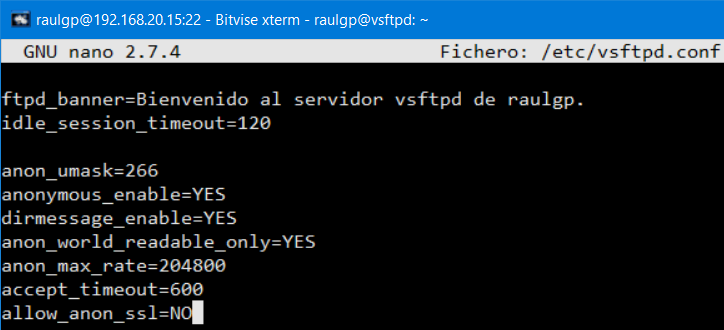

Escribimos el comando, `# nano /etc/vsftpd.userlist`, y escribimos el nombre del usuario anónimo especificado.

	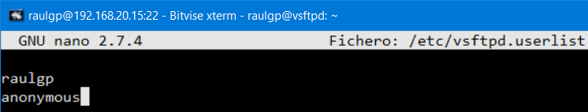

Escribimos el comando, `# nano /srv/ftp/.message`, y escribimos el mensaje de bienvenida del usuario anónimo.

	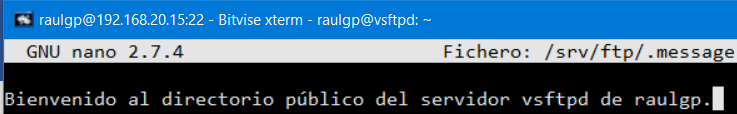

Escribimos el comando, `# service vsftpd restart`, para reiniciar el servidor vsftpd.

	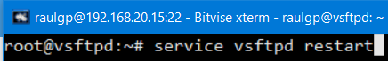

### 3.5  Comprobación del usuario anónimo

Nos vamos a otra máquina virtual, escribimos el comando, `# ftp 192.168.20.15`, escribimos el nombre de usuario, y escribimos la contraseña.

	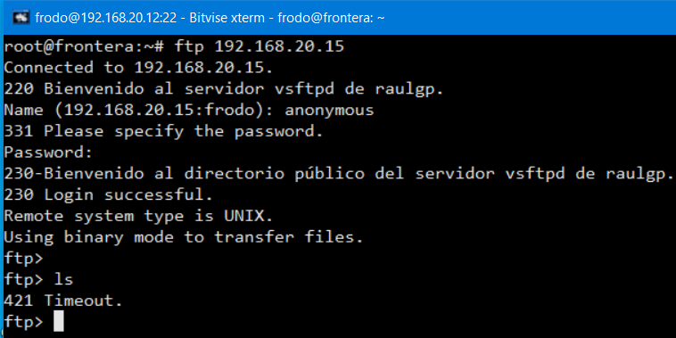

Escribimos el comando, `# vsftpdwho`, para mostrar los usuarios conectados en el servidor vsftpd.

	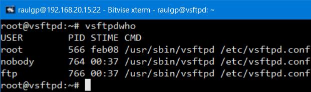

Nos vamos a la máquina anfitriona, ejecutamos el cliente FileZilla, escribimos la dirección IP del servidor, escribimos el nombre de usuario, escribimos la contraseña, y le damos a conexión rápida.

	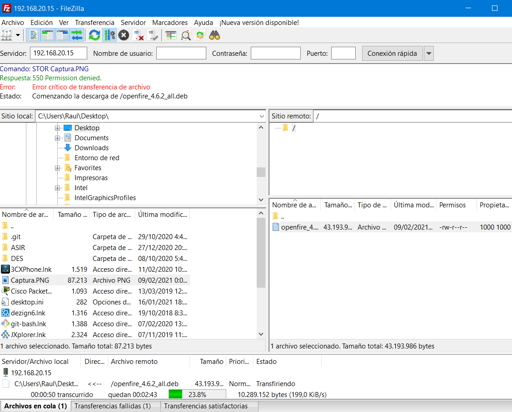

### 3.6  Seguridad

Escribimos el comando, `# nano /etc/vsftpd.conf`, y escribimos el contenido.

	listen=YES
	listen_ipv6=NO # Deshabilitación de escucha de peticiones en IPv6
	
	xferlog_file=/var/log/vsftpd.log # Habilitación del log
	
	listen_port=21 # Establecer puerto de escucha de peticiones
	listen_address=192.168.20.15 # Establecer la dirección IP de la interfaz de red de escucha de peticiones
	max_clients=5 # Establecer número máximo de usuarios
	max_per_ip=5 # Establecer número máximo de usuarios en la misma interfaz de red

	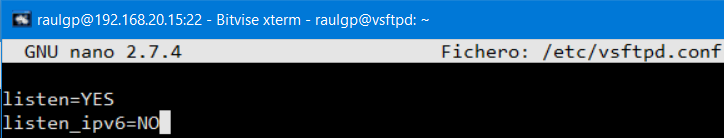

	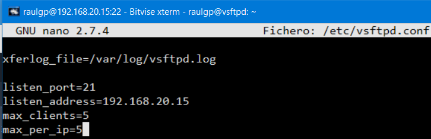

#### 3.6.1  Conexión por SSL

Escribimos el comando, `# openssl genrsa 4096 > /home/raulgp/certificadoseg.key`, para generar la clave del certificado SSL especificado.

	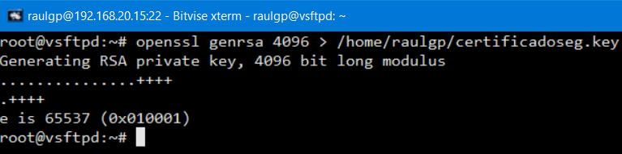

Escribimos el comando, `# chown root:ssl-cert /home/raulgp/certificadoseg.key`, y escribimos el comando, `# chmod 640 /home/raulgp/certificadoseg.key`, para establecer los permisos de la clave del certificado SSL especificado.

	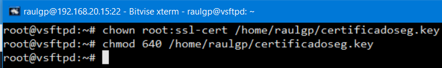

	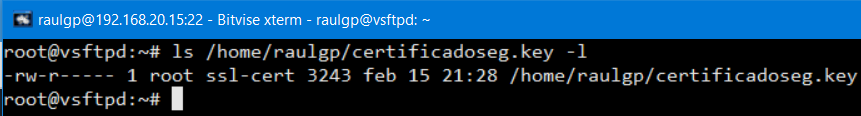

Escribimos el comando, `# openssl req -new -x509 -nodes -sha1 -days 365 -key /home/raulgp/certificadoseg.key > /home/raulgp/certificadoseg.pem`, para generar el certificado SSL especificado.

	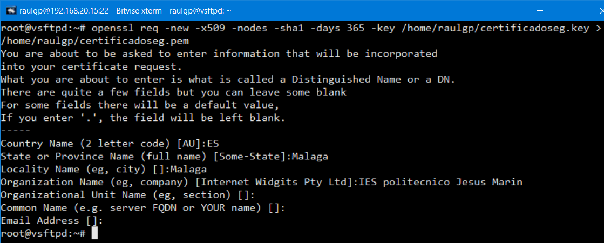

Escribimos el comando, `# nano /etc/vsftpd.conf`, y escribimos el contenido.

	allow_anon_ssl=YES # Habilitación de la conexión establecida del usuario anónimo por SSL
	
	rsa_cert_file=/home/raulgp/certificadoseg.pem
	rsa_private_key_file=/home/raulgp/certificadoseg.key
	ssl_enable=YES # Habilitación de la conexión establecida por SSL

	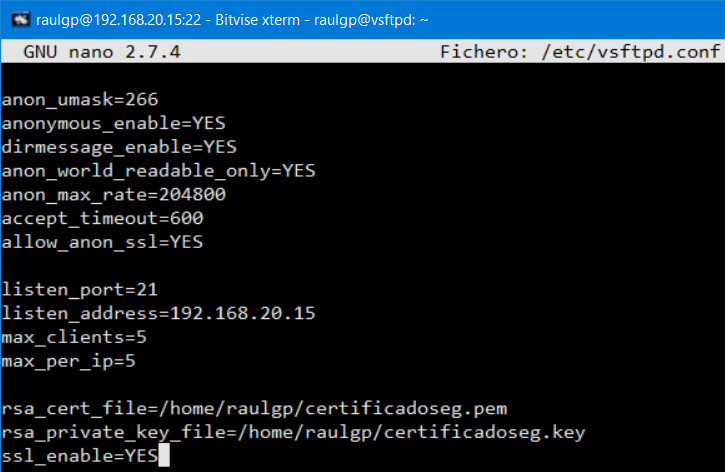

Escribimos el comando, `# service vsftpd restart`, para reiniciar el servidor vsftpd.

	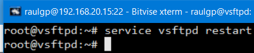

#### 3.6.2  Establecimiento de cuotas de usuario

Escribimos el comando, `# apt install quota quotatool`, escribimos el comando, `# nano /etc/fstab`, y escribimos las opciones, `usrquota,grpquota`, para establecer las opciones de montaje de los dispositivos especificados.

	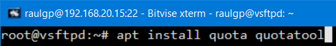

	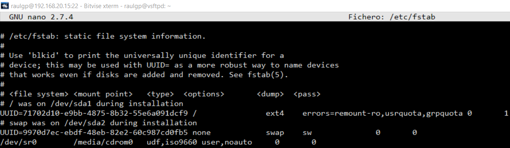

Escribimos el comando, `# mount -o remount,rw /`, para montar los dispositivos especificados.

	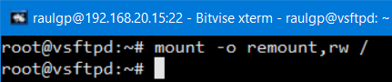

Escribimos el comando, `# quotacheck -cgum /`, escribimos el comando, `# edquota -u "nombre de usuario"`, y escribimos el contenido.

	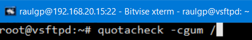

	

Escribimos el comando, `# repquota / -s`, para comprobar las cuotas de usuario en el dispositivo especificado.

	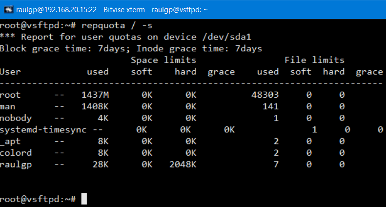

Escribimos el comando, `# edquota -g "nombre de grupo"`, y escribimos el contenido.

	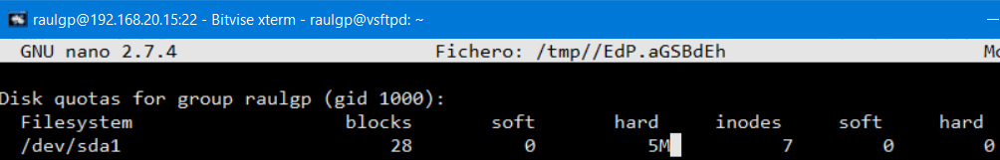

Escribimos el comando, `# repquota / -sg`, para comprobar las cuotas de grupo en el dispositivo especificado.

	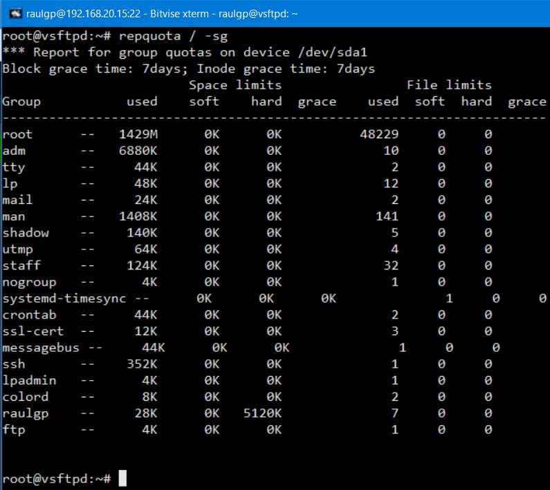

#### 3.6.3  Cortafuegos

Escribimos el comando, `# nano regvsftpdiptables.sh`, y escribimos el contenido.

	# Limpieza de todas las reglas y denegar o aceptar las conexiones  
	iptables -F  
	iptables -X  
	iptables -Z  
	iptables -t nat -F  
	iptables -P INPUT DROP  
	iptables -P FORWARD DROP  
	iptables -P OUTPUT ACCEPT  
	  
	# Aceptar los protocolos y los puertos de entrada en las interfaces de red  
	iptables -A INPUT -i lo -p all -j ACCEPT  
	iptables -A INPUT -i ens33 -p icmp -j ACCEPT  
	iptables -A INPUT -p tcp --dport 20 -j ACCEPT  
	iptables -A INPUT -p tcp --dport 21 -j ACCEPT  
	iptables -A INPUT -p tcp --dport 22 -j ACCEPT  
	iptables -A INPUT -p tcp --dport 40000:40100 -j ACCEPT

	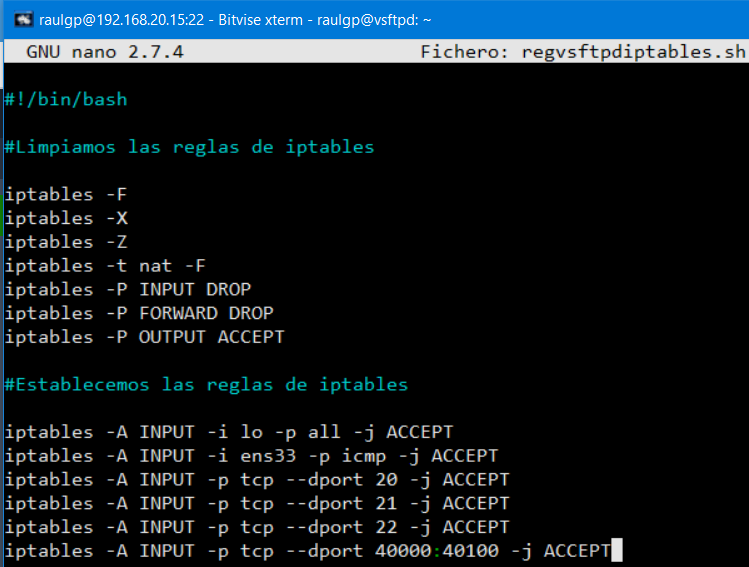

### 3.7  Comprobación de la seguridad

Escribimos el comando, `# netstat -putan | egrep vsftpd`, para comprobar que esta escuchando peticiones en el puerto y en la interfaz de red especificadas el servicio vsftpd.

	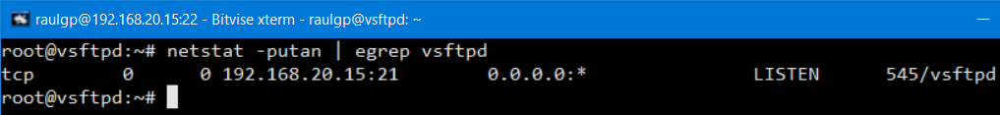

Nos vamos a la máquina anfitriona, ejecutamos el cliente FileZilla, escribimos la dirección IP del servidor, escribimos el nombre de usuario, escribimos la contraseña, le damos a conexión rápida, comprobamos que excedemos el número máximo de usuarios establecido.

	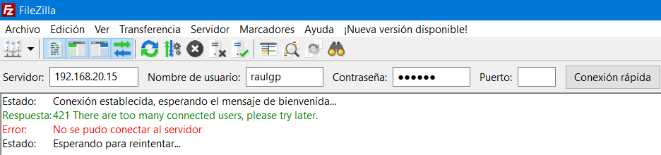

Nos vamos al servidor vsftpd, escribimos el comando, `# tail /var/log/vsftpd.log`, para mostrar el log del servidor vsftpd.

	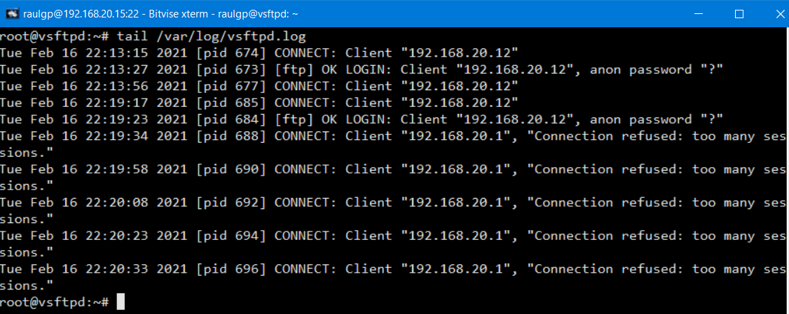

Nos vamos a la máquina anfitriona, ejecutamos el Wireshark, seleccionamos la interfaz de red especificada, le damos a capturar, le damos a empezar, comprobamos que la conexión establecida esta encriptada.

	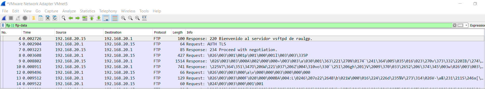

Ejecutamos el cliente FileZilla, escribimos la dirección IP del servidor, escribimos el nombre de usuario, escribimos la contraseña, le damos a conexión rápida, subimos un archivo, comprobamos que excedemos la cuota de usuario especificada.

	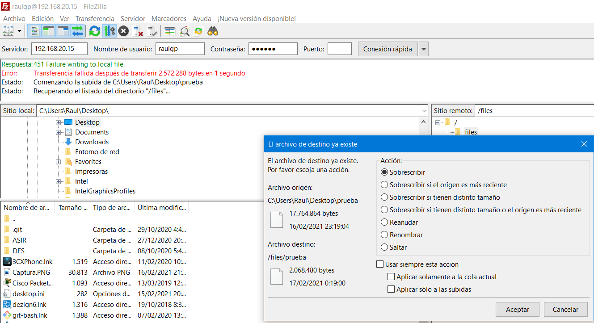

Nos vamos al servidor vsftpd, escribimos el comando, `# iptables -L`, para mostrar las reglas de iptables establecidas.

	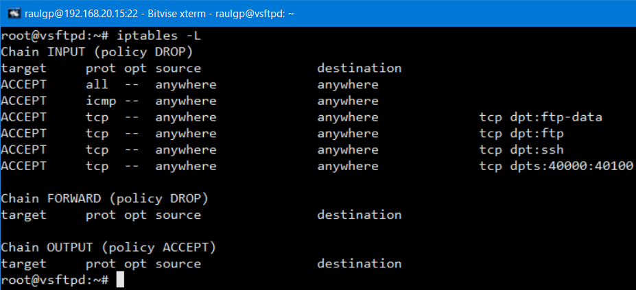

## 4  Webgrafía

<https://linux.die.net/man/5/vsftpd.conf>  
<https://krypted.com/unix/customizing-vsftpd-banners/>  
<https://www.zeppelinux.es/instalacion-y-configuracion-del-servidor-ftp-vsftpd-en-linux-debian/>  
<https://linuxize.com/post/how-to-setup-ftp-server-with-vsftpd-on-debian-9/>

## 5  Conclusión

Un servidor ftp es una manera sencilla de que los usuarios permitidos puedan subir o descargar archivos.
