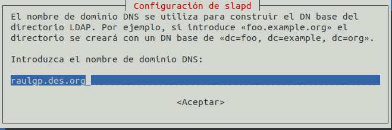
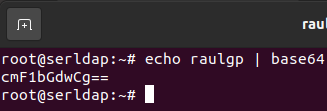

# Servidor LDAP

## Índice

### [1 Introducción](#1--Introducción)

### [2 Requerimientos](#2--Requerimientos)

### [3 Preparación](#3--Preparación)
#### &nbsp; &nbsp; [3.1 Instalación](#31--Instalación)
#### &nbsp; &nbsp; [3.2 Creación y configuración de objetos](#32--Creación-y-configuración-de-objetos)
#### &nbsp; &nbsp; [3.3 Unión al dominio de clientes con sistemas operativos libres](#33--Unión-al-dominio-de-clientes-con-sistemas-operativos-libres)
#### &nbsp; &nbsp; [3.4 Seguridad](#34--Seguridad)
#### &nbsp; &nbsp; [3.5 Comprobación de la seguridad](#35--Comprobación-de-la-seguridad)

### [4 Webgrafía](#4--Webgrafía)

### [5 Conclusión](#5--Conclusión)

---

## 1  Introducción

El protocolo ligero de acceso a directorios (Lightweight Directory Access Protocol) hace referencia a un protocolo a nivel de aplicación que permite el acceso a un servicio de directorio ordenado y distribuido para buscar diversa información en un entorno de red.

Un cliente inicia una sesión de LDAP, conectándose a un servidor usando el puerto 389 o utilizando SSL en el puerto 636. El cliente luego envı́a una petición de operación al servidor, y este envı́a respuestas.

En una empresa la aplicación más común de un servidor LDAP es la autenticación de los clientes en una red, y almacenar adjuntamente otra información de ellos.

## 2  Requerimientos

Todas las máquinas virtuales tienen el sistema operativo Debian 9 stretch.

- Hipervisor VMware Workstation.

- Servidor ssh en las máquinas virtuales.

- Cliente ssh en la máquina anfitriona.

## 3  Preparación

En una máquina virtual accedemos mediante ssh desde la máquina anfitriona.

### 3.1  Instalación

Escribimos el comando, `# apt install slapd ldap-utils`, para instalar el servidor LDAP.

	

Escribimos la contraseña del administrador, para gestionar la configuración del servidor LDAP.

	

Escribimos el comando, `# dpkg-reconfigure -plow slapd`, para configurar el servidor LDAP.

	

Seleccionamos que no vamos a omitir la configuración del servidor LDAP.

	

Escribimos el nombre de dominio DNS, para establecer el DN base del directorio LDAP.

	

Escribimos el nombre de la organización en el DN base del directorio LDAP.

	

Escribimos la contraseña del administrador del servidor LDAP, y seleccionamos el motor de la base de datos.

	

Seleccionamos que no elimine la base de datos cuando se configure el servidor LDAP.

	

Seleccionamos que si vamos a mover la base de datos antigua.

	

### 3.2  Creación y configuración de objetos

Escribimos el comando, `# nano uniorg.ldif`, y escribimos el contenido.

	dn: ou=usuarios,dc=raulgp,dc=des,dc=org
	objectClass: top
	objectClass: organizationalUnit # Establecimiento del tipo de objeto
	ou: usuarios # Nombre de la unidad organizativa

	

Escribimos el comnando, `# nano grupos.ldif`, y escribimos el contenido.

	dn: cn=clientes,ou=usuarios,dc=raulgp,dc=des,dc=org
	objectClass: top
	objectClass: posixGroup # Establecimiento del tipo de objeto
	gidNumber: 2000 # ID del grupo
	cn: clientes # Nombre del grupo

	

Escribimos el comando, `# slappasswd -v`, y escribimos la contraseña del nuevo usuario del servidor LDAP.

	

Escribimos el comando, `# echo "nombre de usuario" | base64`, para codificar el nombre del nuevo usuario del servidor LDAP.

	

Escribimos el comando, `# nano usuarios.ldif`, y escribimos el contenido.

	dn: uid=raulgp,ou=usuarios,dc=raulgp,dc=des,dc=org
	objectClass: top
	objectClass: posixAccount
	objectClass: inetOrgPerson
	objectClass: person # Establecimiento del tipo de objeto
	cn:: cmF1bGdwCg== # Nombre completo del usuario
	uid: raulgp # Nombre del usuario
	uidNumber: 2001 # ID del usuario
	gidNumber: 2000 # ID del grupo del usuario
	homeDirectory: /home/ldap/raulgp
	userPassword: SSHACKZ0ozrZrKK8Xcn30Cqpm91nbU61YJae # Contraseña del usuario
	sn:: cHJ1ZWJhCg== # Apellidos del usuario
	givenName: raulgp # Nombre del usuario

	

Escribimos el comando, `# ldapadd -x -D cn=admin,dc=raulgp,dc=des,dc=org -W -f uniorg.ldif`, para añadir los objetos al servidor LDAP.

	

	

### 3.3  Unión al dominio de clientes con sistemas operativos libres

Nos vamos al equipo cliente, y escribimos el comando, `# apt install libnss-ldap libpam-ldap ldap-utils`, para instalar los paquetes del cliente LDAP.

	

Escribimos la dirección del servidor LDAP.

	

Escribimos el nombre de dominio DNS, para establecer el DN del servidor LDAP en el equipo cliente.

	

Seleccionamos la versión del protocolo LDAP, y establecemos la cuenta del administrador del servidor LDAP en el equipo cliente.

	

Escribimos la contraseña de la cuenta del administrador, seleccionamos que el archivo nsswitch.conf no se gestionara automáticamente, y seleccionamos que si se comporte la cuenta del administrador del servidor LDAP como el administrador local.

	

Seleccionamos que no hace falta un usuario para acceder a la base de datos LDAP, establecemos la cuenta del administrador del servidor LDAP en el equipo cliente y escribimos la contraseña.

	

Escribimos el comando, `# nano /etc/nsswitch.conf`, para establecer el orden de búsqueda en la base de datos del cliente LDAP, y escribimos el contenido.

	passwd: compat ldap
	group: compat ldap
	shadow: compat ldap
	gshadow: files

	

Escribimos el comando, `# nano /etc/pam.d/common-password`, para configurar el módulo PAM del establecimiento de las contraseñas, y escribimos el contenido.

	password [success=1 user_unknown=ignore default=die] pam_ldap.so try_first_pass

	

Escribimos el comando, `# nano /etc/pam.d/common-session`, para crear automáticamente el directorio principal de los usuarios si no está creado, y escribimos el contenido.

	session optional pam_mkhomedir.so skel=/etc/skel umask=077

	

	

### 3.4  Seguridad

Escribimos el comando, `# nano regldapiptables.sh`, y escribimos el contenido.

	# Limpieza de todas las reglas y denegar o aceptar las conexiones
	iptables -F
	iptables -X
	iptables -Z
	iptables -t nat -F
	iptables -P INPUT DROP
	iptables -P FORWARD DROP
	iptables -P OUTPUT ACCEPT
	
	echo "40000 40100" > /proc/sys/net/ipv4/ip_local_port_range
	
	# Aceptar los protocolos y los puertos de entrada en las interfaces de red
	iptables -A INPUT -i lo -p all -j ACCEPT
	iptables -A INPUT -p icmp -j ACCEPT
	iptables -A INPUT -p tcp --dport 22 -j ACCEPT
	iptables -A INPUT -p tcp --dport 389 -j ACCEPT
	iptables -A INPUT -p tcp --dport 40000:40100 -j ACCEPT

	

### 3.5  Comprobación de la seguridad

Escribimos el comando, `# iptables -L`, para mostrar las reglas de iptables establecidas.

	

## 4  Webgrafía

<https://juanjoselo.wordpress.com/2017/10/29/instalacion-y-configuracion-de-ldap-en-debian-stretch-con-directorio-ldap-basico/>  
<https://kifarunix.com/configure-openldap-client-on-debian-9-stretch/>

## 5  Conclusión

Un servidor LDAP en una manera sencilla de autenticar clientes en una red y almacenar información de ellos.
