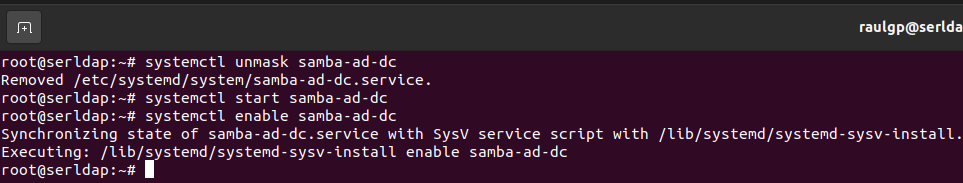
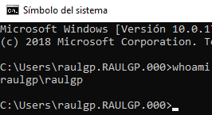

# Servidor directorio activo controlador de dominio

## Índice

### [1 Introducción](#1--Introducción)

### [2 Requerimientos](#2--Requerimientos)

### [3 Preparación](#3--Preparación)
#### &nbsp; &nbsp; [3.1 Instalación](#31--Instalación)
#### &nbsp; &nbsp; [3.2 Configuración del servidor DNS](#32--Configuración-del-servidor-DNS)
#### &nbsp; &nbsp; [3.3 Unión al dominio de clientes con sistemas operativos propietarios](#33--Unión-al-dominio-de-clientes-con-sistemas-operativos-propietarios)
#### &nbsp; &nbsp; [3.4 Seguridad](#34--Seguridad)
#### &nbsp; &nbsp; [3.5 Comprobación de la seguridad](#35--Comprobación-de-la-seguridad)

### [4 Webgrafía](#4--Webgrafía)

### [5 Conclusión](#5--Conclusión)

---

## 1  Introducción

El protocolo ligero de acceso a directorios (Lightweight Directory Access Protocol) hace referencia a un protocolo a nivel de aplicación que permite el acceso a un servicio de directorio ordenado y distribuido para buscar diversa información en un entorno de red.

Un cliente inicia una sesión de LDAP, conectándose a un servidor usando el puerto 389 o utilizando SSL en el puerto 636. El cliente luego envı́a una petición de operación al servidor, y este envı́a respuestas.

En una empresa la aplicación más común de un servidor LDAP es la autenticación de los clientes en una red, y almacenar adjuntamente otra información de ellos.

Un servicio de directorio, es establecido en uno o varios servidores donde se crean objetos tales como usuarios, equipos o grupos, con el objetivo de administrar los inicios de sesión en los equipos conectados a la red, ası́ como también la administración de polı́ticas en toda la red.

Uno de los servicios de un directorio activo es la de controlador de dominio, en la que una de sus funciones es la autenticación, que es el proceso de garantizar o denegar a un usuario el acceso a recursos compartidos o a otra máquina de la red, normalmente a través del uso de una contraseña.

## 2  Requerimientos

Todas las máquinas virtuales tienen el sistema operativo Debian 9 stretch.

- Hipervisor VMware Workstation.

- Servidor ssh en las máquinas virtuales.

- Cliente ssh en la máquina anfitriona.

## 3  Preparación

En una máquina virtual accedemos mediante ssh desde la máquina anfitriona.

### 3.1  Instalación

Escribimos el comando, `# apt install acl attr samba samba-dsdb-modules samba-vfs-modules winbind libpam-winbind libnss-winbind libpam-krb5 krb5-config krb5-user`, para instalar samba y kerberos y configurarlos.

	

Escribimos el nombre de dominio DNS, para establecer el DN base predeterminado que utilizara kerberos para autenticar a los usuarios.

	

Escribimos el nombre del servidor kerberos que utilizara en el dominio.

	

Escribimos el nombre del servidor kerberos administrativo.

	

Escribimos el comando, `# systemctl stop samba-ad-dc smbd nmbd winbind`, y escribimos el comando, `# systemctl disable samba-ad-dc smbd nmbd winbind`, para parar y deshabilitar los servicios especificados.

	

Escribimos el comando, `# mv /etc/samba/smb.conf /etc/samba/smb1.conf`, y escribimos el comando, `# samba-tool domain provision --use-rfc2307 --interactive`,
para aprovisionar samba como directorio activo controlador de dominio.

	

Escribimos el comando, `# systemctl unmask samba-ad-dc`, escribimos el comando, `# systemctl start samba-ad-dc`, y escribimos el comando, `# systemctl enable samba-ad-dc`, para iniciar y habilitar los servicios especificados.

	

	

Escribimos el comando, `# samba-tool user create raulgp A12345a. --given-name="raulgp" --surname="prueba"`, para crear un usuario en el dominio.

	

	

### 3.2  Configuración del servidor DNS

En otra máquina virtual con un servidor bind9 instalado y configurado, escribimos el comando, `# nano /etc/bind/zones/db.raulgp.des.org`, para establecer los registros SRV, y escribimos el contenido.

	$ORIGIN _udp.raulgp.des.org.
	$TTL 900 ; 15 minutes
	_domain IN SRV 5 0 53 serldap.raulgp.des.org.
	_domain IN SRV 5 0 53 raulgp.des.org.
	_kerberos._udp.raulgp.des.org. SRV 0 0 389 serldap.raulgp.des.org.
	_kerberos._udp.raulgp.des.org. SRV 0 0 389 raulgp.des.org.
	
	$ORIGIN _tcp.raulgp.des.org.
	$TTL 900 ; 15 minutes
	_domain IN SRV 5 0 53 serldap.raulgp.des.org.
	_ldap._tcp.raulgp.des.org. SRV 0 0 389 serldap.raulgp.des.org.
	_ldap._tcp.dc._msdcs.raulgp.des.org. SRV 0 0 389 serldap.raulgp.des.org.
	ldap._tcp.gc._msdcs.raulgp.des.org. SRV 0 0 389 serldap.raulgp.des.org.
	_kerberos._tcp.dc._msdcs.raulgp.des.org. SRV 0 0 389 serldap.raulgp.des.org.
	ldap._tcp.pdc._msdcs.raulgp.des.org. SRV 0 0 389 serldap.raulgp.des.org.
	
	_domain IN SRV 5 0 53 raulgp.des.org.
	_ldap._tcp.raulgp.des.org. SRV 0 0 389 raulgp.des.org.
	_ldap._tcp.dc._msdcs.raulgp.des.org. SRV 0 0 389 raulgp.des.org.
	ldap._tcp.gc._msdcs.raulgp.des.org. SRV 0 0 389 raulgp.des.org.
	_kerberos._tcp.dc._msdcs.raulgp.des.org. SRV 0 0 389 raulgp.des.org.
	ldap._tcp.pdc._msdcs.raulgp.des.org. SRV 0 0 389 raulgp.des.org.

	

Escribimos el comando, `# named-checkzone raulgp.des.org /etc/bind/zones/db.raulgp.des.org`, para comprobar la configuración del archivo.

	

Escribimos el comando, `# service bind9 restart`, para reiniciar el servidor bind9.

	

### 3.3  Unión al dominio de clientes con sistemas operativos propietarios

Nos vamos al equipo cliente, nos vamos al panel de control, nos vamos a sistema y seguridad, nos vamos a sistema, y le damos a cambiar configuración, para establecer el nombre de dominio en el equipo cliente.

	

Le damos a cambiar, seleccionamos dominio, escribimos el nombre del dominio, le damos a aceptar, escribimos el nombre del usuario administrador del dominio, escribimos la contraseña, y le damos a aceptar.

	

	

### 3.4  Seguridad

Escribimos el comando, `# nano regldapiptables.sh`, y escribimos el contenido.

	# Limpieza de todas las reglas y denegar o aceptar las conexiones
	iptables -F
	iptables -X
	iptables -Z
	iptables -t nat -F
	iptables -P INPUT DROP
	iptables -P FORWARD DROP
	iptables -P OUTPUT ACCEPT
	
	echo "40000 40100" > /proc/sys/net/ipv4/ip_local_port_range
	
	# Aceptar los protocolos y los puertos de entrada en las interfaces de red
	iptables -A INPUT -i lo -p all -j ACCEPT
	iptables -A INPUT -p icmp -j ACCEPT
	iptables -A INPUT -p tcp --dport 22 -j ACCEPT
	iptables -A INPUT -p tcp --dport 53 -j ACCEPT
	iptables -A INPUT -p tcp --dport 389 -j ACCEPT
	iptables -A INPUT -p tcp --dport 135 -j ACCEPT
	iptables -A INPUT -p tcp --dport 1024 -j ACCEPT
	iptables -A INPUT -p tcp --dport 88 -j ACCEPT
	iptables -A INPUT -p tcp --dport 445 -j ACCEPT
	iptables -A INPUT -p tcp --dport 139 -j ACCEPT
	iptables -A INPUT -p tcp --dport 40000:40100 -j ACCEPT

	

### 3.5  Comprobación de la seguridad

Escribimos el comando, `# iptables -L`, para mostrar las reglas de iptables establecidas.

	

## 4  Webgrafía

<https://usuariodebian.blogspot.com/2019/04/samba-4-como-controlador-de-dominios-ad.html>  
<https://linuxyotrascosas.wordpress.com/2019/07/16/debian-9-como-controlador-de-dominio-con-samba4-active-directory/>

## 5  Conclusión

Un servidor de directorio activo controlador de dominio es una manera sencilla de administrar los inicios de sesión de los usuarios y el acceso a recursos en una red.
