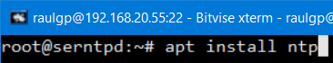
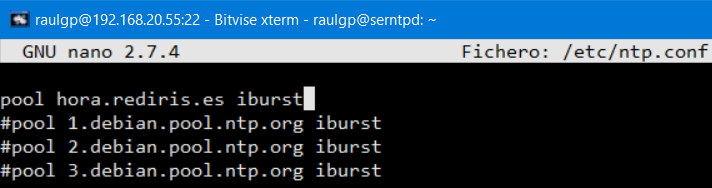
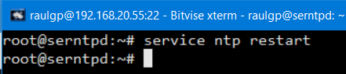
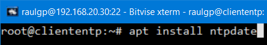
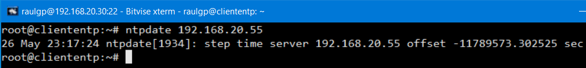
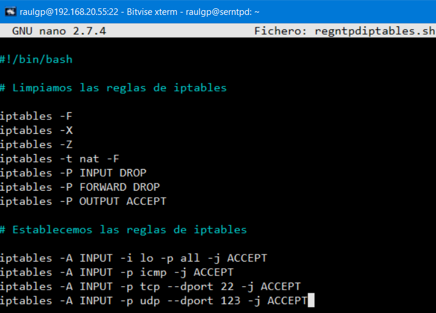
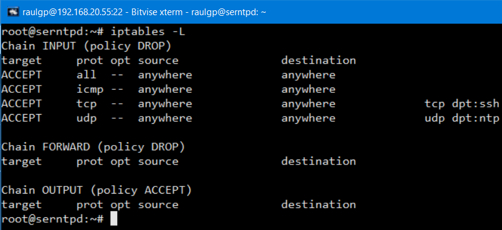

# Servidor NTP

## Índice

### [1 Introducción](#1--Introducción)

### [2 Requerimientos](#2--Requerimientos)

### [3 Preparación](#3--Preparación)
#### &nbsp; &nbsp; [3.1 Instalación](#31--Instalación)
#### &nbsp; &nbsp; [3.2 Configuración](#32--Configuración)
#### &nbsp; &nbsp; [3.3 Comprobación](#33--Comprobación)
#### &nbsp; &nbsp; [3.4 Seguridad](#34--Seguridad)
#### &nbsp; &nbsp; [3.5 Comprobación de la seguridad](#35--Comprobación-de-la-seguridad)

### [4 Webgrafía](#4--Webgrafía)

### [5 Conclusión](#5--Conclusión)

---

## 1  Introducción

El protocolo de red NTP (Network Time Protocol) es para sincronizar los relojes de los sistemas informáticos a través del enrutamiento de paquetes en redes con latencia variable.

Utiliza UDP como capa de transporte, usando el puerto 123, y está diseñado para resistir los efectos de la variación de latencia.

En una empresa la aplicación más común de un servidor NTP es actualizar los clientes horarios de los equipos, e iniciar sesión con el mismo uso horario en un servidor LDAP.

## 2  Requerimientos

Todas las máquinas virtuales tienen el sistema operativo Debian 9 stretch.

- Hipervisor VMware Workstation.

- Servidor ssh en las máquinas virtuales.

- Cliente ssh en la máquina anfitriona.

## 3  Preparación

En una máquina virtual accedemos mediante ssh desde la máquina anfitriona.

### 3.1  Instalación

Escribimos el comando, `# apt install ntp`, para instalar el servidor ntp.

	

### 3.2  Configuración

Escribimos el comando, `# nano /etc/ntp.conf`, y escribimos el contenido.

	pool hora.rediris.es iburst

	

Escribimos el comando, `n# service ntp restart`, para reiniciar el servidor ntp.

	

### 3.3  Comprobación

Nos vamos a un cliente ntp, escribimos el comando, `# apt install ntpdate`, y escribimos el comando, `# ntpdate "dirección ip"`, para sincronizar el reloj del sistema con el servidor ntp.

	

	

### 3.4  Seguridad

Escribimos el comando, `# nano regntpdiptables.sh`, y escribimos el contenido.

	# Limpieza de todas las reglas y denegar o aceptar las conexiones
	iptables -F
	iptables -X
	iptables -Z
	iptables -t nat -F
	iptables -P INPUT DROP
	iptables -P FORWARD DROP
	iptables -P OUTPUT ACCEPT
	
	# Aceptar los protocolos y los puertos de entrada en las interfaces de red
	iptables -A INPUT -i lo -p all -j ACCEPT
	iptables -A INPUT -p icmp -j ACCEPT
	iptables -A INPUT -p tcp --dport 22 -j ACCEPT
	iptables -A INPUT -p udp --dport 123 -j ACCEPT

	

### 3.5  Comprobación de la seguridad

Escribimos el comando, `# iptables -L`, para mostrar las reglas de iptables establecidas.

	

## 4  Webgrafía

<https://linuxconfig.org/how-to-setup-ntp-server-and-client-on-debian-9-stretch-linux>

## 5  Conclusión

Un servidor ntp es una manera sencilla de sincronizar los relojes de los sistemas informáticos e iniciar sesión en un servidor LDAP con el mismo uso horario.
