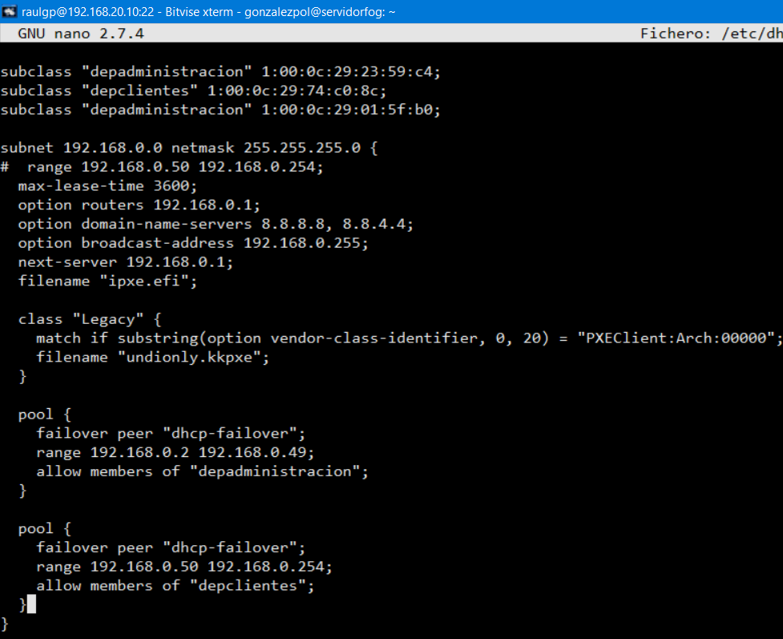
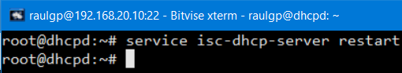
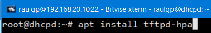
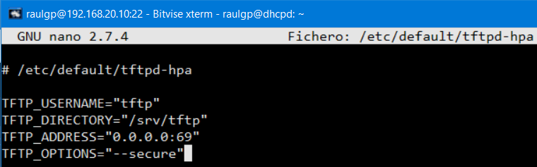
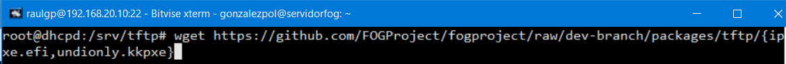
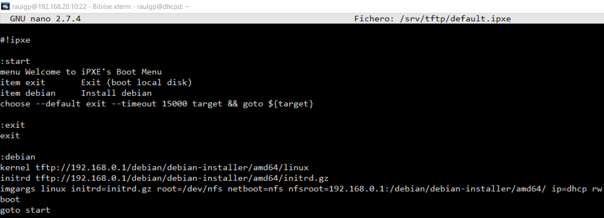
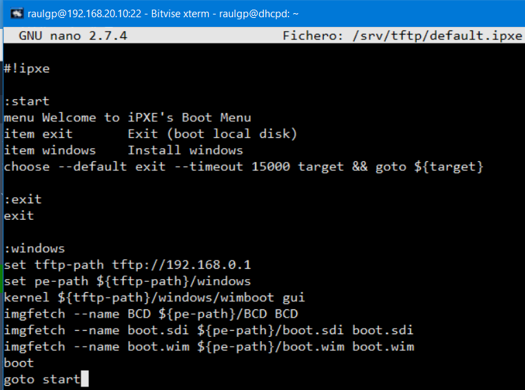
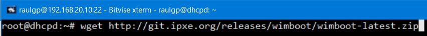
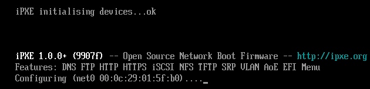
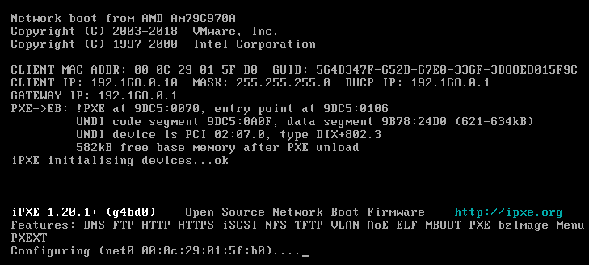

# Servidor PXE

## Índice

### [1 Introducción](#1--Introducción)

### [2 Requerimientos](#2--Requerimientos)

### [3 Preparación](#3--Preparación)
#### &nbsp; &nbsp; [3.1 Instalación](#31--Instalación)
#### &nbsp; &nbsp; [3.2 Arranque por red de instaladores de sistemas operativos libres](#32--Arranque-por-red-de-instaladores-de-sistemas-operativos-libres)
#### &nbsp; &nbsp; [3.3 Arranque por red de instaladores de sistemas operativos propietarios](#33--Arranque-por-red-de-instaladores-de-sistemas-operativos-propietarios)
#### &nbsp; &nbsp; [3.4 Comprobación](#34--Comprobación)

### [4 Webgrafía](#4--Webgrafía)

### [5 Conclusión](#5--Conclusión)

---

## 1  Introducción

El entorno PXE (Preboot eXecution Environment), es utilizado para arrancar o instalar el sistema operativo en computadoras a través de una red, de manera independiente de los dispositivos de almacenamiento o de los sistemas operativos instalados.

El protocolo PXE consiste en una combinación de los protocolos DHCP y TFTP con pequeñas modificaciones, DHCP es utilizado para localizar el servidor de arranque, y con TFTP se descarga el programa inicial del proceso de inicio y archivos adicionales.

En una empresa la aplicación más común de un servidor PXE es arrancar sistemas operativos customizados en equipos sin unidades de almacenamientos, o usarlo de servidor de clonación para hacer o volcar copias de seguridad.

## 2  Requerimientos

Todas las máquinas virtuales tienen el sistema operativo Debian 9 stretch.

- Hipervisor VMware Workstation.

- Servidor ssh en las máquinas virtuales.

- Cliente ssh en la máquina anfitriona.

## 3  Preparación

En una máquina virtual accedemos mediante ssh desde la máquina anfitriona.

### 3.1  Instalación

En otras maquinas virtuales con un servidor isc-dhcp-server instalado y configurado, escribimos el comando, `# nano /etc/dhcp/dhcpd.conf`, y escribimos el contenido.

    subnet 192.168.0.0 netmask 255.255.255.0 {
    # range 192.168.0.50 192.168.0.254;
      max-lease-time 3600;
      option routers 192.168.0.1;
      option domain-name-servers 8.8.8.8, 8.8.4.4;
      option broadcast-address 192.168.0.255;
      
      next-server 192.168.0.1; # Establecimiento del servidor tftp
      filename "ipxe.efi"; # Establecimiento del nombre del archivo para UEFI.
      
    # Establecimiento del nombre del archivo para BIOS
      class "Legacy" {
        match if substring(option vendor-class-identifier, 0, 20) = "PXEClient:Arch:00000";
        filename "undionly.kkpxe";
      }
      
      pool {
        failover peer "dhcp-failover";
        range 192.168.0.2 192.168.0.49;
        allow members of "depadministracion";
      }
      
      pool {
        failover peer "dhcp-failover";
        range 192.168.0.50 192.168.0.254;
        allow members of "depclientes";
      }
    }

	

Escribimos el comando, `# service isc-dhcp-server restart`, para reiniciar los servidores dhcp.

	

Escribimos el comando, `# apt install tftpd-hpa`, para instalar el servidor tftp.

	

Escribimos el comando, `# nano /etc/default/tftpd-hpa`, para comprobar la configuración por defecto del servidor tftp.

	

Escribimos el comando, `# wget https://github.com/FOGProject/fogproject/raw/dev-branch/packages/tftp/{ipxe.efi,undionly.kkpxe}`, para descargar los archivos que enviara los servidores dhcp para UEFI y para BIOS.

	

### 3.2  Arranque por red de instaladores de sistemas operativos libres

Escribimos el comando, `# nano /srv/tftp/default.ipxe`, y escribimos el contenido.

	:start
	menu Welcome to iPXE’s Boot Menu
	item exit	Exit (boot local disk)
	item debian	Install debian
	choose --default exit --timeout 15000 target && goto ${target}
	
	:exit
	exit
	
	:debian
	kernel tftp://192.168.0.1/debian/debian-installer/amd64/linux
	initrd tftp://192.168.0.1/debian/debian-installer/amd64/initrd.gz
	imgargs linux initrd=initrd.gz root=/dev/nfs netboot=nfs nfsroot=192.168.0.1:/debian/debian-installer/amd64/ ip=dhcp rw
	boot
	goto start

	

### 3.3  Arranque por red de instaladores de sistemas operativos propietarios

Escribimos el comando, `# nano /srv/tftp/default.ipxe`, y escribimos el contenido

	:start
	menu Welcome to iPXE’s Boot Menu
	item exit	Exit (boot local disk)
	item windows	Install windows
	choose --default exit --timeout 15000 target && goto ${target}
	
	:exit
	exit
	
	:windows
	set tftp-path tftp://192.168.0.1
	set pe-path ${tftp-path}/windows
	kernel ${tftp-path}/windows/wimboot gui
	imgfetch --name BCD ${pe-path}/BCD BCD
	imgfetch --name boot.sdi ${pe-path}/boot.sdi boot.sdi
	imgfetch --name boot.wim ${pe-path}/boot.wim boot.wim
	boot
	goto start

	

Escribimos el comando, `# wget http://git.ipxe.org/releases/wimboot/wimboot-latest.zip`, lo descomprimimos y escribimos el comando, `# mv ./wimboot-2.6.0-signed/wimboot /srv/tftp/windows`, para mover el kernel del sistema operativo propietario.

	

### 3.4  Comprobación

Nos vamos a un cliente pxe con UEFI, arrancamos el equipo por red, y seleccionamos una opción de instalación de un sistema operativo del menú.

	

Nos vamos a un cliente pxe con BIOS, arrancamos el equipo por red, y seleccionamos una opción de instalación de un sistema operativo del menú.

	

## 4  Webgrafía

<https://ipxe.org/start>  
<https://gist.github.com/alevin/ee1382bb9ee410a228fefc1c55371227>  
<https://forums.fogproject.org/topic/10944/using-fog-to-pxe-boot-into-your-favorite-installer-images/3>

## 5  Conclusión

Un servidor pxe es una manera sencilla de arrancar o instalar sistemas operativos en equipos a través de una red.
