# Servidor web

## Índice

### [1 Introducción](#1--Introducción)

### [2 Requerimientos](#2--Requerimientos)

### [3 Preparación](#3--Preparación)
#### &nbsp; &nbsp; [3.1 Instalación](#31--Instalación)
#### &nbsp; &nbsp; [3.2 Habilitación de un virtualhost](#32--Habilitación-de-un-virtualhost)
#### &nbsp; &nbsp; [3.3 Mapeado de directorios](#33--Mapeado-de-directorios)
#### &nbsp; &nbsp; [3.4 Redireccionamiento](#34--Redireccionamiento)
#### &nbsp; &nbsp; [3.5 Establecimiento de un nombre alternativo](#35--Establecimiento-de-un-nombre-alternativo)
#### &nbsp; &nbsp; [3.6 Ejecución de páginas en php](#36--Ejecución-de-páginas-en-php)
#### &nbsp; &nbsp; [3.7 Ejecución de páginas en python](#37--Ejecución-de-páginas-en-python)
#### &nbsp; &nbsp; [3.8 Seguridad](#38--Seguridad)
##### &nbsp; &nbsp; &nbsp; &nbsp; &nbsp; &nbsp; [3.8.1 Conexión por SSL](#381--Conexión-por-SSL)
##### &nbsp; &nbsp; &nbsp; &nbsp; &nbsp; &nbsp; [3.8.2 Cortafuegos](#382--Cortafuegos)
#### &nbsp; &nbsp; [3.9 Comprobación de la seguridad](#39--Comprobación-de-la-seguridad)

### [4 Webgrafía](#4--Webgrafía)

### [5 Conclusión](#5--Conclusión)

---

## 1  Introducción

El protocolo de red HTTP (Hypertext Transfer Protocol) es de comunicación que permite las transferencias de información a través de archivos en la World Wide Web, es un protocolo sin estado, por lo que no guarda ninguna información sobre conexiones anteriores, utilizando el puerto 80 y en su versión de transferencia segura el 443.

Este servidor web procesa una aplicación del lado del servidor, realizando conexiones bidireccionales o unidireccionales y sı́ncronas o ası́ncronas con el cliente y generando o cediendo una respuesta en cualquier lenguaje o aplicación del lado del cliente.

En una empresa la aplicación más común de un servidor web es proveer de páginas en un determinado lenguaje y procesarlo al cliente, y emplearlo de proxy inverso en una red.

## 2  Requerimientos

Todos los contenedores tienen el sistema operativo Debian 9 stretch.

- Aplicación de virtualización Docker.

- Servidor ssh en los contenedores.

- Cliente ssh en la máquina anfitriona.

## 3  Preparación

En un contenedor accedemos mediante ssh desde la máquina anfitriona.

### 3.1  Instalación

Escribimos el comando, `# apt install apache2`, para instalar el servidor apache.

	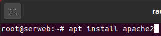

Reiniciamos el servidor apache, y escribimos el comando, `# netstat -putan | egrep ":80\s+"`, para comprobar que esta escuchado peticiones el servicio httpd.

	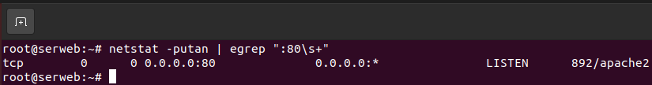

### 3.2  Habilitación de un virtualhost

Escribimos el comando, `# nano /etc/apache2/sites-available/virtualhostserweb.conf`, y escribimos el contenido.

	<VirtualHost *:80>
	  ServerName serweb.asir # Establecimiento del nombre de acceso al virtualhost
	  
	  ServerAdmin webmaster@localhost
	  DocumentRoot /serweb/ # Establecimiento de la ruta de los archivos
	  
	  ErrorLog $APACHE_LOG_DIR/error.log
	  CustomLog $APACHE_LOG_DIR/access.log combined
	</VirtualHost>

	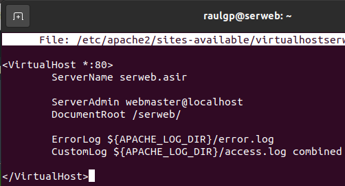

Escribimos el comando, `# a2ensite virtualhostserweb.conf`, para habilitar el virtualhost en el servidor apache.

	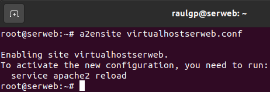

Escribimos el comando, `# nano /etc/apache2/apache2.conf`, para establecer las opciones de acceso a la ruta de los archivos del virtualhost, y escribimos el contenido.

	<Directory /serweb/>
	  Options -Indexes +FollowSymLinks # Establecimiento de las opciones de la ruta
	  AllowOverride None
	  Require all granted
	</Directory>

	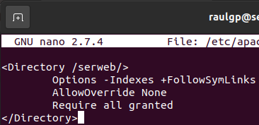

Escribimos el comando, `# apache2ctl restart`, para reiniciar el servidor apache.

	

	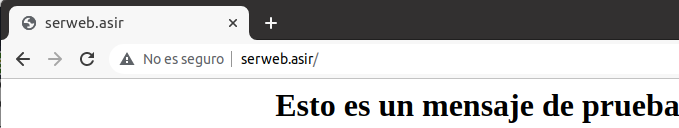

### 3.3  Mapeado de directorios

Escribimos el comando, `# nano /etc/apache2/sites-enabled/virtualhostserweb.conf`, para establecer un alias, y escribimos el contenido.

	alias /prueba /var/www/html/prueba.html

	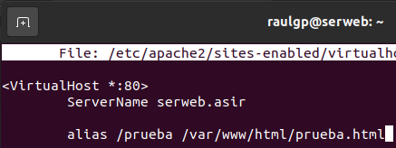

Escribimos el comando, `# apache2ctl restart`, para reiniciar el servidor apache.

	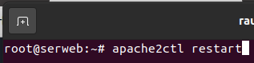

	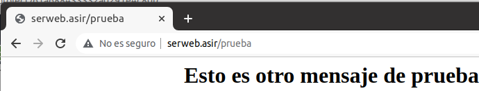

### 3.4  Redireccionamiento

Escribimos el comando, `# nano /etc/apache2/sites-enabled/virtualhostserweb.conf`, para establecer una redirección, y escribimos el contenido.

	redirect permanent /des https://www.google.es

	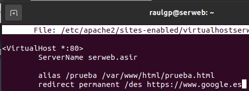

Escribimos el comando, `# apache2ctl restart`, para reiniciar el servidor apache.

	

	

### 3.5  Establecimiento de un nombre alternativo

Escribimos el comando, `# nano /etc/apache2/sites-enabled/virtualhostserweb.conf`, para establecer un nombre alternativo al virtuallhost, y escribimos el contenido.

	ServerAlias serraulweb.asir

	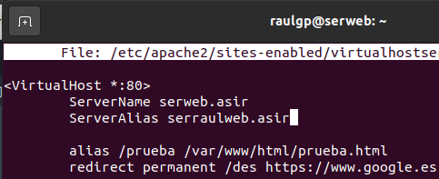

Escribimos el comando, `# apache2ctl restart`, para reiniciar el servidor apache.

	

	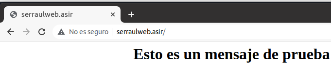

### 3.6  Ejecución de páginas en php

Escribimos el comando, `# curl -fsSL https://packages.sury.org/php/apt.gpg | apt-key add -`, para importar la llave del repositorio de php.

	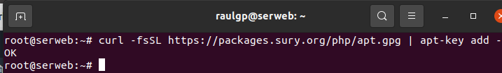

Escribimos el comando, `# nano /etc/apt/sources.list`, para añadir el repositorio de php, y escribimos el contenido.

	deb https://packages.sury.org/php/ stretch main

	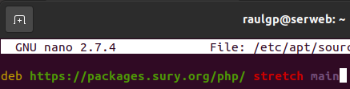

Actualizamos los repositorios, y escribimos el comando, `# apt install php libapache2-mod-php php-mysql`, para instalar php, y reiniciamos el servidor apache.

	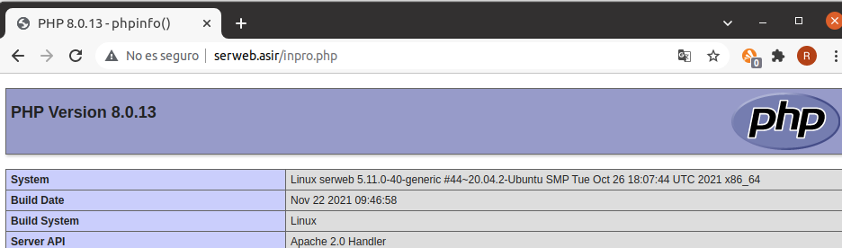

### 3.7  Ejecución de páginas en python

Escribimos el comando, `# a2enmod cgi`, para habilitar el módulo de procesamiento cgi en el servidor apache.

	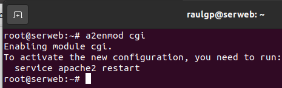

Escribimos el comando, `# nano /etc/apache2/apache2.conf`, para añadir la cabecera de los scripts en python, escribimos el contenido, y reiniciamos el servidor apache.

	<Directory /serweb/>
	  Options -Indexes +FollowSymLinks +ExecCGI
	  AddHandler cgi-script .py # Establecimiento de la cabecera de los scripts en python
	  AllowOverride None
	  Require all granted
	</Directory>

	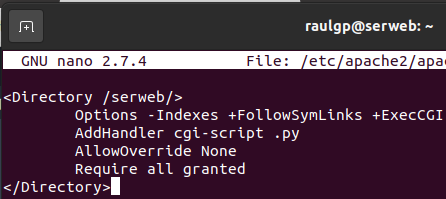

	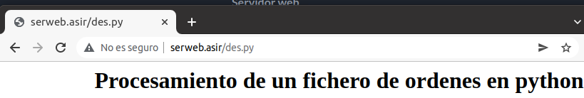

### 3.8  Seguridad

Escribimos el comando, `# nano /etc/apache2/apache2.conf`, para establecer el nivel de error en el registro log, y escribimos el contenido.

	LogLevel crit

	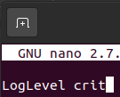

#### 3.8.1  Conexión por SSL

Escribimos el comando, `# openssl genrsa 4096 > /home/raulgp/certificadoseg.key`, para generar la llave del certificado SSL.

	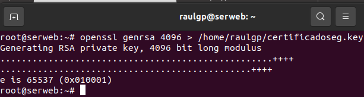

Escribimos el comando, `# openssl req -new -x509 -nodes -sha1 -days 365 -key /home/raulgp/certificadoseg.key > /home/raulgp/certificadoseg.pem`, para generar el certificado SSL especificado.

	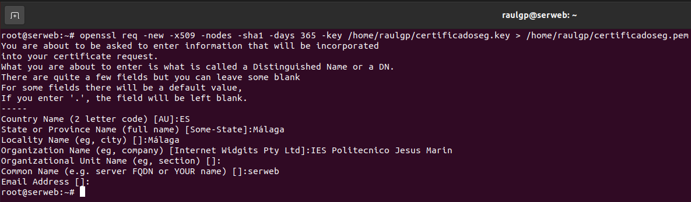

Escribimos el comando, `# a2enmod ssl`, para habilitar el módulo SSL del servidor apache.

	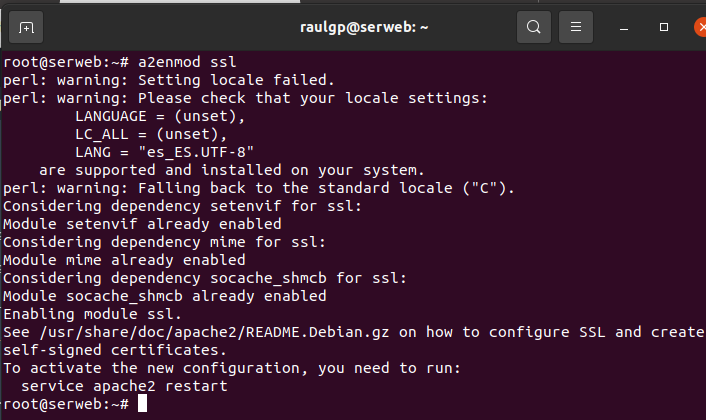

Escribimos el comando, `# nano /etc/apache2/sites-enabled/virtualhostserweb.conf`, y escribimos el contenido.

	<VirtualHost *:443>
	
	  SSLEngine on # Habilitación del módulo SSL
	  
	  SSLCertificateFile /home/raulgp/certificadoseg.pem
	  SSLCertificateKeyFile /home/raulgp/certificadoseg.key
	</VirtualHost>

	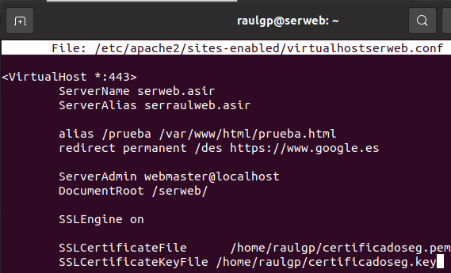

#### 3.8.2  Cortafuegos

Escribimos el comando, `# nano regwebiptables.sh`, y escribimos el contenido.

	# Limpieza de todas las reglas y denegar o aceptar las conexiones
	iptables -F
	iptables -X
	iptables -Z
	iptables -t nat -F
	iptables -P INPUT DROP
	iptables -P FORWARD DROP
	iptables -P OUTPUT ACCEPT
	
	echo "40000 40100" > /proc/sys/net/ipv4/ip_local_port_range
	
	# Aceptar los protocolos y los puertos de entrada en las interfaces de red
	iptables -A INPUT -i lo -p all -j ACCEPT
	iptables -A INPUT -p icmp -j ACCEPT
	iptables -A INPUT -p tcp --dport 22 -j ACCEPT
	iptables -A INPUT -p tcp --dport 80 -j ACCEPT
	iptables -A INPUT -p tcp --dport 443 -j ACCEPT
	iptables -A INPUT -p tcp --dport 40000:40100 -j ACCEPT

	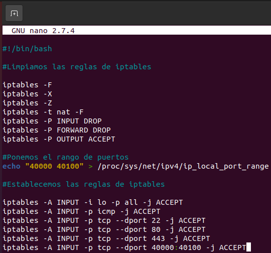

### 3.9  Comprobación de la seguridad

Forzamos un error critico en el servidor apache, y escribimos el comando, `# cat /var/log/apache2/error.log`, para mostrar los errores del registro log.

	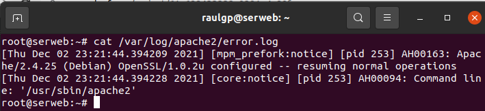

Nos vamos a la máquina anfitriona, ejecutamos un navegador web, escribimos la dirección del servidor apache, comprobamos que la conexión establecida esta encriptada.

	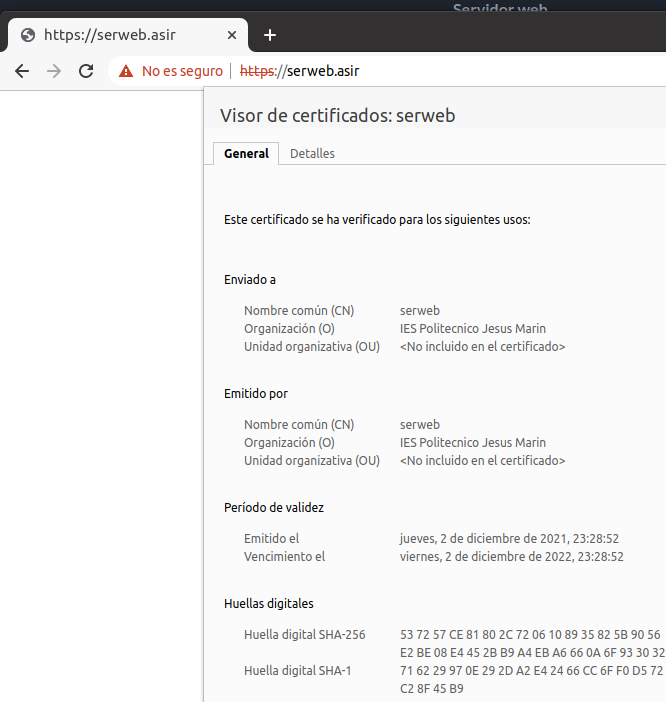

Escribimos el comando, `# iptables -L`, para mostrar las reglas de iptables establecidas.

	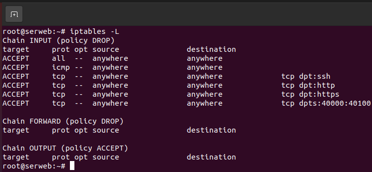

## 4  Webgrafía

<https://www.digitalocean.com/community/tutorials/como-instalar-el-servidor-web-de-apache-en-debian-9-es>  
<http://httpd.apache.org/>

## 5  Conclusión

Un servidor web es una manera sencilla de procesar páginas en un determinado lenguaje al cliente, y configurarlo de proxy inverso.
