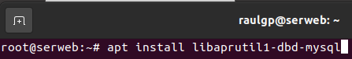
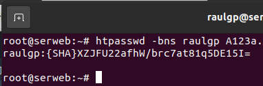

# Autenticación al servidor web

## Índice

### [1 Introducción](#1--Introducción)

### [2 Requerimientos](#2--Requerimientos)

### [3 Preparación](#3--Preparación)
#### &nbsp; &nbsp; [3.1 Autenticación con el módulo digest](#31--Autenticación-con-el-módulo-digest)
#### &nbsp; &nbsp; [3.2 Autenticación PAM](#32--Autenticación-PAM)
#### &nbsp; &nbsp; [3.3 Autenticación en una base de datos](#33--Autenticación-en-una-base-de-datos)
##### &nbsp; &nbsp; &nbsp; &nbsp; &nbsp; &nbsp; [3.3.1 Configuración de la base de datos](#331--Configuración-de-la-base-de-datos)
#### &nbsp; &nbsp; [3.4 Autenticación por el protocolo LDAP](#34--Autenticación-por-el-protocolo-LDAP)

### [4 Webgrafía](#4--Webgrafía)

### [5 Conclusión](#5--Conclusión)

---

## 1  Introducción

El protocolo de red HTTP (Hypertext Transfer Protocol) es de comunicación que permite las transferencias de información a través de archivos en la World Wide Web, es un protocolo sin estado, por lo que no guarda ninguna información sobre conexiones anteriores, utilizando el puerto 80 y en su versión de transferencia segura el 443.

Este servidor web procesa una aplicación del lado del servidor, realizando conexiones bidireccionales o unidireccionales y sı́ncronas o ası́ncronas con el cliente y generando o cediendo una respuesta en cualquier lenguaje o aplicación del lado del cliente.

En una empresa la aplicación más común de un servidor web es proveer de páginas en un determinado lenguaje y procesarlo al cliente, y emplearlo de proxy inverso en una red.

Hay diferentes formas de autenticación en un servidor web a la hora de intentar acceder a un sitio determinado, además de la autenticación basic y digest, suelen usarse los usuarios almacenados con PAM, en una base de datos MariaDB, o en un servidor LDAP.

El módulo basic provee autenticación usando una contraseña en texto plano almacenada en un archivo, una alternativa es usar el módulo digest en el que utiliza el algoritmo de encryptación MD5 para cifrar las contraseñas.

MariaDB es un sistema de gestión de bases de datos derivado de MySQL desarrollado por Michael Widenius fundador de MySQL, la fundación MariaDB y la comunidad de desarrolladores de software libre. Tiene una alta compatibilidad con MySQL ya que posee las mismas órdenes, interfaces, API y bibliotecas, siendo su objetivo poder cambiar un servidor por otro directamente.

El protocolo ligero de acceso a directorios (Lightweight Directory Access Protocol) hace referencia a un protocolo a nivel de aplicación que permite el acceso a un servicio de directorio ordenado y distribuido para buscar diversa información en un entorno de red.

## 2  Requerimientos

Todos los contenedores tienen el sistema operativo Debian 9 stretch.

- Aplicación de virtualización Docker.

- Servidor ssh en los contenedores.

- Cliente ssh en la máquina anfitriona.

## 3  Preparación

En un contenedor accedemos mediante ssh desde la máquina anfitriona.

Dependiendo del tipo de autenticación realizaremos una configuración distinta en el servidor web instalado y configurado.

### 3.1  Autenticación con el módulo digest

Escribimos el comando, `# a2enmod auth_digest`, para habilitar el módulo de autenticación especificado.

	

Escribimos el comando, `# nano /home/raulgp/public_html/.htaccess`, y escribimos el contenido.

    AuthType Digest # Establecimiento del tipo de autenticación
    AuthName "serweb" # Establecimiento del realm del usuario
    AuthDigestProvider file
    AuthUserFile "/etc/apache2/usuauthdig"
    Require valid-user

	

Escribimos el comando, `# htdigest -c /etc/apache2/usuauthdig "nombre de realm" "nombre de usuario"`, para establecer la contraseña del usuario especificado.

	

Escribimos el comando, `# apache2ctl restart`, para reiniciar el servidor apache.

	

	

### 3.2  Autenticación PAM

Escribimos el comando, `# apt install libapache2-mod-authnz-pam`, para instalar el módulo de autenticación especificado.

	

Escribimos el comando, `# nano /etc/apache2/sites-enabled/virtualhostserweb.conf`, y escribimos el contenido.

	<Directory /serweb/>
		AuthType Basic # Establecimiento del tipo de autenticación
		AuthName "Directorio de acceso restringido"
		AuthBasicProvider PAM
		AuthPAMService common-auth # Establecimiento del servicio de autenticación PAM
		Require valid-user
	</Directory>

	

Escribimos el comando, `# apache2ctl restart`, para reiniciar el servidor apache.

	

Escribimos el comando, `# addgroup www-data shadow`, para añadir al usuario el grupo especificado.

	

	

### 3.3  Autenticación en una base de datos

Escribimos el comando, `# apt install libaprutil1-dbd-mysql`, para instalar el módulo de autenticación especificado.

	

Escribimos el comando, `# a2enmod authn_dbd authn_socache`, para habilitar los módulos especificados.

	

Escribimos el comando, `# nano /etc/apache2/sites-enabled/virtualhostserweb.conf`, y escribimos el contenido.

	DBDriver mysql
	DBDParams "host=192.168.20.30 dbname=authweb user=raulgp pass=A123a."
	
	DBDMin 4
	DBDKeep 8
	DBDMax 20
	DBDExptime 300
	
	<Directory /serweb/authdb>
		AuthType Basic
		AuthName "Directorio de acceso restringido"
		AuthBasicProvider socache dbd
		AuthnCacheProvideFor dbd
		AuthnCacheContext my-server
		Require valid-user
		AuthDBDUserPWQuery "select passwd from mysql_auth where username = %s"
	</Directory>

	

Escribimos el comando, `# apache2ctl restart`, para reiniciar el servidor apache.

	

#### 3.3.1  Configuración de la base de datos

En una máquina virtual con un servidor MariaDB instalado y configurado, escribimos la sentencia, `> create table mysql_auth (username varchar(255) not null, passwd varchar(255), groups varchar(255), primary key (username) );`, para crear una tabla con esas especificaciones.

	

Escribimos el comando, `# htpasswd -bns "nombre de usuario" "contraseña"`, para codificar una contraseña con el algoritmo SHA1 especificado.

	

Escribimos la sentencia, ``> insert into `mysql_auth` (`username`, `passwd`, `groups`) values ('raulgp', 'contraseña encriptada', 'serweb');``, para insertar un usuario en el servidor MariaDB.

	

	

### 3.4  Autenticación por el protocolo LDAP

Establece una conexión con un servidor LDAP instalado y configurado al autenticarse.

Escribimos el comando, `# a2enmod authnz_ldap`, para habilitar el módulo de autenticación especificado.

	

Escribimos el comando, `# nano /etc/apache2/sites-enabled/virtualhostserweb.conf`, y escribimos el contenido.

	<Directory /serweb/authldap>
		AuthName "Directorio de acceso restringido"
		AuthType Basic
		AuthBasicProvider ldap
		AuthLDAPURL ldap://192.168.20.50/dc=raulgp,dc=des,dc=org?uid?sub?(objectClass=*)
		Require ldap-filter objectClass=posixAccount # Establecimiento de validación de usuarios
	</Directory>

	

Escribimos el comando, `# apache2ctl restart`, para reiniciar el servidor apache.

	

	

## 4  Webgrafía

<https://www.linuxito.com/gnu-linux/nivel-alto/414-configurar-autenticacion-digest-en-apache-y-mostrar-directorios-protegidos-en-indices>  
<https://techexpert.tips/es/apache-es/apache-autenticacion-pam/>  
<https://www.howtoforge.com/tutorial/password-protect-directories-with-mod_authn_dbd-mysql-on-apache-debian-jessie/>  
<https://computingforgeeks.com/secure-apache-web-pages-with-ldap-authentication/>

## 5  Conclusión

Autenticarse en un servidor web mediante los módulos basic y digest, usuarios almacenados en PAM, en una base de datos o por el protocolo LDAP, es una manera sencilla de administrar muchos usuarios permitidos que acceden a un determinado sitio.
