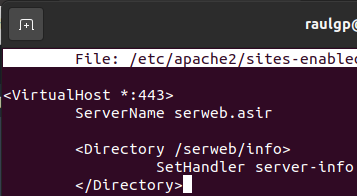

# Habilitación de módulos de un servidor web

## Índice

### [1 Introducción](#1--Introducción)

### [2 Requerimientos](#2--Requerimientos)

### [3 Preparación](#3--Preparación)
#### &nbsp; &nbsp; [3.1 Habilitación de módulos](#31--Habilitación-de-módulos)

### [4 Webgrafía](#4--Webgrafía)

### [5 Conclusión](#5--Conclusión)

---

## 1  Introducción

El protocolo de red HTTP (Hypertext Transfer Protocol) es de comunicación que permite las transferencias de información a través de archivos en la World Wide Web, es un protocolo sin estado, por lo que no guarda ninguna información sobre conexiones anteriores, utilizando el puerto 80 y en su versión de transferencia segura el 443.

Este servidor web procesa una aplicación del lado del servidor, realizando conexiones bidireccionales o unidireccionales y sı́ncronas o ası́ncronas con el cliente y generando o cediendo una respuesta en cualquier lenguaje o aplicación del lado del cliente.

En una empresa la aplicación más común de un servidor web es proveer de páginas en un determinado lenguaje y procesarlo al cliente, y emplearlo de proxy inverso en una red.

Los módulos de un servidor web son extensiones adicionales que disponen la funcionalidad del mismo, ya sea del núcleo base del servidor web u otros propósitos.

## 2  Requerimientos

Todos los contenedores tienen el sistema operativo Debian 9 stretch.

- Aplicación de virtualización Docker.

- Servidor ssh en los contenedores.

- Cliente ssh en la máquina anfitriona.

## 3  Preparación

En un contenedor accedemos mediante ssh desde la máquina anfitriona.

### 3.1  Habilitación de módulos

En el contenedor con un servidor web instalado y configurado, habilitamos los módulos con sus caracterı́sticas.

- Módulo mod_userdir: Un equipo con múltiples usuarios pueden tener una página web dedicada de sus directorios home especificados.

Escribimos el comando, `# a2enmod userdir`, para habilitar el módulo especificado.

	

Escribimos el comando, `# apache2ctl restart`, para reiniciar el servidor apache.

	

Escribimos el comando, `# mkdir /home/"nombre de usuario"/public_html`, para crear el directorio base de la página web del usuario especificado.

	

	

- Módulo mod_info: Provee de una comprensiva descripción de la configuración del servidor.

Escribimos el comando, `# a2enmod info`, para habilitar el módulo especificado.

	

Escribimos el comando, `# nano /etc/apache2/sites-enabled/virtualhostserweb.conf`, y escribimos el contenido.

	<Directory /serweb/info>
	  SetHandler server-info
	</Directory>

	

Escribimos el comando, `# apache2ctl restart`, para reiniciar el servidor apache.

	

	

- Módulo mod_ratelimit: Limita el ratio de ancho de banda de las descargas de los clientes.

Escribimos el comando, `# a2enmod ratelimit`, para habilitar el módulo especificado.

	

Escribimos el comando, `# nano /etc/apache2/sites-enabled/virtualhostserweb.conf`, y escribimos el contenido.

	<Directory />
	  SetOutputFilter RATE_LIMIT
	  SetEnv rate-limit 15 # Establecimiento del limite de ancho de banda
	</Directory>

	

Escribimos el comando, `# apache2ctl restart`, para reinciar el servidor apache.

	

	

- Módulo mod_rewrite: Provee de un motor de escritura basado en reglas para sobrescribir las URLs solicitadas.

Escribimos el comando, `# a2enmod rewrite`, para habilitar el módulo especificado.

	

Escribimos el comando, `# nano /etc/apache2/sites-enabled/virtualhostserweb.conf`, y escribimos el contenido.

	<Directory /serweb/>
	  RewriteEngine On
	  RewriteRule "^(.+)\.html$" "$1\.php" [NC] # Establecimiento de la regla
	</Directory>

	

Escribimos el comando, `# apache2ctl restart`, para reiniciar el servidor apache.

	

	

- Módulo mod_geoip: Localiza el paı́s por la dirección IP desde donde accede el cliente.

Escribimos el comando, `# apt install libapache2-mod-geoip`, para instalar el módulo especificado.

	

Escribimos el comando, `# nano /etc/apache2/mods-enable/geoip.conf`,y escribimos el contenido.

	<IfModule mod_geoip.c>
	  GeoIPEnable On
	  GeoIPDBFile /usr/share/GeoIP/GeoIP.dat
	</IfModule>

	

Escribimos el comando, `# apache2ctl restart`, para reiniciar el servidor apache.

	

	

- Módulo mod_dav: Habilita la funcionalidad WebDAV, en el que es una extension del protocolo HTTP que permite editar y manejar archivos en un servidor web remoto.

Escribimos el comando, `# a2enmod dav dav_fs`, para habilitar los módulos especificados.

	

Escribimos el comando, `# nano /etc/apache2/sites-enabled/virtualhostserweb.conf`, y escribimos el contenido.

	<Directory /serweb/dav>
	  Dav On
	</Directory>

	

Escribimos el comando, `# apache2ctl restart`, para reiniciar el servidor apache.

	

	

- Módulo de procesamiento múltiple: Administra los diferentes procesos para solicitar una nueva conexión por el protocolo HTTP a los clientes.

Escribimos el comando, `# apache2ctl stop`, para parar el servidor apache.

	

Escribimos el comando, `# a2dismod php8.0 mpm_prefork`, para deshabilitar los módulos especificados.

	

Escribimos el comando, `# a2enmod mpm_event`, para habilitar el módulo de multiprocesamiento.

	

Escribimos el comando, `# apt install php-fpm libapache2-mod-fcgid`, para instalar los módulos especificados.

	

Escribimos el comando, `# a2enconf php8.0-fpm`, para habilitar el módulo de multiprocesamiento de páginas en php.

	

Escribimos el comando, `# a2enmod proxy_fcgi`, para habilitar el módulo del protocolo intermediario entre las aplicaciones y el servidor apache.

	

Escribimos el comando, `# /etc/init.d/php8.0-fpm start`, y escribimos el comando, `# apache2ctl start`, para iniciar los servicios especificados.

	

	

## 4  Webgrafía

<https://httpd.apache.org/docs/trunk/es/mod/>  
<https://www.digitalocean.com/community/tutorials/how-to-configure-apache-http-with-mpm-event-and-php-fpm-on-ubuntu-18-04-es>

## 5  Conclusión

Los módulos de un servidor web son una manera sencilla de agregar funcionalidades adicionales de la base del mismo servidor u otras caracterı́sticas.
