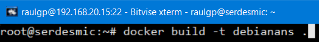
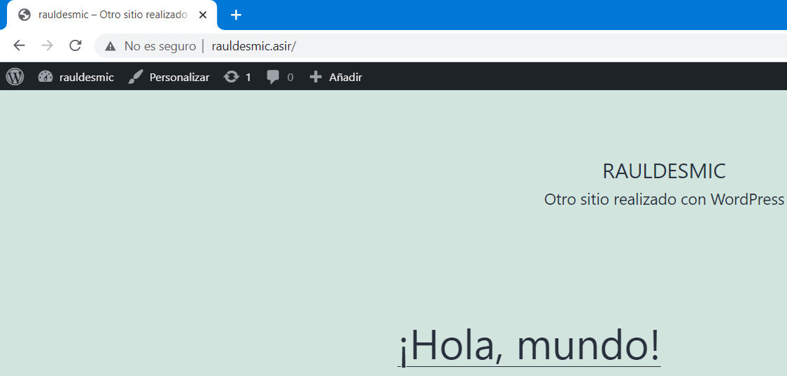

# Despliegue ágil de microservicios: Virtualización ligera

## Índice

### [1 Introducción](#1--Introducción)

### [2 Requerimientos](#2--Requerimientos)

### [3 Preparación](#3--Preparación)
#### &nbsp; &nbsp; [3.1 Instalación](#31--Instalación)
#### &nbsp; &nbsp; [3.2 Creación de imagen a partir de un archivo Dockerfile ](#32--Creación-de-imagen-a-partir-de-un-archivo-Dockerfile)
#### &nbsp; &nbsp; [3.3 Creación de una red y de contenedores](#33--Creación-de-una-red-y-de-contenedores)
#### &nbsp; &nbsp; [3.4 Despligue de contenedores mediante Docker Compose](#34--Despliegue-de-contenedores-mediante-Docker-Compose)

### [4 Webgrafía](#4--Webgrafía)

### [5 Conclusión](#5--Conclusión)

---

## 1  Introducción

Docker es de código abierto que automatiza el despliegue de aplicaciones dentro de contenedores de software, proporcionando una capa adicional de abstracción y automatización de virtualización de aplicaciones en múltiples sistemas operativos.

Utiliza características de aislamiento de recursos del kernel Linux, para permitir que "contenedores" independientes se ejecuten dentro de una sola instancia, evitando la sobrecarga de iniciar y mantener máquinas virtuales.

Un contenedor Docker a diferencia de una máquina virtual, no requiere incluir un sistema operativo independiente. En su lugar, se basa en las funcionalidades del kernel y utiliza el aislamiento de recursos y namespaces separados para aislar la vista de una aplicación del sistema operativo.

En una empresa la aplicación más común de un proyecto para servir contenedores de software mediante virtualización ligera es desplegar ágilmente microservicios de forma automática mediante un archivo de configuración.

## 2  Requerimientos

Todas las máquinas virtuales tienen el sistema operativo Debian 9 stretch.

- Hipervisor VMware Workstation.

- Servidor ssh en las máquinas virtuales.

- Cliente ssh en la máquina anfitriona.

## 3  Preparación

En una máquina virtual accedemos mediante ssh desde la máquina anfitriona.

### 3.1  Instalación

Escribimos el comando, `# apt install apt-transport-https ca-certificates curl gnupg lsb-release`, para instalar las dependencias de Docker.

	

Escribimos el comando, `# curl -fsSL https://download.docker.com/linux/debian/gpg | gpg --dearmor -o /usr/share/keyrings/docker-archive-keyring.gpg`, para descargar e importar la llave especificada.

	

Escribimos el comando, `# nano /etc/apt/sources.list`, y escribimos el contenido.

    deb [arch=amd64 signed-by=/usr/share/keyrings/docker-archive-keyring.gpg] https://download.docker.com/linux/debian stretch stable

	

Actualizamos los repositorios, y escribimos el comando, `# apt install docker-ce docker-ce-cli containerd.io`, para instalar Docker.

### 3.2  Creación de imagen a partir de un archivo Dockerfile

Escribimos el comando, `# docker pull debian:9`, para descargar una imagen de debian 9.

	

Si queremos aprovisionar el contenedor con el lenguaje de aprovisionamiento Ansible, escribimos el comando, `# nano dockerfile`, y escribimos el contenido.

	FROM debian:9
	
	# Instalación de las dependencias de Ansible
	RUN apt update && apt -y upgrade && apt install -y ssh && apt install -y python && apt install -y wget
	
	RUN mkdir /root/.ssh
	
	# Envío de la llave pública de ssh
	ADD [".ssh/id_rsa.pub","/root/.ssh/authorized_keys"]
	
	RUN mkdir /var/run/sshd
	
	# Inicio del servidor ssh
	CMD ["/usr/sbin/sshd", "-D"]

	

Si queremos aprovisionar el contenedor con el lenguaje de aprovisionamiento Puppet, escribimos el comando, `# nano dockerfile`, y escribimos el contenido.

	FROM debian:9
	
	RUN apt update && apt -y upgrade && apt install -y wget
	
	# Descarga e instalación del repositorio de puppet
	RUN wget https://apt.puppetlabs.com/puppet6-release-stretch.deb && dpkg -i puppet6-release-stretch.deb
	
	# Instalación del agente puppet
	RUN apt update && apt install -y puppet-agent
	
	# Envío de un script al contenedor de docker
	ADD ["scriptpuppet.sh","/root/"]
	
	# Ejecución del script e inicio del agente puppet
	CMD /root/scriptpuppet.sh && /opt/puppetlabs/bin/puppet agent -D && bash

	

Si queremos aprovisionar el contenedor con el lenguaje de aprovisionamiento Chef, escribimos el comando, `# nano dockerfile`, y escribimos el contenido.

	FROM debian:9

	# Instalación de las dependencias de Chef
	RUN apt update && apt -y upgrade && apt install -y ssh && apt install -y wget && apt install -y curl && apt install -y perl && apt install -y python

	RUN mkdir /root/.ssh

	# Envío de la llave pública de ssh
	ADD [".ssh/id_rsa.pub","/root/.ssh/authorized_keys"]

	RUN mkdir /var/run/sshd

	# Creación de un archivo al contenedor de Docker
	RUN echo "192.168.20.80 serdesmic" >> /root/scriptchef.sh

	# Lectura y redirección del contenido del archivo e inicio del servidor ssh
	CMD cat /root/scriptchef.sh >> /etc/hosts && /usr/sbin/sshd -D && bash

	

Escribimos el comando, `# docker build -t "nombre de la imagen" .`, para leer las instrucciones del archivo Dockerfile y construir la imagen de Docker.

	

### 3.3  Creación de una red y de contenedores

Escribimos el comando, `# docker network create -d bridge --subnet=192.168.15.0/24 --ip-range=192.168.15.0/24 --gateway=192.168.15.1 -o "com.docker.network.bridge.name"="desmic" desmic`, para crear una red de Docker.

	

Escribimos el comando, `# docker run -d -it --name wordpress --network desmic --ip 192.168.15.25 debianans`, para crear un contenedor con la red especificada.

	

Aprovisionamos los contenedores con un lenguaje de aprovisionamiento, y escribimos el comando, `# docker commit "nombre de imagen" "nombre de contenedor"`, para crear una nueva imagen de los cambios de un contenedor.

	

### 3.4  Despliegue de contenedores mediante Docker Compose

Escribimos el comando, `# apt install python-pip python-dev libffi-dev openssl gcc libc6-dev make`, escribimos el comando, `# curl -L "https://github.com/docker/compose/releases/download/1.25.4/docker-compose-$(uname -s)-$(uname -m)" -o /root/docker-compose`, y le damos permisos de ejecución al archivo, para instalar Docker Compose.

	

Escribimos el comando, `# nano docker-compose.yaml`, y escribimos el contenido.

	version: '3'
	services:
	  debianans1:
	    container_name: wordpress # Establecimiento del nombre del contenedor
	    image: wordpress # Establecimiento de la imagen de Docker
	    
	# Inicio del servidor apache2 al inicio del contenedor
	    command: bash -c "/etc/init.d/apache2 restart && tail -f /dev/null"
	    
	# Exposición del puerto 80 del exterior y mapeo al puerto 80 del contenedor
	    ports:
	      - '80:80'
	      
	# Establecimiento de la red
	    networks:
	      desmic:
	        ipv4_address: 192.168.15.25
	
	  debianans2:
	    container_name: mysql
	    image: mysql
	    
	# Inicio del servidor mysql al inicio del contenedor
	    command: bash -c "/etc/init.d/mysql restart && tail -f /dev/null"
	    networks:
	      desmic:
	        ipv4_address: 192.168.15.26
		
	# Creacón de una red de Docker
	networks:
	  desmic:
	    driver: bridge
	    ipam:
	      driver: default
	      config:
	        - subnet: 192.168.15.0/24

	

Escribimos el comando, `# /root/docker-compose up -d`, para crear e iniciar los contenedores con los servicios configurados.

	

	

	

## 4  Webgrafía

<https://docs.docker.com/engine/install/debian/>  
<https://docs.docker.com/engine/reference/commandline/docker/>  
<https://docs.docker.com/engine/reference/builder/>  
<https://docs.docker.com/compose/compose-file/>

## 5  Conclusión

Docker es una manera sencilla de desplegar ágilmente microservicios mediante archivos de configuración.
