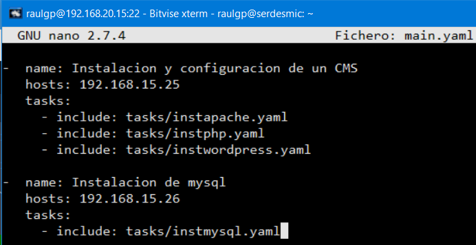

# Lenguaje de aprovisionamiento: Ansible

## Índice

### [1 Introducción](#1--Introducción)

### [2 Requerimientos](#2--Requerimientos)

### [3 Preparación](#3--Preparación)
#### &nbsp; &nbsp; [3.1 Instalación](#31--Instalación)
#### &nbsp; &nbsp; [3.2 Estructura de un playbook](#32--Estructura-de-un-playbook)
#### &nbsp; &nbsp; [3.3 Aprovisionamiento de los equipos](#33--Aprovisionamiento-de-los-equipos)

### [4 Webgrafía](#4--Webgrafía)

### [5 Conclusión](#5--Conclusión)

---

## 1  Introducción

El lenguajes de aprovisionamiento Ansible es una herramienta de software libre que permite a los usuarios alterar la configuración y administrar ordenadores, gestiona nodos a través de SSH y no requiere ningún software remoto adicional para instalarlo.

Dispone de módulos que trabajan sobre JSON y la salida estándar puede ser escrita en cualquier lenguaje, utiliza YAML para describir las configuraciones reusables que manejan a los nodos.

En una empresa la aplicación más común de un lenguaje de aprovisionamiento es el abastecimiento de los equipos en una red, y automatizar el despliegue de microservicios.

## 2  Requerimientos

Todas las máquinas virtuales tienen el sistema operativo Debian 9 stretch.

- Hipervisor VMware Workstation.

- Servidor ssh en las máquinas virtuales.

- Cliente ssh en la máquina anfitriona.

## 3  Preparación

En una máquina virtual accedemos mediante ssh desde la máquina anfitriona.

### 3.1  Instalación

Escribimos el comando, `# apt install python`, escribimos el comando, `# nano /etc/apt/sources.list`, y escribimos el contenido.

    deb http://ppa.launchpad.net/ansible/ansible/ubuntu trusty main

	

Escribimos el comando, `# apt-key adv --keyserver keyserver.ubuntu.com --recv-keys 93C4A3FD7BB9C367`, actualizamos los repositorios, y escribimos el comando, `# apt install ansible`, para instalar Ansible.

	

	

Escribimos el comando, `# ssh-keygen`, para generar las llaves de ssh y enviar luego la pública mediante un archivo Dockerfile a los contenedores de Docker.

	

Escribimos el comando, `# nano /etc/ansible/hosts`, y escribimos las direcciones ip de los contenedores de Docker.

	

### 3.2  Estructura de un playbook

Escribimos el comando, `# nano main.yaml`, y escribimos el contenido.

	- name: Instalacion y configuracion de un CMS
	  hosts: 192.168.15.25 # Dirección ip del contenedor
	  tasks: # Importación de tareas
	    - include: tasks/instapache.yaml
	    - include: tasks/instphp.yaml
	    - include: tasks/instwordpress.yaml
	    
	- name: Instalacion de mysql
	  hosts: 192.168.15.26
	  tasks:
	    - include: tasks/instmysql.yaml

	

Escribimos el comando, `# nano tasks/instapache.yaml`, para configurar la instalación del servidor apache, y escribimos el contenido.

	- name: Instalacion y configuracion de apache
	  apt:
	    name: apache2
	    
	- name: Copiando el virtualhost
	  template:
	    src: ../files/wordpress.conf
	    dest: /etc/apache2/sites-available/
	    
	- name: Habilitando el virtualhost
	  shell: 'a2ensite wordpress.conf'
	  
	- name: Reiniciando apache
	  service:
	    name: apache2
	    state: restarted

	

Escribimos el comando, `# nano tasks/instphp.yaml`, para configurar la instalación de php, y escribimos el contenido.

	- name: Instalacion de php
	  apt:
	    name: [php, libapache2-mod-php, php-mysql]
	    
	- name: Reiniciando apache
	  service:
	    name: apache2
	    state: restarted

	

Escribimos el comando, `# nano tasks/instwordpress.yaml`, para configurar la instalación de un CMS WordPress, y escribimos el contenido.

	- name: Instalacion y configuracion de wordpress
	  unarchive:
	    src: https://es.wordpress.org/latest-es_ES.tar.gz
	    dest: /var/www/
	    remote_src: yes
	    
	- name: Copiando el archivo de configuracion de wordpress
	  copy:
	    src: ../files/wp-config.php
	    dest: /var/www/wordpress

	

Escribimos el comando, `# nano tasks/instmysql.yaml`, para configurar la instalación del servidor MySQL, y escribimos el contenido.

	- name: Instalacion y configuracion de mysql
	  apt:
	    name: mysql-server
	    
	- name: Instalando libreria de mysql
	  apt:
	    name: python-mysqldb
	    
	- name: Reiniciando mysql
	  service:
	    name: mysql
	    state: restarted
	    
	- name: Creando usuario de mysql
	  mysql_user:
	    name=raulgp
	    host=%
	    password=A123a.
	    priv=*.*:ALL,GRANT
	    login_user=root
	    login_password=
	    
	- name: Creando una base de datos
	  mysql_db:
	    name: wordpress
	    
	- name: Configuracion de ip de mysql
	  lineinfile:
	    path: /etc/mysql/mariadb.conf.d/50-server.cnf
	    regexp: '^bind\-address'
	    line: 'bind-address = 0.0.0.0'
	    
	- name: Reiniciando mysql
	  service:
	    name: mysql
	    state: restarted

	

### 3.3  Aprovisionamiento de los equipos

Escribimos el comando, `# ansible-playbook main.yaml`, para aprovisionar los contenedores de Docker.

	

	

	

	

	

## 4  Webgrafía

<https://ualmtorres.github.io/CursoAnsible/tutorial/>  
<https://docs.ansible.com/ansible/latest/user_guide/playbooks.html>

## 5  Conclusión

Un lenguaje de aprovisionamiento es una manera sencilla de abastecer a equipos y desplegar microservicios en una red.
