# Lenguaje de aprovisionamiento: Chef

## Índice

### [1 Introducción](#1--Introducción)

### [2 Requerimientos](#2--Requerimientos)

### [3 Preparación](#3--Preparación)
#### &nbsp; &nbsp; [3.1 Instalación de chef infra server](#31--Instalación-de-chef-infra-server)
#### &nbsp; &nbsp; [3.2 Instalación de chef workstation](#32--Instalación-de-chef-workstation)
#### &nbsp; &nbsp; [3.3 Estructura de un cookbook](#33--Estructura-de-un-cookbook)
#### &nbsp; &nbsp; [3.4 Aprovisionamiento de los equipos](#34--Aprovisionamiento-de-los-equipos)

### [4 Webgrafía](#4--Webgrafía)

### [5 Conclusión](#5--Conclusión)

---

## 1  Introducción

El lenguaje de aprovisionamiento Chef es una herramienta de administración y gestión de la configuración para abastecer automáticamente nuevos equipos, está escrita en Ruby y en Erlang, y usa puramente Ruby para describir las configuraciones llamadas "recetas".

Las recetas en el que pueden agruparse como un "cookbook" describen como Chef administrara aplicaciones y utilidades y como deben ser configuradas, declarando una serie de recursos en un estado en particular, y asegurando que cada recurso este correctamente configurado y corrigiendo el que no este en buen estado.

En una empresa la aplicación más común de un lenguaje de aprovisionamiento es el abastecimiento de los equipos en una red, y automatizar el despliegue de microservicios.

## 2  Requerimientos

Todas las máquinas virtuales tienen el sistema operativo Debian 9 stretch.

- Hipervisor Oracle VM VirtualBox.

- Servidor ssh en las máquinas virtuales.

- Cliente ssh en la máquina anfitriona.

## 3  Preparación

En una máquina virtual accedemos mediante ssh desde la máquina anfitriona.

### 3.1  Instalación de chef infra server

Escribimos el comando, `# wget https://packages.chef.io/files/stable/chef-server/14.12.21/ubuntu/20.04/chef-server-core_14.12.21-1_amd64.deb`, y escribimos el comando, `# dpkg -i chef-server-core_14.12.21-1_amd64.deb`, para instalar el servidor chef.

	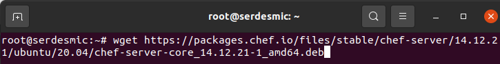

Escribimos el comando, `# chef-server-ctl reconfigure`, para configurar el servidor chef.

	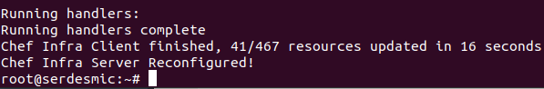

	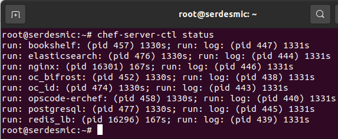

Escribimos el comando, `# chef-server-ctl user-create chefadmin raulgp prueba raulgp@sercor.raulgp.des.org A123a. -f /root/chefadmin.pem`, para crear un usuario administrador en el servidor chef.

	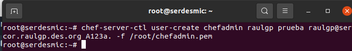

	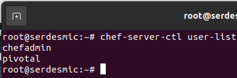

Escribimos el comando, `# chef-server-ctl org-create raulgp 'raulgp prueba' --association_user chefadmin --filename /root/raulgp-validator.pem`, para crear una organización en el servidor chef.

	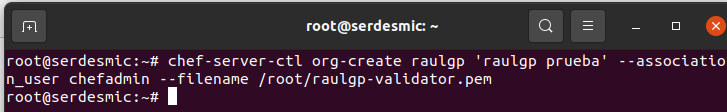

	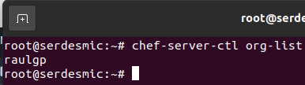

### 3.2  Instalación de chef workstation

En otra máquina virtual, escribimos el comando, `# wget https://packages.chef.io/files/stable/chef-workstation/22.1.745/debian/9/chef-workstation_22.1.745-1_amd64.deb`, y escribimos el comando, `# dpkg -i chef-workstation_22.1.745-1_amd64.deb`, para instalar chef workstation.

	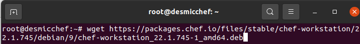

	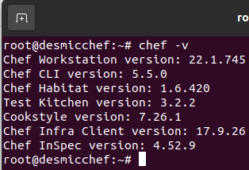

Escribimos el comando, `# chef generate repo chef-repo`, para generar un repositorio donde describiremos las recetas.

	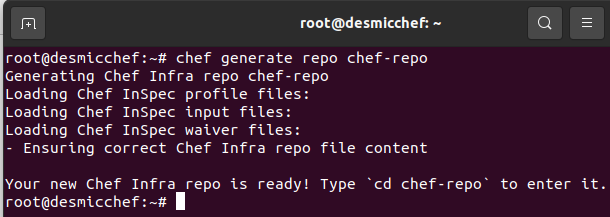

Escribimos el comando, `# ssh-keygen`, para generar las llaves de ssh y enviar luego la pública mediante un archivo Dockerfile a los contenedores de Docker.

	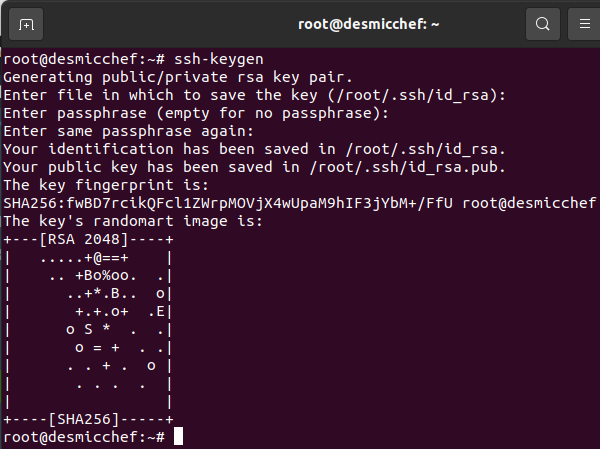

Escribimos el comando, `# mkdir chef-repo/.chef`, y escribimos el comando, `# scp root@192.168.20.80:/root/*.pem chef-repo/.chef`, para copiar las llaves de los certificados del servidor chef al directorio de configuración de knife.

	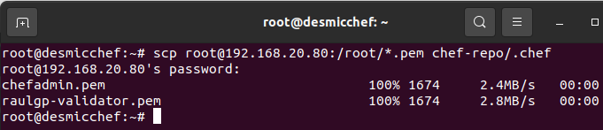

Escribimos el comando, `# nano chef-repo/.chef/config.rb`, para establecer la configuración de knife, y escribimos el contenido.

	current_dir = File.dirname(__FILE__)
	log_level                :info
	log_location             STDOUT
	node_name                'chefadmin'
	client_key               "chefadmin.pem"
	validation_client_name   'raulgp-validator'
	validation_key           "raulgp-validator.pem"
	chef_server_url          'https://serdesmic/organizations/raulgp'
	cache_type               'BasicFile'
	cache_options( :path => "#{ENV['HOME']}/.chef/checksums" )
	cookbook_path            ["#{current_dir}/../cookbooks"]

	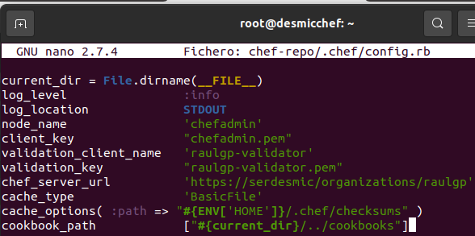

Nos vamos al repositorio, y escribimos el comando, `# knife ssl fetch`, para descargar los certificados SSL del servidor chef.

	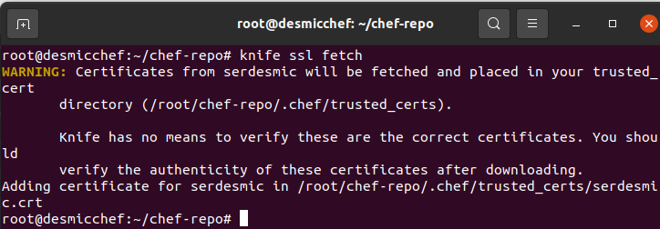

	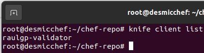

Una vez los contenedores de Docker se han iniciado, escribimos el comando, `# knife bootstrap -i /root/.ssh/id_rsa root@192.168.15.25 --node-name serapache`, para instalar el cliente chef en los contenedores de Docker.

	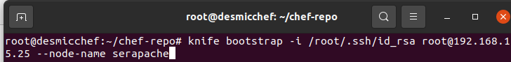

	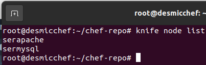

### 3.3  Estructura de un cookbook

Nos vamos al directorio de los cookbooks, escribimos el comando, `# chef generate cookbook instcms`, para generar un cookbook donde describiremos las recetas.

	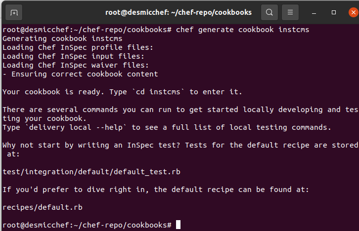

Escribimos el comando, `# nano instcms/recipes/default.rb`, y escribimos el contenido.

	include_recipe 'instcms::instapache'
	include_recipe 'instcms::instphp'
	include_recipe 'instcms::instwordpress'

	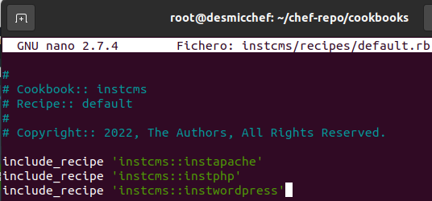

Escribimos el comando, `# nano instcms/recipes/instapache.rb`, para configurar la instalación del servidor apache, y escribimos el contenido.

	apt_package 'apache2' do
	  action :install
	end

	cookbook_file "/etc/apache2/sites-available/wordpress.conf" do
	  source "wordpress.conf"
	  mode "0644"
	end

	execute "Habilitando el virtualhost" do
	  command "a2ensite wordpress.conf"
	end

	service 'apache2' do
	  action :restart
	end

	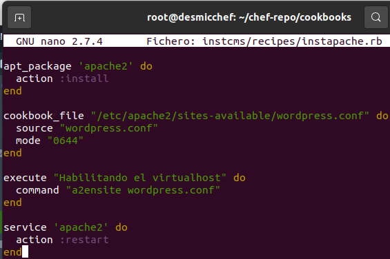

Escribimos el comando, `# nano instcms/recipes/instphp.rb`, para configurar la instalación de php, y escribimos el contenido.

	apt_package %w(php libapache2-mod-php php-mysql) do
	  action :install
	end

	service 'apache2' do
	  action :restart
	end

	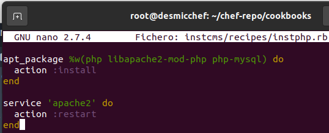

Escribimos el comando, `# nano instcms/recipes/instwordpress.rb`, para configurar la instalación de un CMS WordPress, y escribimos el contenido.

	remote_file '/var/www/latest-es_ES.tar.gz' do
	  source 'https://es.wordpress.org/latest-es_ES.tar.gz'
	  action :create
	end

	execute "Configuracion de wordpress" do
	  command "tar xzf /var/www/latest-es_ES.tar.gz -C /var/www/"
	end

	cookbook_file "/var/www/wordpress/wp-config.php" do
	  source "wp-config.php"
	  mode "0644"
	end

	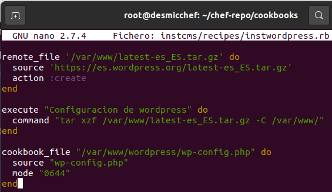

Escribimos el comando, `# nano instcms/recipes/instmysql.rb`, para configurar la instalación del servidor MySQL, y escribimos el contenido.

	apt_package "mysql-server" do
	  action :install
	end

	execute "Configurando ip de mysql" do
	  command 'sed -i "s/^bind-address.*/bind-address = 0.0.0.0/g" /etc/mysql/mariadb.conf.d/50-server.cnf'
	end

	service "mysql" do
	  action :restart
	end

	execute "Creando usuario de mysql" do
	  command 'mysql -u root -p" " -e "create user \"raulgp\"@\"%\" identified by \"A123a.\";"'
	end

	execute "Estableciendo permisos" do
	  command 'mysql -u root -p" " -e "grant all privileges on *.* to \"raulgp\"@\"%\";"'
	end

	execute "Creando base de datos" do
	  command 'mysql -u root -p" " -e "create database wordpress;"'
	end

	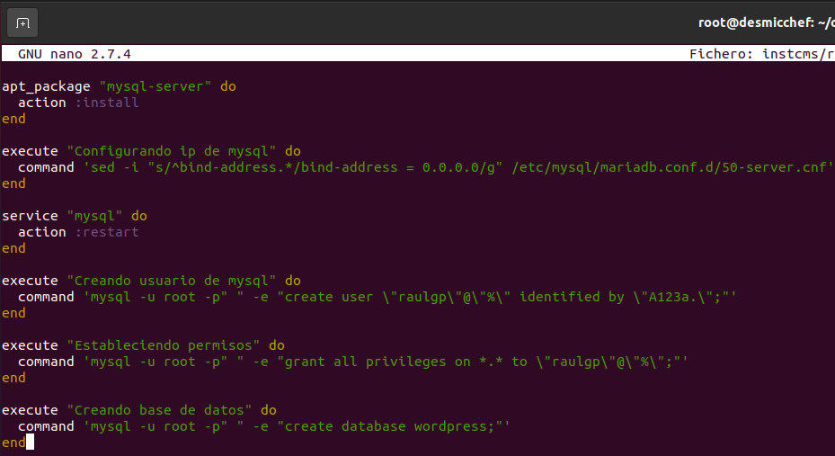

Escribimos el comando, `# knife cookbook upload -a`, para subir el cookbook al servidor chef.

	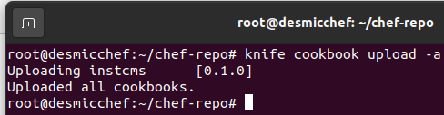

Escribimos el comando, `# knife node run_list add serapache "instcms"`, para añadir un cookbook a la lista de ejecución de un contenedor.

	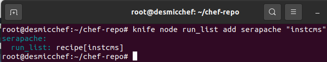

### 3.4  Aprovisionamiento de los equipos

Una vez los contenedores de han iniciado, escribimos el comando, `# docker exec -it "nombre de contenedor" bash`, y escribimos el comando, `# chef-client`, para aprovisionar los contenedores de Docker.

	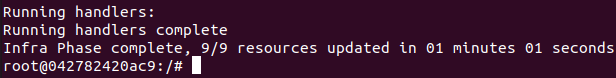

	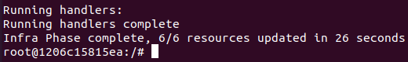

	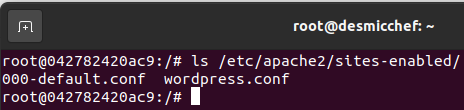

	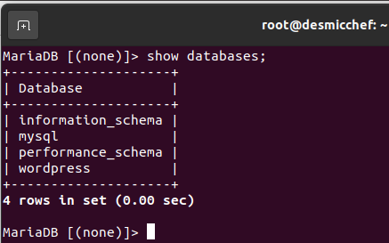

	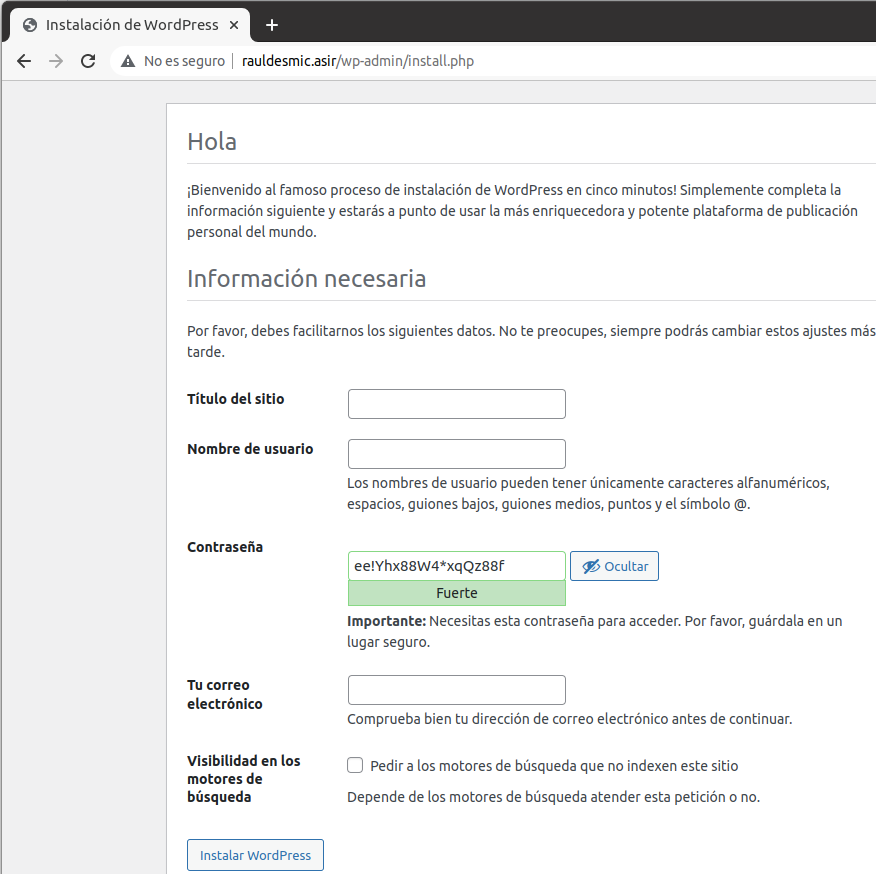

	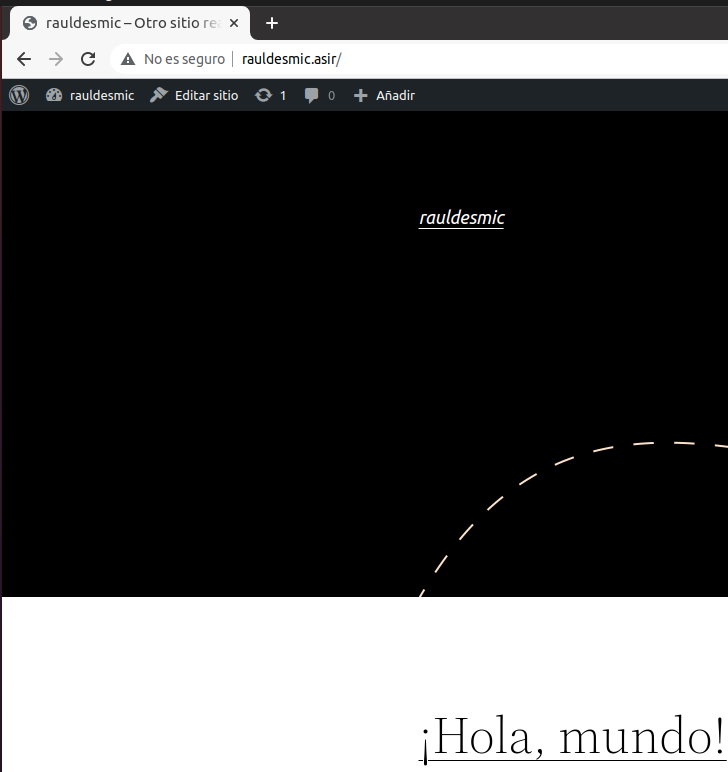

## 4  Webgrafía

<https://computingforgeeks.com/how-to-install-chef-infra-server-on-debian/>  
<https://docs.chef.io/resource/>

## 5  Conclusión

Un lenguaje de aprovisionamiento es una manera sencilla de abastecer a equipos y desplegar microservicios en una red.
