# Lenguaje de aprovisionamiento: Puppet

## Índice

### [1 Introducción](#1--Introducción)

### [2 Requerimientos](#2--Requerimientos)

### [3 Preparación](#3--Preparación)
#### &nbsp; &nbsp; [3.1 Instalación](#31--Instalación)
#### &nbsp; &nbsp; [3.2 Estructura de un manifiesto](#32--Estructura-de-un-manifiesto)
#### &nbsp; &nbsp; [3.3 Aprovisionamiento de los equipos](#33--Aprovisionamiento-de-los-equipos)

### [4 Webgrafía](#4--Webgrafía)

### [5 Conclusión](#5--Conclusión)

---

## 1  Introducción

El lenguaje de aprovisionamiento Puppet es una herramienta de gestión de la configuración de código abierto, está diseñada para administrar la configuración de sistemas similares a Unix y Microsoft Windows de forma declarativa.

El usuario describe los recursos del sistema y sus estados utilizando el lenguaje declarativo que proporciona Puppet, almacenándolos en archivos denominados "manifiestos Puppet".

La capa de abstracción de recursos permite describir la configuración en términos de alto nivel, sin necesidad de especificar los comandos específicos del sistema operativo.

En una empresa la aplicación más común de un lenguaje de aprovisionamiento es el abastecimiento de los equipos en una red, y automatizar el despliegue de microservicios.

## 2  Requerimientos

Todas las máquinas virtuales tienen el sistema operativo Debian 9 stretch.

- Hipervisor VMware Workstation.

- Servidor ssh en las máquinas virtuales.

- Cliente ssh en la máquina anfitriona.

## 3  Preparación

En una máquina virtual accedemos mediante ssh desde la máquina anfitriona.

### 3.1  Instalación

Escribimos el comando, `# wget https://apt.puppetlabs.com/puppet6-release-stretch.deb`, y escribimos el comando, `# dpkg -i puppet6-release-stretch.deb`, para instalar el repositorio de puppet.

	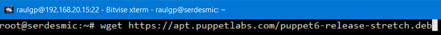

Actualizamos los repositorios, y escribimos el comando, `# apt install puppetserver`, para instalar el servidor puppet.

	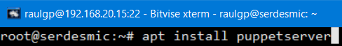

Si queremos cambiar el tamaño de memoria de la máquina virtual de java de puppet, escribimos el comando, `# nano /etc/default/puppetserver`, y cambiamos el valor de los argumentos especificados.

	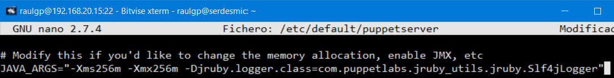

Escribimos el comando, `# nano /etc/puppetlabs/puppet/puppet.conf`, y escribimos el contenido.

    [master]
    vardir = /opt/puppetlabs/server/data/puppetserver
    logdir = /var/log/puppetlabs/puppetserver
    rundir = /var/run/puppetlabs/puppetserver
    pidfile = /var/run/puppetlabs/puppetserver/puppetserver.pid
    codedir = /etc/puppetlabs/code
    dns_alt_names = serdesmic # Es el nombre del equipo del servidor puppet
    
    [main]
    certname = serdesmic
    server = serdesmic
    environment = production
    runinterval = 15m

	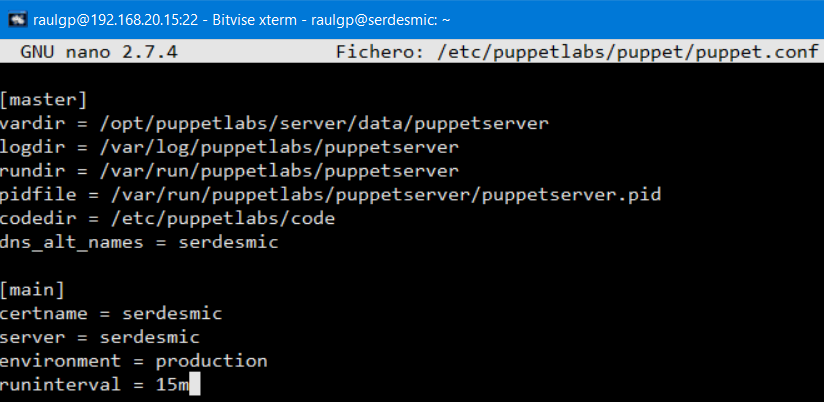

Escribimos el comando, `# /opt/puppetlabs/bin/puppetserver ca setup`, para generar una estructura de entidad certificadora en el servidor puppet.

	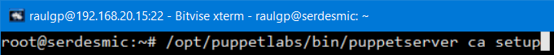

Reiniciamos y habilitamos el servicio de puppet.

	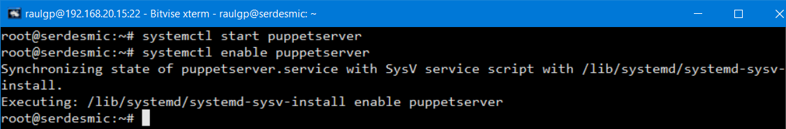

Escribimos el comando, `# nano scriptpuppet.sh`, para añadir la configuración del agente puppet y luego enviarlo y ejecutarlo mediante un archivo Dockerfile a los contenedores de Docker, y escribimos el contenido.

    cat >> /etc/puppetlabs/puppet/puppet.conf << EOF
    [main]
    certname = $(hostname) # Es el nombre del equipo del agente puppet
    server = serdesmic # Es el nombre del equipo del servidor puppet
    environment = production
    runinterval = 15m
    EOF
    echo "192.168.20.15 serdesmic" >> /etc/hosts

	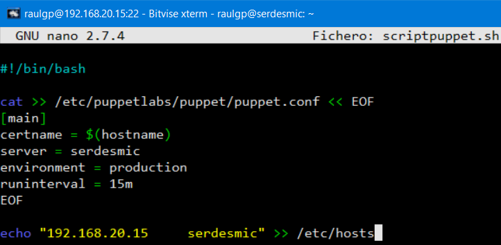

Una vez los contenedores de Docker se han iniciado, escribimos el comando, `# /opt/puppetlabs/bin/puppetserver ca sign --certname "nombre del certificado"`, para autorizar el certificado de los agentes puppet.

	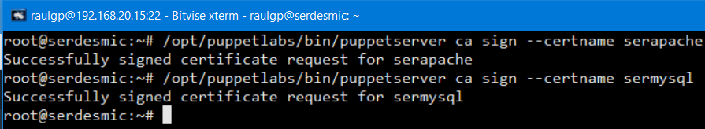

Escribimos el comando, `# /opt/puppetlabs/bin/puppetserver ca list --all`, para mostrar todos los certificados autorizados y pendientes de autorizar.

	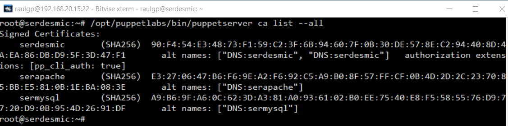

### 3.2  Estructura de un manifiesto

Escribimos el comando, `# cd /etc/puppetlabs/code/environments/production/manifests/`, escribimos el comando, `# nano site.pp`, y escribimos el contenido.

	node 'serapache' {
	  include apache
	  include php
	  include wordpress
	}
	
	node 'sermysql' {
	  include mysql
	}

	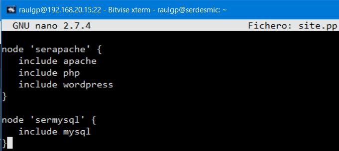

Escribimos el comando, `# nano apache.pp`, para configurar la instalación del servidor apache, y escribimos el contenido.

	class apache {
	
	  package { 'apache':
	    ensure => installed,
	    name => "apache2",
	  }
	  
	  file { 'wordpress.conf':
	    path => '/etc/apache2/sites-available/wordpress.conf',
	    ensure => file,
	    source => "puppet:///modules/apache/wordpress.conf",
	  }
	  
	  file { '/etc/apache2/sites-enabled/wordpress.conf':
	    ensure => 'link',
	    target => '/etc/apache2/sites-available/wordpress.conf',
	  }
	}

	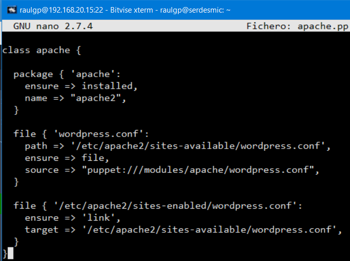

Escribimos el comando, `# nano php.pp`, para configurar la instalación de php, y escribimos el contenido.

	class php {
	  $paquetes = [ 'php', 'libapache2-mod-php', 'php-mysql' ]
	  package { $paquetes:
	    ensure => installed,
	  }
	  
	  exec { 'Servicio apache':
	    command => 'apache2ctl restart',
	    path => '/usr/sbin/',
	  }
	}

	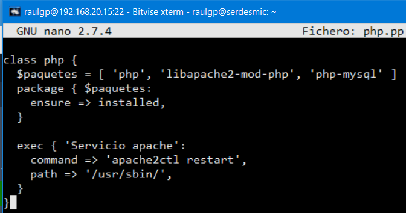

Escribimos el comando, `# nano wordpress.pp`, para configurar la instalación de un CMS WordPress, y escribimos el contenido.

	class wordpress {
	
	  exec { 'Instalacion de wordpress':
	    command => 'wget https://es.wordpress.org/latest-es_ES.tar.gz',
	    path => '/usr/bin/',
	  }
	  
	  exec { 'Configuracion de wordpress':
	    command => 'tar xzf *.tar.gz -C /var/www/',
	    path => '/bin/',
	  }
	  
	  file { 'wp-config.php':
	    path => '/var/www/wordpress/wp-config.php',
	    ensure => file,
	    source => "puppet:///modules/wordpress/wp-config.php",
	  }
	}

	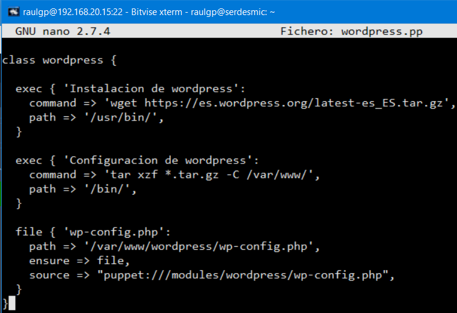

Escribimos el comando, `# nano mysql.pp`, para configurar la instalación del servidor MySQL, y escribimos el contenido.

	class mysql {
	  package { 'mysql':
	    ensure => installed,
	    name => "mysql-server",
	  }
	  
	  exec { 'Configuracion ip de mysql':
	    command => 'sed -i "s/^bind-address.*/bind-address = 0.0.0.0/g" /etc/mysql/mariadb.conf.d/50-server.cnf',
	    path => ’/bin/’,
	  }
	  
	  exec { 'Servicio mysql':
	    command => '/etc/init.d/mysql restart',
	    path => '/usr/bin/:/bin/',
	  }
	  
	  exec { 'Creando usuario de mysql':
	    command => 'mysql -u root -p" " -e "create user \"raulgp\"@\"%\" identified by \"A123a.\";"',
	    path => '/usr/bin/',
	  }
	  
	  exec { 'Estableciendo permisos':
	    command => 'mysql -u root -p" " -e "grant all privileges on *.* to \"raulgp\"@\"%\";"',
	    path => '/usr/bin/',
	  }
	  
	  exec { 'Creando base de datos':
	    command => 'mysql -u root -p" " -e "create database wordpress;"',
	    path => '/usr/bin/',
	  }
	}

	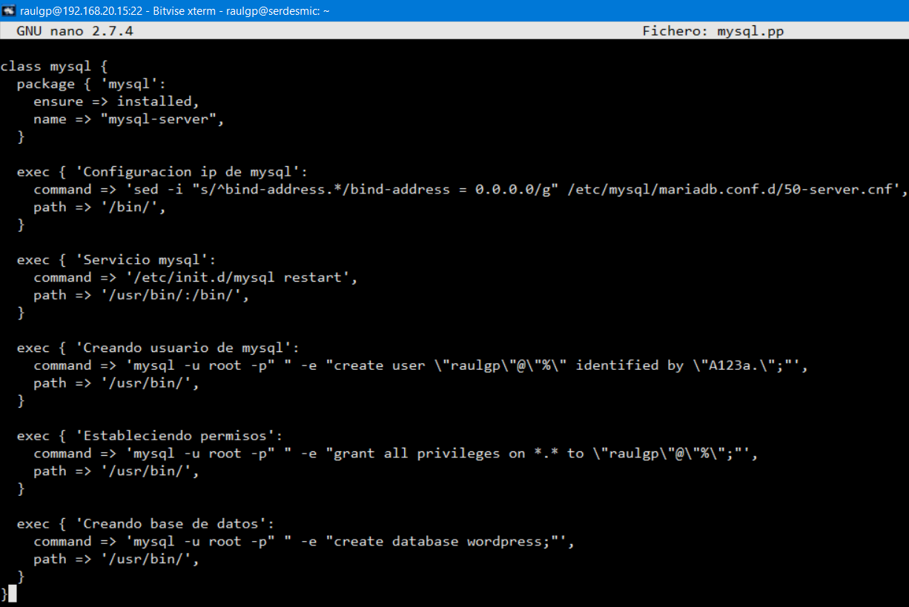

### 3.3  Aprovisionamiento de los equipos

Una vez los contenedores se han iniciado, esperamos el tiempo que definimos en el archivo de configuración de puppet para aprovisionar a los agentes, o escribimos el comando, `# docker exec -it "nombre de contenedor" bash`, y escribimos el comando, `# /opt/puppetlabs/bin/puppet agent -t`, para aprovisionar directamente los agentes puppet.

	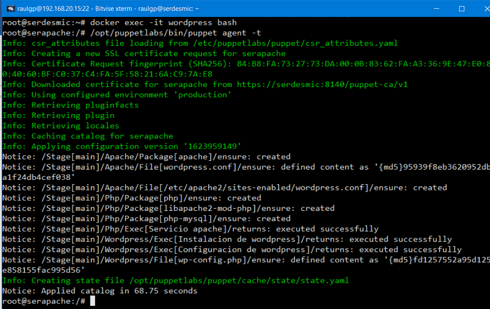

	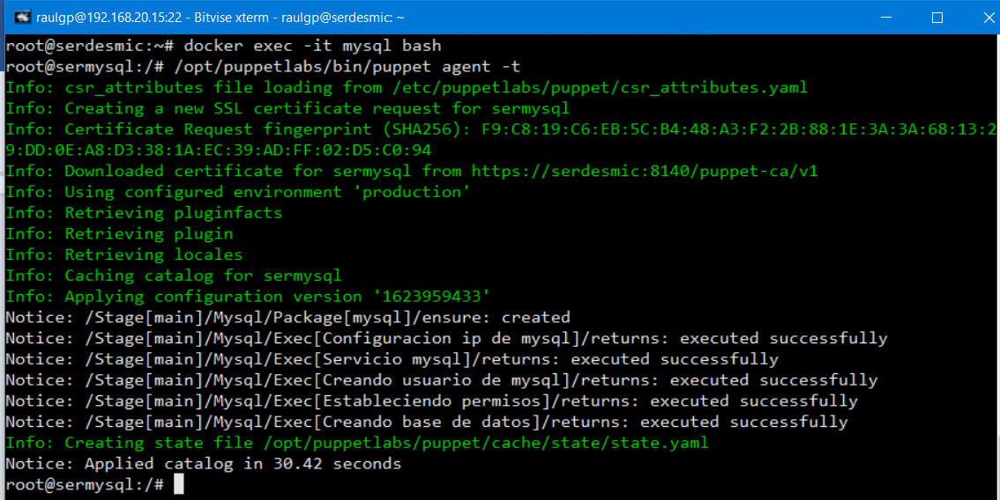

	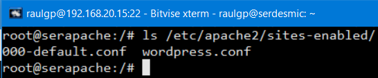

	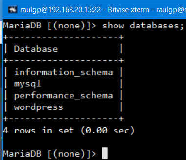

	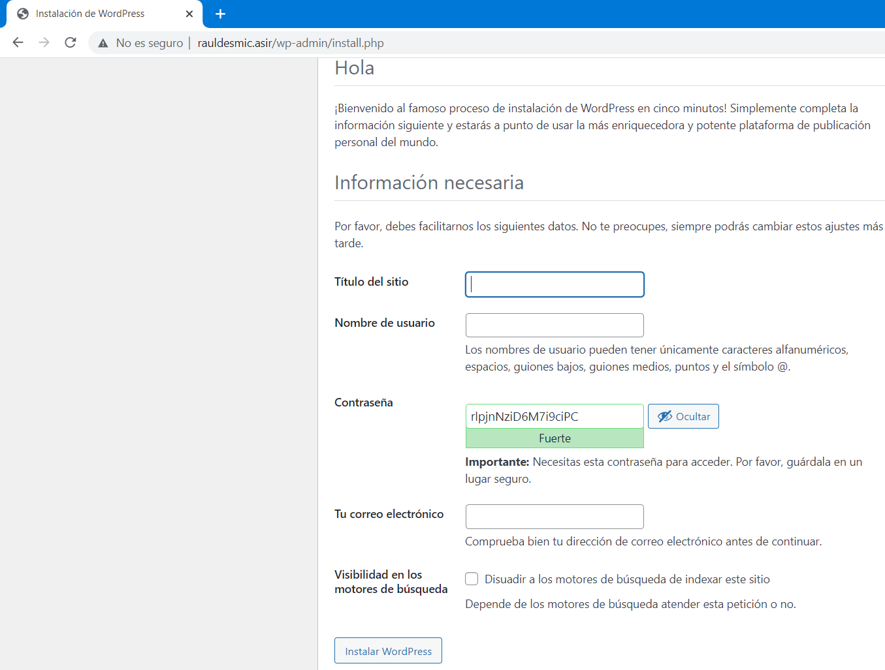

	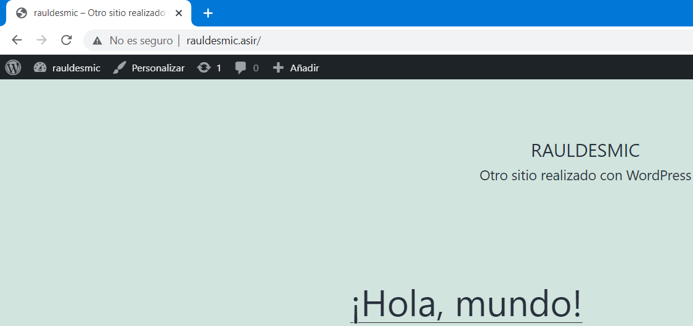

## 4  Webgrafía

<https://www.puppetcookbook.com/>  
<https://puppet.com/docs/puppet/latest/puppet_index.html>

## 5  Conclusión

Un lenguaje de aprovisionamiento es una manera sencilla de abastecer a equipos y desplegar microservicios en una red.
