# Orquestación de contenedores: Docker Swarm

## Índice

### [1 Introducción](#1--Introducción)

### [2 Requerimientos](#2--Requerimientos)

### [3 Preparación](#3--Preparación)
#### &nbsp; &nbsp; [3.1 Creación de un clúster](#31--Creación-de-un-clúster)
#### &nbsp; &nbsp; [3.2 Replicación de contenedores](#32--Replicación-de-contenedores)
#### &nbsp; &nbsp; [3.3 Abastecimiento en alta disponibilidad](#33--Abastecimiento-en-alta-disponibilidad)

### [4 Webgrafía](#4--Webgrafía)

### [5 Conclusión](#5--Conclusión)

---

## 1  Introducción

Un orquestador de contenedores es un proceso que automatiza y administra un gran número de contenedores y cómo interactúan entre sí, las versiones actuales de Docker incluyen el modo swarm nativamente para administrar un clúster de contenedores de Docker llamado swarm.

El CLI de Docker Swarm permite a los usuarios iniciar contenedores en el modo swarm, crear tokens para añadir un nodo al clúster, listar nodos del clúster, declarar el número de réplicas de cada servicio que quieres arrancar, especificar la red que usaran los servicios, y exponer los puertos de los servicios a un balanceador de carga externo.

En una empresa la aplicación más común de un orquestador es administrar automáticamente un número elevado de contenedores y abastecerlo de alta disponibilidad.

## 2  Requerimientos

Todas las máquinas virtuales tienen el sistema operativo Debian 9 stretch.

- Hipervisor VMware Workstation.

- Servidor ssh en las máquinas virtuales.

- Cliente ssh en la máquina anfitriona.

## 3  Preparación

En una máquina virtual accedemos mediante ssh desde la máquina anfitriona.

### 3.1  Creación de un clúster

Escribimos el comando, `# docker swarm init --advertise-addr 192.168.20.15`, para crear un clúster de Docker Swarm.

	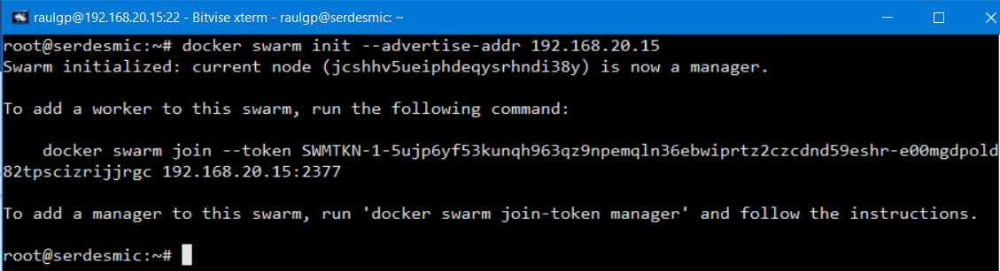

Clonamos la máquina virtual, nos vamos a la máquina trabajadora, y de la salida del comando anterior, escribimos el comando, `# docker swarm join --token SWMTKN-1-5ujp6yf53kunqh963qz9npemqln36ebwiprtz2czcdnd59eshr-e00mgdpold82tpscizrijjrgc 192.168.20.15:2377`, para unirse al clúster de Docker Swarm.

	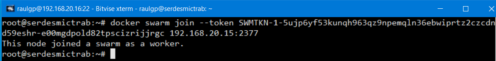

### 3.2  Replicación de contenedores

Iniciamos y entramos en un contenedor de un CMS WordPress instalado y configurado, cambiamos la dirección ip del servidor MySQL en el archivo de configuración de WordPress, creamos una nueva imagen de los cambios del contenedor, y escribimos el comando, `# docker save wordpress:ansible -o wordpress.tar`, para guardar una imagen de Docker en un archivo comprimido.

	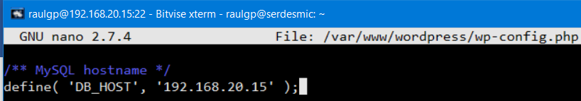

	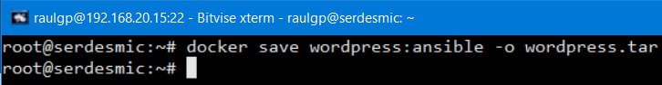

Escribimos el comando, `# scp wordpress.tar raulgp@192.168.20.16:/home/raulgp/`, nos vamos a la máquina trabajadora, y escribimos el comando, `# docker load -i wordpress.tar`, para cargar una imagen de Docker de un archivo comprimido.

	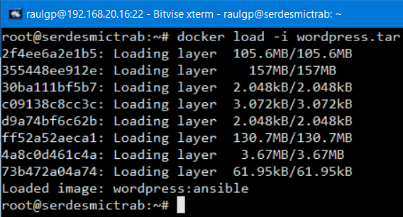

Nos vamos a la máquina administradora, escribimos el comando, `# nano docker-compose-swarm.yaml`, para desplegar réplicas de contenedores e iniciar servicios configurados, y escribimos el contenido.

	version: '3'
	services:
	  debianans:
	    image: wordpress:ansible # Imagen de Docker del repositorio local
	  
	# Inicio del servidor apache al arranque del contenedor
	    command: bash -c "/etc/init.d/apache2 restart && tail -f /dev/null"
	  
	# Exposición del puerto 80 del exterior y mapeo al puerto 80 del contenedor
	    ports:
	      - '80:80'
	    networks:
	      desmic: {}
	    
	# Despliegue de dos réplicas en el clúster del contenedor
	    deploy:
	      replicas: 2
	    
	# Creación de una red de Docker
	networks:
	  desmic:
	    driver: overlay
	    ipam:
	      driver: default
	      config:
	        - subnet: 192.168.15.0/24

	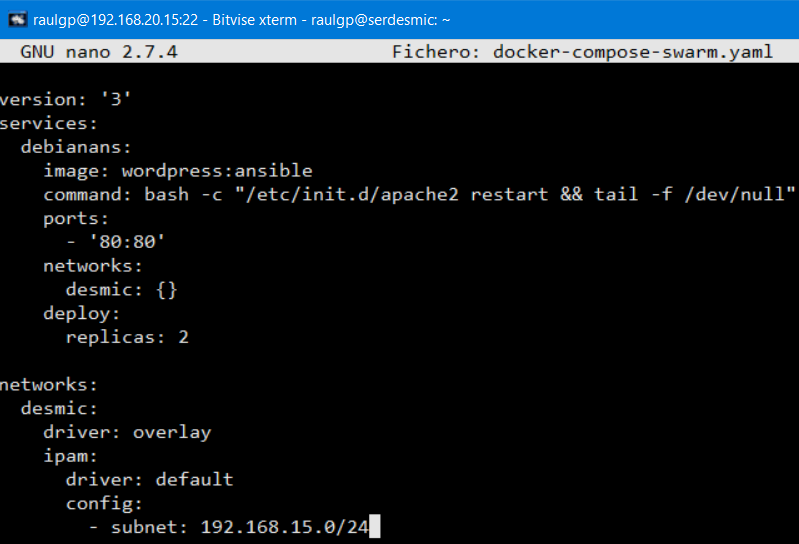

Escribimos el comando, `# nano docker-compose.yaml`, para cambiar la configuración de los contenedores creados y los servicios configurados, y escribimos el contenido.

	version: '3'
	services:
	  debianans:
	    container_name: mysql
	    image: mysql
	    
	# Inicio del servidor MySQL al arranque del contenedor
	    command: bash -c "/etc/init.d/mysql restart && tail -f /dev/null"
	    
	# Exposición del puerto 3306 del exterior y mapeo al 3306 del contenedor
	    ports:
	      - ’3306:3306’
	    networks:
	      desmic:
	        ipv4_address: 192.168.10.26
		
	# Creación de una red de Docker
	networks:
	  desmic:
	    driver: bridge
	    ipam:
	      driver: default
	      config:
	        - subnet: 192.168.10.0/24

	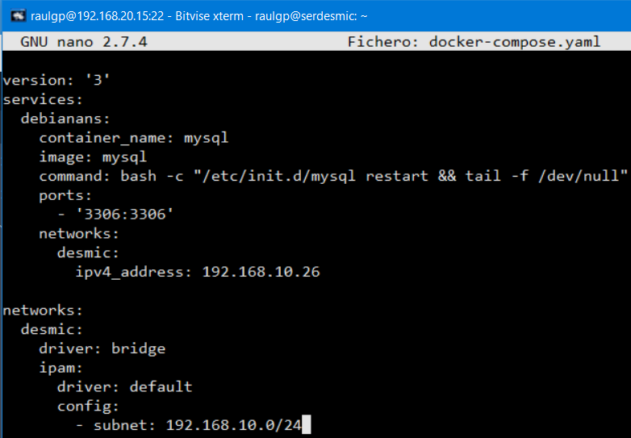

### 3.3  Abastecimiento en alta disponibilidad

Escribimos el comando, `# docker stack deploy -c docker-compose-swarm.yaml wordpress`, y escribimos el comando, `# /root/docker-compose up -d`, para desplegar y crear los servicios configurados.

	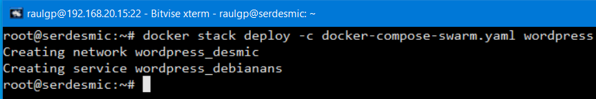

	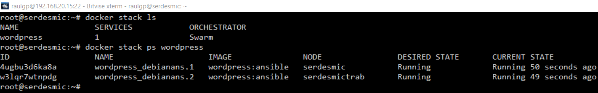

	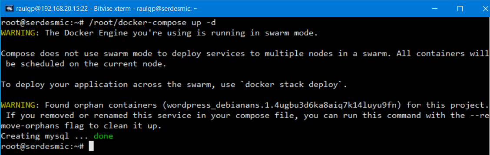

	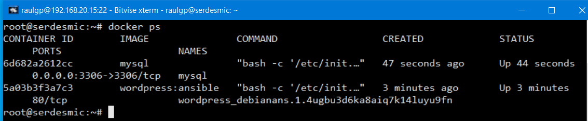

	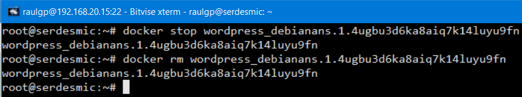

	

## 4  Webgrafía

<https://docs.docker.com/engine/swarm/>  
<https://docs.docker.com/engine/swarm/swarm-tutorial/>

## 5  Conclusión

Un orquestador en una manera sencilla de administrar numerosos contenedores abastecidos en alta disponibilidad.
