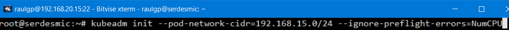
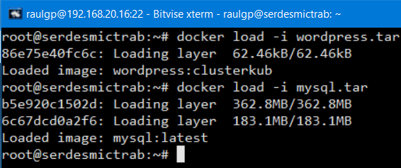

# Orquestación de contenedores: Kubernetes

## Índice

### [1 Introducción](#1--Introducción)

### [2 Requerimientos](#2--Requerimientos)

### [3 Preparación](#3--Preparación)
#### &nbsp; &nbsp; [3.1 Creación de un clúster](#31--Creación-de-un-clúster)
#### &nbsp; &nbsp; [3.2 Replicación de contenedores](#32--Replicación-de-contenedores)
#### &nbsp; &nbsp; [3.3 Abastecimiento en alta disponibilidad](#33--Abastecimiento-en-alta-disponibilidad)

### [4 Webgrafía](#4--Webgrafía)

### [5 Conclusión](#5--Conclusión)

---

## 1  Introducción

Kubernetes es una plataforma portable y extensible de código abierto para administrar cargas de trabajo y servicios. Facilita la automatización y la configuración declarativa teniendo un ecosistema grande y en rápido crecimiento, con el soporte, las herramientas y los servicios ampliamente disponibles.

Kubernetes puede desplegar servicios configurados usando un archivo YAML convertido desde un archivo de Docker Compose con Kompose, una herramientade conversión de archivos de Docker Compose para un orquestador de contenedores.

En  una  empresa  la  aplicación  más  común  de  un  orquestador  es  administrar automáticamente un número elevado de contenedores y abastecerlo de alta disponibilidad.

## 2  Requerimientos

Todas las máquinas virtuales tienen el sistema operativo Debian 9 stretch.

- Hipervisor VMware Workstation.

- Servidor ssh en las máquinas virtuales.

- Cliente ssh en la máquina anfitriona.

## 3  Preparación

En una máquina virtual accedemos mediante ssh desde la máquina anfitriona.

### 3.1  Creación de un clúster

En ambas máquinas, escribimos el comando, `# curl -s https://packages.cloud.google.com/apt/doc/apt-key.gpg | apt-key add -`, para añasir la llave oficial GPG de Kubernetes.

	

Escribimos el comando, `# nano /etc/apt/sources.list`, y escribimos el contenido.

	deb http://apt.kubernetes.io/ kubernetes-xenial main

	

Actualizamos los repositorios, y escribimos el comando, `# apt install kubeadm kubelet kubectl`, para instalar Kubernetes.

	

Escribimos el comando, `# swapon -s`, y escribimos el comando, `# swapoff -a`,para deshabilitar la memoria swap.

	

Nos vamos a la máquina administradora, y escribimos el comando, `# kubeadm init --pod-network-cidr=192.168.15.0/24 --ignore-preflight-errors=NumCPU`, para crear un clúster de Kubernetes.

	

De la salida del comando anterior, escribimos el comando, `# mkdir -p $HOME/.kube`, escribimos el comando, `# cp -i /etc/kubernetes/admin.conf $HOME/.kube/config`, y escribimos el comando, `# chown $(id -u):$(id -g) $HOME/.kube/config`, para copiar un archivo de configuración del clúster de Kubernetes.

	

Escribimos el comando, `# wget https://raw.githubusercontent.com/coreos/flannel/master/Documentation/kube-flannel.yml`, escribimos el comando, `# nano kube-flannel.yml`, para descargar un archivo de configuración de la arquitectura de red de los pods de Kubernetes, y escribimos el contenido.

	"Network": "192.168.15.0/24",

	

Escribimos el comando, `# kubectl apply -f kube-flannel.yml`, para aplicar el archivo de configuración.

	

Nos vamos a la máquina trabajadora, de la salida del comando, de la creación del clúster de Kubernetes, escribimos el comando, `# kubeadm join 192.168.20.15:6443 --token i7r3bq.01anghl3kx55qk0y --discovery-token-ca-cert-hash sha256:26dae14e8ea36d75c39047d71a3f2015e31d3c54947ba125afd709120241d05a`, para unirse al cúuster de kubernetes.

	

Nos vamos a la máquina administradora, escribimos el comando, `# scp /run/flannel/subnet.env root@192.168.20.16:/run/flannel/`, para copiar el archivo de configuración del direccionamiento de red de los pods.

	

### 3.2  Replicación de contenedores

Iniciamos y entramos en un contenedor de un CMS WordPress instalado y configurado, cambiamos la dirección ip del servidor MySQL en el archivo de configuración de WordPress, creamos una nueva imagen de los cambios del contenedor, escribimos el comando, `# docker save wordpress:clusterkub -o wordpress.tar`, y escribimos el comando, `# docker save mysql -o mysql.tar`, para guardar una imagen de Docker en un archivo comprimido.

	

	

Escribimos el comando, `# scp wordpress.tar mysql.tar docker-compose.yaml raulgp@192.168.20.16:/home/raulgp/`, nos vamos a la máquina trabajadora, escribimos el comando, `# docker load -i wordpress.tar`, y escribimos el comando, `# docker load -i mysql.tar`, para cargar una imagen de Docker de un archivo comprimido.

	

Nos vamos a la máquina administradora, y escribimos el comando, `# curl -L https://github.com/kubernetes/kompose/releases/download/v1.21.0/komposelinux-amd64 -o kompose`, para instalar Kompose.

	

Le damos permisos de ejecución al script de Kompose, y escribimos el comando, `# /root/kompose convert -f docker-compose-swarm.yaml`, para convertir el archivo de Docker Compose del orquestador Docker Swarm en archivos YAML de Kubernetes.

	

Escribimos el comando, `# rm desmic-networkpolicy.yaml`, para eliminar un archivo de la conversión de Kompose.

	

Kompose genera muchos metadatos en la conversión de un archivo, escribimos el comando, `# nano debianans-deployment.yaml`, y escribimos el contenido.

	apiVersion: apps/v1
	kind: Deployment
	metadata:
	  labels:
	    app: debianans
	  name: debianans # Nombre del recurso al implementarse
	spec:
	  replicas: 2 # Despliegue de dos réplicas en el clúster del contenedor
	  selector:
	    matchLabels:
	      app: debianans
	  strategy: {}
	  template:
	    metadata:
	      labels:
	        app: debianans
	    spec:
	      containers:
	      - args:
	      
	# Inicio del servidor apache al arranque del contenedor
	        - bash
	        - -c
	        - /etc/init.d/apache2 restart && tail -f /dev/null
	        image: wordpress:clusterkub # Es el nombre de la imagen de Docker
	        imagePullPolicy: Never # Usa la imagen de Docker del repositorio local
	        name: debianans
		
	# Exposición del puerto 80 del contenedor
	        ports:
	        - containerPort: 80
	        resources: {}
	      restartPolicy: Always
	status: {}

	

Escribimos el comando, `# nano debianans-service.yaml`, y escribimos el contenido.

	apiVersion: v1
	kind: Service # Nombre del tipo de recurso
	metadata:
	  labels:
	    run: debianans
	  name: debianansser # Nombre del recurso al implementarse
	spec:
	  type: LoadBalancer # Es el nombre del tipo de servicio
	  
	# Accedemos a los contenedores a través de la dirección ip del nodo del clúster
	  externalIPs:
	  - 192.168.20.16
	
	# Exposición del puerto 80 del exterior y mapeo al 80 del contenedor
	  ports:
	  - protocol: TCP
	    port: 80
	    targetPort: 80
	  selector:
	    app: debianans # Es el nombre del recurso donde se implementa el servicio

	

### 3.3  Abastecimiento en alta disponibilidad

Nos vamos a la máquina trabajadora, y escribimos el comando, `# /root/dockercompose up -d`, para desplegar y crear el servicio de un servidor MySQL instalado configurado.

	

	

Nos vamos a la máquina administradora, escribimos el comando, `# kubectl create -f debianans-deployment.yaml`, y escribimos el comando, `# kubectl create -f debianans-service.yaml`, para desplegar y crear los servicios configurados.

	

	

	

	

## 4  Webgrafía

<https://kubernetes.io/docs/tasks/configure-pod-container/assign-pods-nodes/>  
<https://kubernetes.io/docs/concepts/services-networking/service/>

## 5  Conclusión

Un orquestador en una manera sencilla de administrar numerosos contenedores abastecidos en alta disponibilidad.
