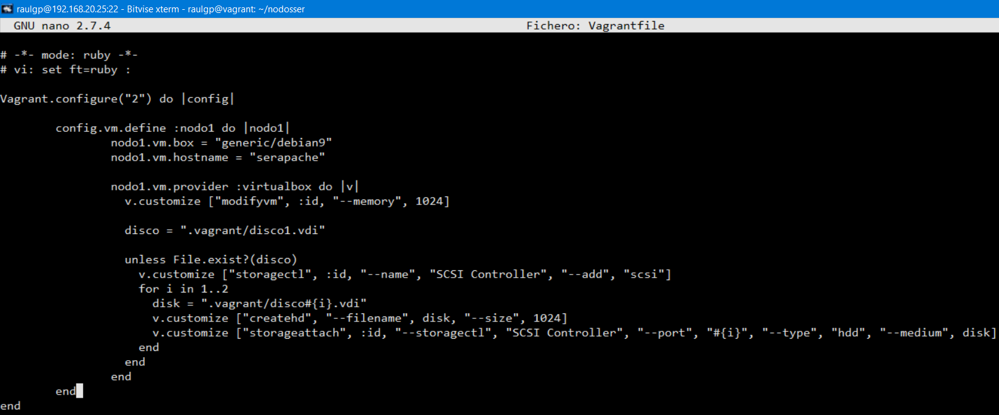
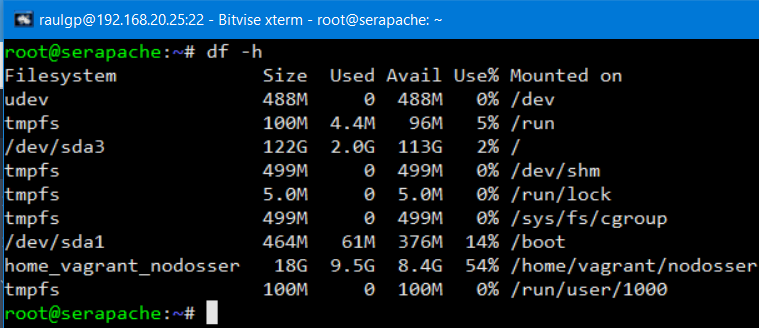

# Despliegue ágil de microservicios: Virtualización pesada

## Índice

### [1 Introducción](#1--Introducción)

### [2 Requerimientos](#2--Requerimientos)

### [3 Preparación](#3--Preparación)
#### &nbsp; &nbsp; [3.1 Instalación](#31--Instalación)
#### &nbsp; &nbsp; [3.2 Configuración](#32--Configuración)
#### &nbsp; &nbsp; [3.3 Modificación del hardware](#33--Modificación-del-hardware)
#### &nbsp; &nbsp; [3.4 Modificación de la infraestructura de red](#34--Modificación-de-la-infraestructura-de-red)
#### &nbsp; &nbsp; [3.5 Habilitación y ejecución de scripts](#35--Habilitación-y-ejecución-de-scripts)
#### &nbsp; &nbsp; [3.6 Instalación de plugins](#36--Instalación-de-plugins)
#### &nbsp; &nbsp; [3.7 Exportación e importación de máquinas virtuales](#37--Exportación-e-importación-de-máquinas-virtuales)

### [4 Webgrafía](#4--Webgrafía)

### [5 Conclusión](#5--Conclusión)

---

## 1  Introducción

Vagrant es una herramienta para la creación y configuración de entornos de desarrollo virtualizados en los que usa "lenguajes de aprovisionamiento" y "proveedores" para customizarlos. Esta escrito en Ruby aunque el ecosistema soporta otros lenguajes.

Los lenguajes de aprovisionamiento son herramientas que permite a los usuarios alterar la configuración de las máquinas virtuales, tales como Puppet, Chef y Ansible que son de los más usados.

Los proveedores son los servicios que vagrant usa para crear las máquinas virtuales, originalmente se desarrolló para VirtualBox pero actualmente es capaz de trabajar con múltiples proveedores, como LXC, DigitalOcean, y otros como VMware y Amazon mediante plugins.

En una empresa la aplicación más común de una herramienta para la creación y configuración de entornos de desarrollo mediante virtualización pesada es desplegar ágilmente microservicios de forma automática mediante un archivo de configuración.

## 2  Requerimientos

Todas las máquinas virtuales tienen el sistema operativo Debian 9 stretch.

- Hipervisor VMware Workstation.

- Servidor ssh en las máquinas virtuales.

- Cliente ssh en la máquina anfitriona.

## 3  Preparación

En una máquina virtual accedemos mediante ssh desde la máquina anfitriona.

### 3.1  Instalación

Escribimos el comando, `# wget -q https://www.virtualbox.org/download/oracle_vbox_2016.asc -O- | apt-key add -`, y escribimos el comando, `# wget -q https://www.virtualbox.org/download/oracle_vbox.asc -O- | apt-key add -`, para descargar e importar las llaves especificadas.

	

Escribimos el comando, `# nano /etc/apt/sources.list`, y escribimos el contenido.

    deb https://download.virtualbox.org/virtualbox/debian stretch contrib

	

Actualizamos los repositorios, y escribimos el comando, `# apt install virtualbox-6.1`, para instalar virtualbox.

	

Escribimos el comando, `# wget https://releases.hashicorp.com/vagrant/2.2.15/vagrant_2.2.15_x86_64.deb`, para descargar el archivo de instalación de vagrant.

	

Escribimos el comando, `# dpkg -i vagrant_2.2.15_x86_64.deb`, para instalar vagrant.

	

### 3.2  Configuración

Escribimos el comando, `# vagrant box add "dirección URL"`, para instalar una box.

	

Escribimos el comando, `# vagrant box list`, para mostrar las boxes instaladas.

	

	

Escribimos el comando, `# vagrant init`, escribimos el comando, `# nano Vagrantfile`, y escribimos el contenido.

	Vagrant.configure("2") do |config|
	  config.vm.define :nodo1 do |nodo1|
	    nodo1.vm.box = "generic/debian9"
	    nodo1.vm.hostname = "serapache"
	  end
	end

	

Escribimos el coamndo, `# vagrant up`, y escribimos el comando, `# vagrant ssh "nombre de la máquina virtual"`, para conectarnos remotamente a la máquina virtual.

	

### 3.3  Modificación del hardware

Escribimos el comando, `# nano Vagrantfile`, y escribimos el contenido.

	Vagrant.configure("2") do |config|
	  config.vm.define :nodo1 do |nodo1|
	    nodo1.vm.box = "generic/debian9"
	    nodo1.vm.hostname = "serapache"
	    
	    nodo1.vm.provider :virtualbox do |v|
	# Establecimiento de la memoria principal
	      v.customize ["modifyvm", :id, "--memory", 1024]
	      
	      disco = ".vagrant/disco1.vdi"
	      unless File.exist?(disco)
	# Habilitación del controlador de almacenamiento
	        v.customize ["storagectl", :id, "--name", "SCSI Controller", "--add", "scsi"]
	# Creación y conexión de las unidades de almacenamiento
	        for i in 1..2
	          disk = ".vagrant/disco#{i}.vdi"
	          v.customize ["createhd", "--filename", disk, "--size", 1024]
	          v.customize ["storageattach", :id, "--storagectl", "SCSI Controller", "--port", "#{i}", "--type", "hdd", "--medium", disk]
	        end
	      end
	    end
	  end

	end

	

	

	

### 3.4  Modificación de la infraestructura de red

Escribimos el comando, `# nano Vagrantfile`, y escribimos el contenido.

	Vagrant.configure("2") do |config|
	  config.vm.define :nodo1 do |nodo1|
	    nodo1.vm.box = "generic/debian9"
	    nodo1.vm.hostname = "serapache"
	    
	# Habilitación de los adaptadores de red
	    nodo1.vm.network :private network, type: "dhcp"
	    nodo1.vm.network :public network, :bridge=>"ens33", ip: "192.168.1.30", netmask: "255.255.255.0"
	    
	# Establecimiento de la redirección de puertos
	    nodo1.vm.network :forwarded_port,
	      guest: 443,
	      host: 8080,
	      id: "apache",
	      auto_correct: true,
	      host_ip: "192.168.20.25",
	      guest_ip: "192.168.1.30"

	

	

	

### 3.5  Habilitación y ejecución de scripts

Escribimos el comando, `# nano Vagrantfile`, y escribimos el contenido.

	Vagrant.configure("2") do |config|
	  config.vm.define :nodo1 do |nodo1|
	    nodo1.vm.box = "generic/debian9"
	    nodo1.vm.hostname = "serapache"
	    
	    instapache = "scripts/instapache"
	    
	    unless File.exist?(instapache)
	# Establecimiento del nombre del script
	      nodo1.vm.provision :shell, path: "./scripts/scriptinstapache.sh", run: 'always'
	    end
	# Establecimiento del nombre del recurso compartido
	    nodo1.vm.synced_folder "/home/raulgp/nodosser/scripts", "/home/vagrant/nodosser"

	

	

	

### 3.6  Instalación de plugins

Los plugins de vagrant ofrecen funcionalidades adicionales que no vienen por defecto integradas, son potentes y extienden las capacidades con documentación de sus versiones actualizables.

\- Vagrant-netinfo: Muestra la redirección de puertos de las máquinas virtuales.

Escribimos el comando, `# vagrant plugin install vagrant-netinfo`, y escribimos el comando, `# vagrant netinfo "nombre de la máquina virtual"`, para mostrar la redirección de puertos de la máquina virtual especificada.

	

	

\- Vagrant-timezone: Configura la zona horaria de las máquinas virtuales.

Escribimos el comando, `# vagrant plugin install vagrant-timezone`, escribimos el comando, `# nano Vagrantfile`, y escribimos el contenido.

	Vagrant.configure("2") do |config|
	  config.vm.define :nodo1 do |nodo1|
	    nodo1.vm.box = "generic/debian9"
	    nodo1.vm.hostname = "serapache"
	    
	# Establecimiento de la zona horaria
	    nodo1.timezone.value = "UTC"

	

	

	

### 3.7  Exportación e importación de máquinas virtuales

Accedemos a la máquina virtual, escribimos el comando, `# wget https://raw.githubusercontent.com/mitchellh/vagrant/master/keys/vagrant.pub -O /home/vagrant/.ssh/authorized_keys`, escribimos el comando, `# chmod 700 /home/vagrant/.ssh`, y escribimos el comando, `# chmod 600 /home/vagrant/.ssh/authorized_keys`, para descargar y establecer a la llave pública los permisos especificados.

	

Escribimos el comando, `# VBoxManage list vms`, para listar las máquinas virtuales, escribimos el comando, `# vagrant package --base "nombre de la máquina virtual" --output "nombre de archivo".box`, para exportar en un archivo la máquina virtual especificada.

	

	

Escribimos el comando, `# vagrant box add --name "nombre de la máquina virtual" "nombre de archivo".box`, para importar una box de la máquina virtual.

	

	

## 4  Webgrafía

<https://www.vagrantup.com/docs>  
<https://github.com/kusnier/vagrant-persistent-storage/issues/33>  
<https://stackoverflow.com/questions/37208309/vagrant-execute-script-or-command-after-every-guest-restart-vagrant-up>  
<https://github.com/hashicorp/vagrant/wiki/Available-Vagrant-Plugins>  
<https://stackoverflow.com/questions/21574260/change-default-disk-controller-in-vagrant>

## 5  Conclusión

Vagrant es una manera sencilla de desplegar ágilmente microservicios mediante archivos de configuración.
