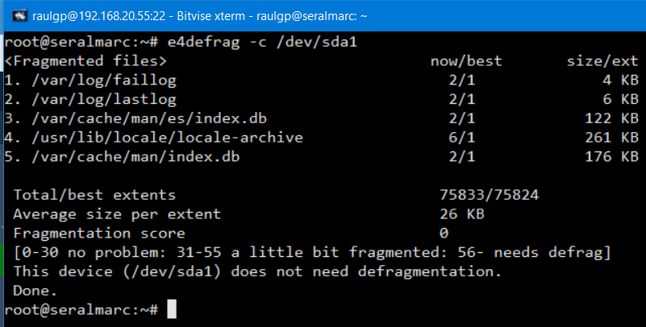
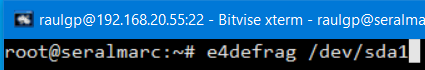
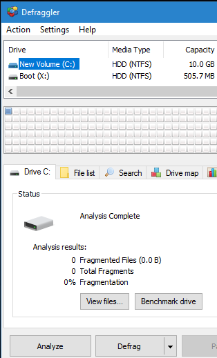
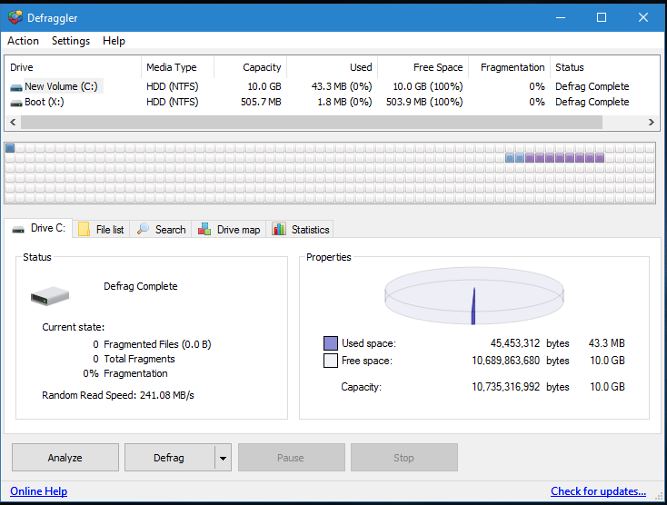

# Desfragmentación

## Índice

### [1 Introducción](#1--Introducción)

### [2 Requerimientos](#2--Requerimientos)

### [3 Preparación](#3--Preparación)
#### &nbsp; &nbsp; [3.1 Desfragmentar sistemas de archivos de sistemas operativos libres](#31--Desfragmentar-sistemas-de-archivos-de-sistemas-operativos-libres)
#### &nbsp; &nbsp; [3.2 Desfragmentar sistemas de archivos de sistemas operativos propietarios](#32--Desfragmentar-sistemas-de-archivos-de-sistemas-operativos-propietarios)

### [4 Webgrafía](#4--Webgrafía)

### [5 Conclusión](#5--Conclusión)

---

## 1  Introducción

La desfragmentación es el proceso mediante el cual se acomodan los archivos en una unidad de almacenamiento para que no se aprecien fragmentos de cada uno de ellos, de tal manera que quede contiguo el archivo y sin espacios dentro del mismo.

Al irse escribiendo y borrando archivos continuamente, los fragmentos tienden a no quedar en áreas continuas, por lo tanto un archivo puede quedar "partido" en muchos pedazos.

Al tener fragmentos de incluso un archivo esparcidos, se vuelve ineficiente el acceso a ellos, por ello es conveniente desfragmentar el almacenamiento de los archivos en dispositivos electromecánicos, ya que en los SSD al no ser mecánicos acortaríamos su vida útil.

Existen dos tipos de fragmentación: interna y externa.

- Fragmentación interna: Es la pérdida de espacio debido al hecho de que el tamaño de un determinado archivo sea inferior al tamaño del clúster, ya que teóricamente el archivo estaría obligado a ser referenciado como un clúster completo.

- Fragmentación externa: La sucesiva creación y eliminación de ficheros de distintos tamaños puede conducir al aislamiento de los bloques libres, dejando demasiados de pequeño tamaño, no "cabiendo" nuevos procesos.

En una empresa la aplicación más común de desfragmentar las unidades de almacenamiento electromecánicas es acelerar el tiempo de acceso a los archivos y no fragmentarlos en diferentes partes.

## 2  Requerimientos

Todas las máquinas virtuales tienen el sistema operativo Debian 9 stretch.

- Hipervisor VMware Workstation.

- Servidor ssh en las máquinas virtuales.

- Cliente ssh en la máquina anfitriona.

## 3  Preparación

En una máquina virtual accedemos mediante ssh desde la máquina anfitriona.

### 3.1  Desfragmentar sistemas de archivos de sistemas operativos libres

Escribimos el comando, `# e4defrag -c /dev/sda1`, para realizar una comprobación si se necesita de desfragmentar la unidad de almacenamiento.

	

Escribimos el comando, `# e4defrag /dev/sda1`, para desfragmentar la unidad de almacenamiento.

	

### 3.2  Desfragmentar sistemas de archivos de sistemas operativos propietarios

Arrancamos el equipo con un live-cd de Hiren´s Boot, ejecutamos defraggler, seleccionamos la unidad de almacenamiento, y le damos a analizar, para realizar una comprobación si se necesita de desfragmentar la unidad de almacenamiento.

	

Le damos a desfragmentar para desfragmentar la unidad de almacenamiento.

	

## 4  Webgrafía

<https://www.linuxadictos.com/tutorial-desfragmentar-tu-disco-duro-bajo-gnu-linux.html>

## 5  Conclusión

Desfragmentar unidades de almacenamiento electromecánicas es una manera sencilla de acelerar el tiempo de acceso a los archivos.
