# Dispositivos en modo RAID

## Índice

### [1 Introducción](#1--Introducción)

### [2 Requerimientos](#2--Requerimientos)

### [3 Preparación](#3--Preparación)
#### &nbsp; &nbsp; [3.1 Instalación de la herramienta de creación de RAID](#31--Instalación-de-la-herramienta-de-creación-de-RAID)
#### &nbsp; &nbsp; [3.2 Creación del RAID 0](#32--Creación-del-RAID-0)
#### &nbsp; &nbsp; [3.3 Creación del RAID 1](#33--Creación-del-RAID-1)
#### &nbsp; &nbsp; [3.4 Creación del RAID 5](#34--Creación-del-RAID-5)

### [4 Webgrafía](#4--Webgrafía)

### [5 Conclusión](#5--Conclusión)

---

## 1  Introducción

Los dispositivos en modo RAID (Redundant Array of Independent Disks) hacen referencia a un sistema de almacenamiento de datos que utilizan múltiples unidades, entre las cuales se distribuyen o replican los datos.

Dependiendo de la configuración del tipo de RAID, los beneficios respecto a un único dispositivo pueden ser mayor integridad, tolerancia frente a fallos, tasa de transferencia o capacidad. Los tipos de RAID más usados son el RAID 0, el RAID 1, y el RAID 5.

- RAID 0 (Conjunto dividido): Un RAID 0 distribuye los datos equitativamente entre dos o más unidades de almacenamiento sin información de paridad que proporcione redundancia, se usa habitualmente para proporcionar un alto rendimiento de escritura ya que los datos se escriben en dos o más dispositivos de forma paralela,

- RAID 1 (Conjunto en espejo): Un RAID 1 crea una copia exacta de un conjunto de datos en dos o más unidades de almacenamiento, resulta útil cuando queremos tener más seguridad desaprovechando capacidad, ya que si perdemos un dispositivo, tenemos el otro con la misma información.

- RAID 5 (Conjunto dividido con paridad distribuida): Un RAID 5 es una división de datos a nivel de bloques que distribuye la información de paridad entre todos las unidades de almacenamiento miembros del conjunto.

  Cada vez que un bloque de datos se escribe en un RAID 5, se genera un bloque de paridad dentro de la misma división, si otro bloque o alguna porción, es escrita en esa misma división, el bloque de paridad es recalculado y vuelto a escribir.

  Los bloques de paridad no se leen en las operaciones de lectura de datos, sino cuando la lectura de un sector de datos provoca un error. En este caso, el sector en la misma posición relativa dentro de cada uno de los bloques de datos restantes en la división y dentro del bloque de paridad se utilizan para reconstruir el sector erróneo.

  Si falla una unidad de almacenamiento del conjunto, los bloques de paridad de los restantes dispositivos son combinados matemáticamente con los bloques de datos para reconstruir la información de la unidad de almacenamiento que ha fallado en el RAID 5.

En una empresa la aplicación más común de configurar unidades de almacenamiento en modo RAID es conectar varios dispositivos en un mismo equipo y visualizarlo como uno solo en el nivel más simple, y ofrecer alta disponibilidad y mayor rendimiento en operaciones de lectura o escritura.

## 2  Requerimientos

Todas las máquinas virtuales tienen el sistema operativo Debian 9 stretch.

- Hipervisor Oracle VM VirtualBox.

- Servidor ssh en las máquinas virtuales.

- Cliente ssh en la máquina anfitriona.

## 3  Preparación

En una máquina virtual accedemos mediante ssh desde la máquina anfitriona.

### 3.1  Instalación de la herramienta de creación de RAID

Escribimos el comando, `# apt install mdadm`, para instalar la herramienta de administración del modo RAID.

	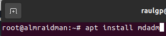

### 3.2  Creación del RAID 0

Escribimos el comando, `# mdadm --create --verbose /dev/md0 --level=0 --raid-devices=2 /dev/sdb /dev/sdc`, para crear el RAID de nivel 0.

	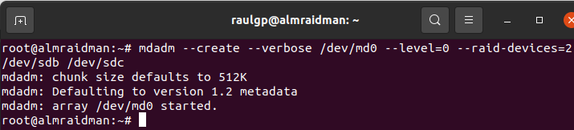

	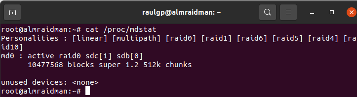

Una vez hayamos particionado y formateado el RAID, escribimos el comando, `# mdadm --detail --scan >> /etc/mdadm/mdadm.conf`, para reensamblar el RAID al arranque del equipo.

	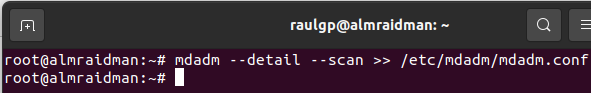

Escribimos el comando, `# update-initramfs -u`, para actualizar la imagen initramfs y que el RAID este disponible durante el arranque del equipo.

	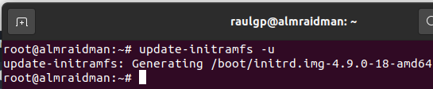

	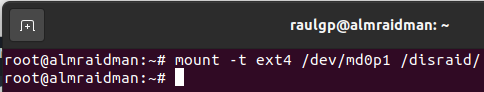

	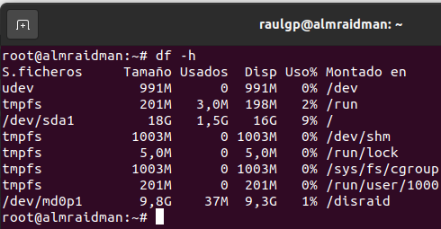

### 3.3  Creación del RAID 1

Escribimos el comando, `# mdadm --create --verbose /dev/md0 --level=1 --raid-devices=2 /dev/sdb /dev/sdc`, para crear el RAID de nivel 1.

	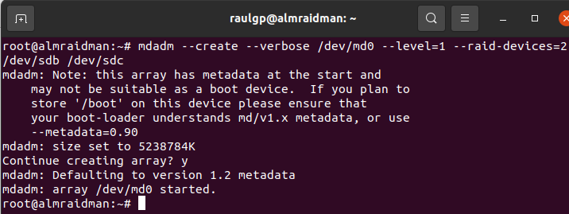

	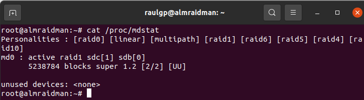

Una vez hayamos particionado y formateado el RAID, escribimos el comando, `# mdadm --detail --scan >> /etc/mdadm/mdadm.conf`, para reensamblar el RAID al arranque del equipo.

	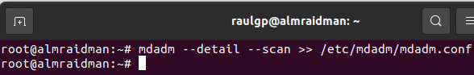

Escribimos el comando, `# update-initramfs -u`, para actualizar la imagen initramfs y que el RAID este disponible al arranque del equipo.

	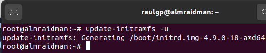

Almacenamos información dentro del RAID, formateamos a bajo nivel uno de los dispositivos que lo forman, y escribimos el comando, `# mdadm --stop /dev/md0`, para desactivar el RAID.

	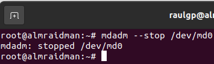

Escribimos el comando, `# mdadm --assemble --run /dev/md0 /dev/sdc`, para ensamblar la unidad de almacenamiento del RAID que funciona, comprobamos que la información era exacta al otro dispositivo.

	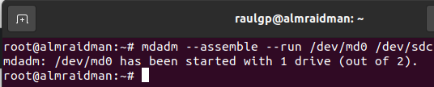

	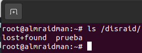

### 3.4  Creación del RAID 5

Escribimos el comando, `# mdadm --create --verbose /dev/md0 --level=5 --raid-devices=3 /dev/sdb /dev/sdc /dev/sdd`, para crear el RAID de nivel 5.

	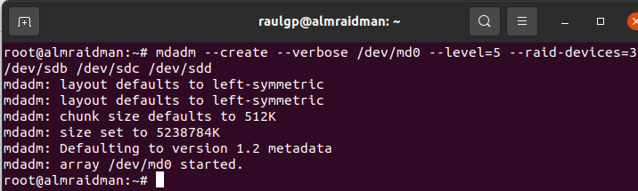

	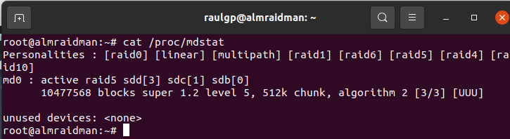

Una vez hayamos particionado y formateado el RAID, escribimos el comando, `# mdadm --detail --scan >> /etc/mdadm/mdadm.conf`, para reensamblar el RAID al arranque del equipo.

	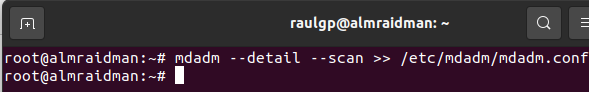

Escribimos el comando, `# update-initramfs -u`, para actualizar la imagen initramfs y que el RAID este disponible al arranque del equipo.

	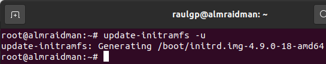

Almacenamos información dentro del RAID, formateamos a bajo nivel uno de los dispositivos que lo forman, y escribimos el comando, `# mdadm --stop /dev/md0`, para desactivar el RAID.

	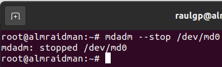

Escribimos el comando, `# mdadm --assemble --run /dev/md0 /dev/sdc /dev/sdd`, para ensamblar las unidades de almacenamiento del RAID que funcionan, comprobamos que la información es reconstruida en los dispositivos.

	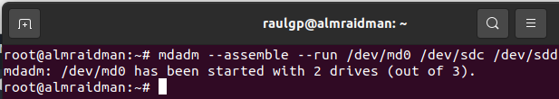

	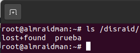

## 4  Webgrafía

<https://www.digitalocean.com/community/tutorials/how-to-create-raid-arrays-with-mdadm-on-debian-9>

## 5  Conclusión

Configurar unidades de almacenamiento en modo RAID es una manera sencilla de visualizar varios dispositivos conectados como uno solo y ofrecer alta disponibilidad y mayor rendimiento.
