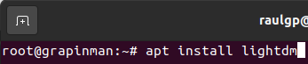
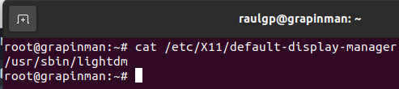
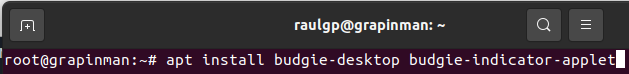
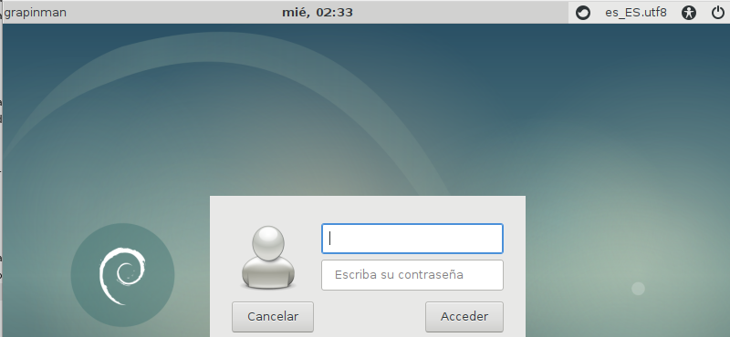
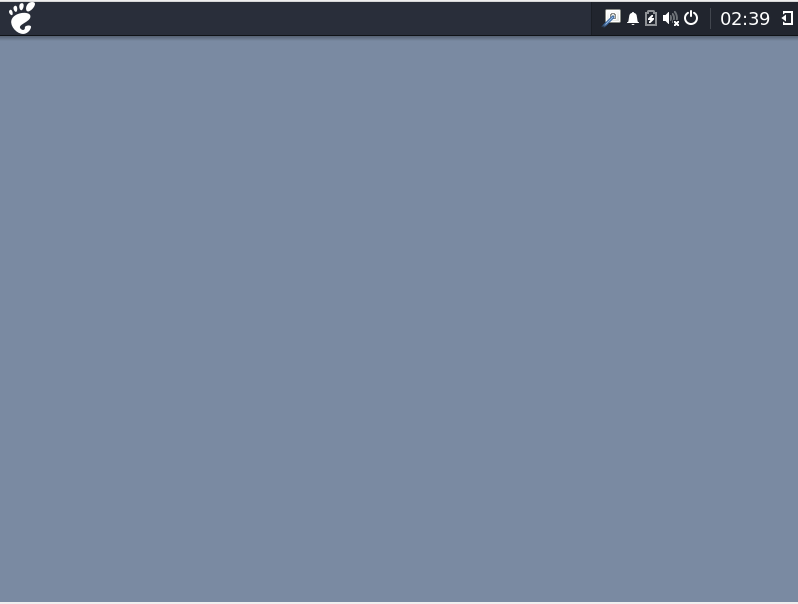

# Implementación del entorno gráfico

## Índice

### [1 Introducción](#1--Introducción)

### [2 Requerimientos](#2--Requerimientos)

### [3 Preparación](#3--Preparación)
#### &nbsp; &nbsp; [3.1 Instalación](#31--Instalación)

### [4 Webgrafía](#4--Webgrafía)

### [5 Conclusión](#5--Conclusión)

---

## 1  Introducción

Un entorno de escritorio es un conjunto de software para ofrecer al usuario una interacción amigable y cómoda. Es una implementación de interfaz gráfica de usuario que ofrece facilidades de acceso y configuración, como barras de herramientas e integración entre aplicaciones.

Los entornos de escritorios por lo general no permiten el acceso a todas las caracterı́sticas que se encuentran en un sistema operativo, en su lugar la interfaz de lı́nea de comandos se utiliza cuando se requiere el control total sobre él.

En una empresa la aplicación más común de ofrecer un sistema operativo con un entorno gráfico es la de aumentar la comunicación con el equipo y que sea más intuitiva la experiencia.

## 2  Requerimientos

Todas las máquinas virtuales tienen el sistema operativo Debian 9 stretch.

- Hipervisor Oracle VM VirtualBox.

- Servidor ssh en las máquinas virtuales.

- Cliente ssh en la máquina anfitriona.

## 3  Preparación

En una máquina virtual accedemos mediante ssh desde la máquina anfitriona.

### 3.1  Instalación

Escribimos el comando, `# apt install lightdm`, para instalar el gestor de pantalla.

	

	

Escribimos el comando, `# apt install budgie-desktop budgie-indicator-applet`, para instalar el entorno de escritorio.

	

	

	

## 4  Webgrafía

<https://linuxconfig.org/how-to-install-budgie-desktop-on-debian>  
<https://wiki.debian.org/DesktopEnvironment>

## 5  Conclusión

Un sistema operativo con un entorno gráfico es una manera sencilla de mejorar la comunicación con el equipo y tener una mayor experiencia intuitiva.
