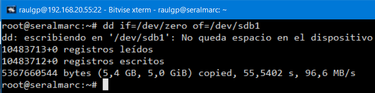

# Particionado y formateado

## Índice

### [1 Introducción](#1--Introducción)

### [2 Requerimientos](#2--Requerimientos)

### [3 Preparación](#3--Preparación)
#### &nbsp; &nbsp; [3.1 Particionado](#31--Particionado)
##### &nbsp; &nbsp; &nbsp; &nbsp; &nbsp; &nbsp; [3.1.1 Por comandos](#311--Por-comandos)
##### &nbsp; &nbsp; &nbsp; &nbsp; &nbsp; &nbsp; [3.1.2 Por un programa](#312--Por-un-programa)
#### &nbsp; &nbsp; [3.2 Formateado](#32--Formateado)
##### &nbsp; &nbsp; &nbsp; &nbsp; &nbsp; &nbsp; [3.2.1 A bajo nivel](#321--A-bajo-nivel)
##### &nbsp; &nbsp; &nbsp; &nbsp; &nbsp; &nbsp; [3.2.2 A alto nivel](#322--A-alto-nivel)

### [4 Webgrafía](#4--Webgrafía)

### [5 Conclusión](#5--Conclusión)

---

## 1  Introducción

El particionado es el nombre genérico que recibe cada división presente en una sola unidad física de almacenamiento de datos. Toda partición tiene su propio sistema de archivos y casi cualquier sistema operativo interpreta, utiliza y manipula cada partición como un disco físico independiente.

Existen distintos esquemas de particiones para la distribución de particiones en un disco, en los que los más conocidos son MBR (Master Boot Record) y GPT (GUID Partition Table).

Independientemente del sistema de archivos de una partición, existen 3 tipos diferentes de particiones:

- Partición primaria: Son las divisiones crudas o primarias del disco, solo puede haber 4 de éstas o 3 primarias y una extendida en el esquema de particiones MBR.

- Partición extendida: También conocida como partición secundaria es otro tipo de partición que actúa como una partición primaria, pero solo sirve para contener múltiples unidades lógicas en su interior y únicamente puede existir una de este tipo por disco. Por lo que, es el único tipo de partición que no soporta un sistema de archivos directamente y sólo existe en unidades de almacenamiento con esquema de particiones MBR.

- Partición lógica: Ocupa una porción de la partición extendida o su totalidad, la cual se ha formateado con un tipo específico de sistema de archivos y se le ha asignado una unidad.

El formateado es un conjunto de operaciones informáticas, independientes entre sí, físicas o lógicas, que permiten restablecer un dispositivo de almacenamiento de datos a un estado para ser reutilizado o reescrito con nueva información.

Existen dos tipos de formateado de unidades de almacenamiento si realizan cambios físicos en los mismos:

- Formateado a bajo nivel: También conocido como formato físico deja la unidad de almacenamiento realmente sin datos. Lo que ocurre es que el cabezal de escritura del disco, pasa por cada sector eliminando los datos que se puedan encontrar en él y marcándolo como vacío.

- Formateado a alto nivel: En este caso no realizamos ninguna modificación física en el disco, se basa únicamente en la asignación de los tamaños de sectores y la tabla de archivos. Lo único que se hace es editar la tabla de particiones para 'indicar' que no hay datos en estos, provocando su pérdida de forma inmediata (aunque no están eliminados) y dejando de existir las referencias a los archivos y sus detalles.

En una empresa la aplicación más común de particionar y formatear una unidad de almacenamiento es la instalación de sistemas operativos y/o el alojamiento de datos en ellos.

## 2  Requerimientos

Todas las máquinas virtuales tienen el sistema operativo Debian 9 stretch.

- Hipervisor VMware Workstation.

- Servidor ssh en las máquinas virtuales.

- Cliente ssh en la máquina anfitriona.

## 3  Preparación

En una máquina virtual accedemos mediante ssh desde la máquina anfitriona.

### 3.1  Particionado

#### 3.1.1  Por comandos

Escribimos el comando, `# fdisk /dev/sdb`, para ejecutar el asistente de particionado del disco especificado.

	

Escribimos la opción, `: o`, si queremos utilizar el esquema de particiones MBR, o escribimos la opción, `: g`, si queremos utilizar GPT.

	

Escribimos la opción, `: n`, elegimos el tipo de partición, seleccionamos el número de partición, escribimos donde comienza el primer sector, y escribimos donde queremos que termine el último sector, para crear una nueva partición.

	

Escribimos la opción, `: w`, para guardar los cambios hechos en el disco y salir del asistente de partcionado.

	

#### 3.1.2  Por un programa

Arrancamos el equipo con un live-cd de GParted, seleccionamos el disco, seleccionamos dispositivos, le damos a crear tabla de particiones, y seleccionamos msdos, si queremos utilizar un esquema de particiones MBR, o seleccionamos gpt, si queremos utilizar GPT.

	

Seleccionamos el espacio en disco sin asignar, seleccionamos partición, le damos a nueva, escribimos el tamaño de la partición, seleccionamos el tipo de partición, y le damos añadir, para crear una nueva partición.

	

Le damos a aplicar, le damos a aplicar, y le damos a cerrar, para guardar los cambios hechos en el disco especificado.

	

### 3.2  Formateado

#### 3.2.1  A bajo nivel

Escribimos el comando, `# dd if=/dev/zero of=/dev/sdb1`, para formatear a bajo nivel la partición especificada.

	

#### 3.2.2  A alto nivel

Escribimos el comando, `# mkfs -t "tipo de sistema de archivos" /dev/sdb1`, para formatear a alto nivel la partición especificada.

	

## 4  Webgrafía

<https://linux.die.net/man/8/mkfs>

## 5  Conclusión

Particionar y formatear una unidad de almacenamiento es una manera sencilla de alojar datos o instalar sistemas operativos en ellos.
