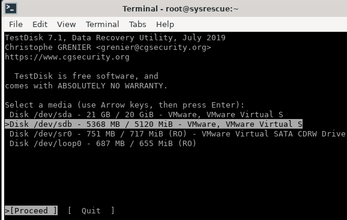
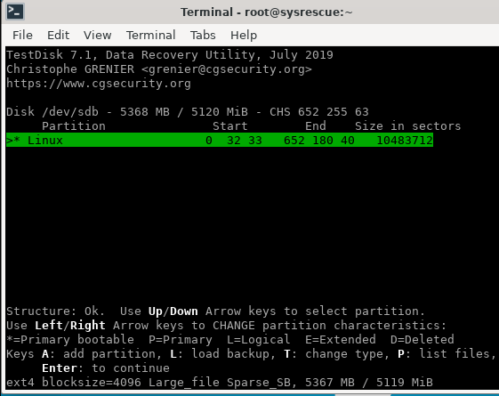
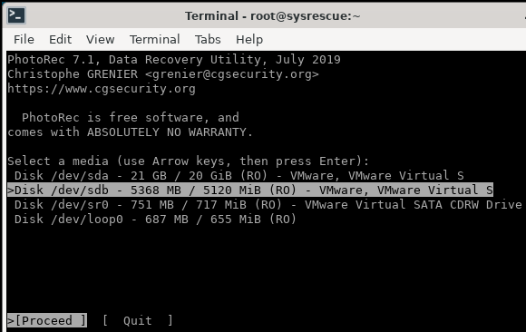
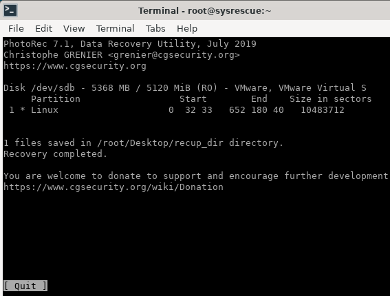

# Recuperación de datos

## Índice

### [1 Introducción](#1--Introducción)

### [2 Requerimientos](#2--Requerimientos)

### [3 Preparación](#3--Preparación)
#### &nbsp; &nbsp; [3.1 Recuperación de particiones](#31--Recuperación-de-particiones)
#### &nbsp; &nbsp; [3.2 Recuperación de archivos](#32--Recuperación-de-archivos)

### [4 Webgrafía](#4--Webgrafía)

### [5 Conclusión](#5--Conclusión)

---

## 1  Introducción

La recuperación de datos es el conjunto de técnicas y procedimientos utilizados para acceder y extraer la información almacenada en medios de almacenamiento digital que no pueden ser accesibles de manera usual.

Existen distintos métodos y herramientas que se pueden ejecutar dependiendo del daño físico o avería lógica que el dispositivo presente, desde software especializado hasta herramientas de hardware diseñadas específicamente.

En una empresa la aplicación más común de la recuperación de datos es extraer información de unidades de almacenamiento que eran inaccesibles.

## 2  Requerimientos

Todas las máquinas virtuales tienen el sistema operativo Debian 9 stretch.

- Hipervisor VMware Workstation.

- Servidor ssh en las máquinas virtuales.

- Cliente ssh en la máquina anfitriona.

## 3  Preparación

Arrancamos el equipo con un live-cd de SystemRescue.

### 3.1  Recuperación de particiones

Escribimos el comando, `# testdisk`, y seleccionamos la unidad de almacenamiento que queremos recuperar.

	

Seleccionamos el tipo de tabla de particiones de la unidad de almacenamiento, le damos a analizar, seleccionamos la partición que queremos recuperar, y le damos a escribir, para escribir los cambios hechos en la unidad de almacenamiento.

	

### 3.2  Recuperación de archivos

Escribimos el comando, `# photorec`, y seleccionamos la unidad de almacenamiento que queremos recuperar archivos.

	

Seleccionamos la partición de la que queremos recuperar archivos, seleccionamos el sistema de archivos, seleccionamos escanear la partición de espacio no asignado, y seleccionamos el directorio donde queremos guardar los archivos recuperados.

	

## 4  Webgrafía

<https://www.system-rescue.org/>

## 5  Conclusión

La recuperación de datos es una manera sencilla de extraer particiones o archivos inaccesibles de unidades de almacenamiento.
